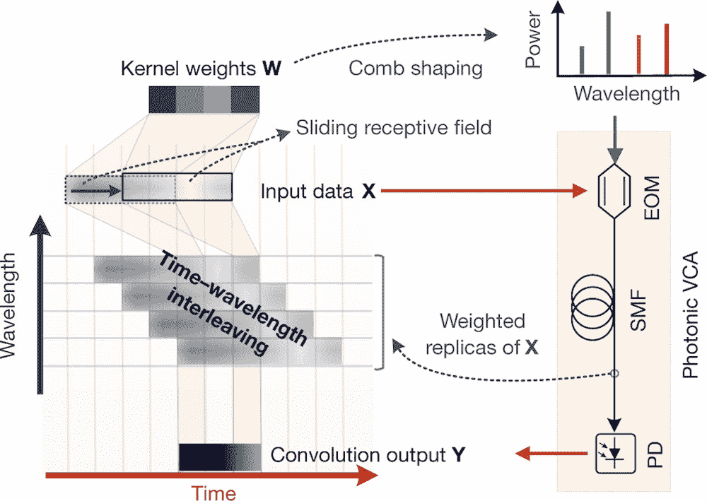

# 光子加速器增强了光学神经网络

> 原文：<https://thenewstack.io/photonic-accelerator-supercharges-optical-neural-networks/>

新兴领域[神经形态计算](https://thenewstack.io/scientists-create-artificial-synapses-brain-like-computing/)旨在开发超节能计算系统，模仿自然界中发现的神经生物架构。在不久的将来，将需要这样的进步，特别是随着人工智能(AI)变得越来越复杂，因此对计算的要求也越来越高。

这个潜在的电子瓶颈的一个可能的解决方案是使用[神经形态微芯片](https://thenewstack.io/neurosynaptic-microchip-uses-light-and-algorithms-to-mimic-human-brain/)，它可以使用激光而不是电子快速处理大量数据。一个例子可以在被吹捧为迄今为止世界上最快和最强大的光学神经形态处理器中找到，它是光学神经网络(ONN)的一部分，该网络最近由来自中国和加拿大的国际研究团队开发，并由澳大利亚 [Swinburne 科技大学](https://www.swinburne.edu.au/)领导。

该团队的新“光子卷积加速器”能够以令人难以置信的每秒 10 万亿次运算(TeraOPs/s)的速度运行，可以彻底改变大规模、密集型机器学习任务的实时处理方式，例如自动驾驶汽车、临床扫描应用程序或人脸识别任务。

正如研究人员在最近发表在 *Nature* 的论文中解释的那样，该团队微芯片的核心是一种相对较新的组件，称为光学微梳。微梳的工作原理是产生一道红外光彩虹，允许数据以多种不同频率的光同时传输。最重要的是，集成微梳的芯片可以做得比其他传统光学芯片更小、更轻、更节能、更便宜。

“我们的光学神经网络代表了实现单片集成 ONNs 的重要一步，并通过我们使用集成的微梳芯片来实现，”该团队解释说。“此外，我们的加速器方案是独立和通用的——与电气或光学接口完全兼容。因此，它可以作为任何神经形态硬件(无论是基于光学还是基于电子的)的通用超高带宽数据压缩前端，使实时和超高带宽数据的大规模数据机器学习触手可及。”

该团队集成的 micro-comb 微芯片的功能通过训练和测量深度学习卷积神经网络(CNN)在识别从 1 到 9 的一系列手写数字方面的准确性进行了测试。卷积神经网络(CNN)广泛用于许多基于人工智能的应用中，其功能类似于生物视觉皮层系统，并通过提取输入数据进行“学习”，以便允许它们在以后识别类似的样本。虽然这对于人类来说在相对较少的例子后就很容易掌握，但对于机器来说，这可能是一个很难掌握的任务，这取决于底层硬件的计算能力。但是，配备了该团队的光子卷积加速器，并使用一种新技术，通过集成的微梳在时间，波长和空间维度上同时交织数据，CNN 能够以 88%的准确率执行。

正如该团队指出的那样，他们的实验结果——全部在单个微芯片上实现——与更昂贵的硬件组件相比，如谷歌最先进的张量处理单元(T1)或 TPU(能够以 100 万亿次/秒的速度运行，但需要数千个并行工作的 TPU)相比，更加令人印象深刻。

“手写数字识别虽然被广泛用作数字硬件的基准测试，但仍然超出了现有模拟可重构 ONNs 的能力，”该团队指出。“数字识别需要全连接网络的大量物理并行路径，这对当前的纳米制造技术提出了巨大的挑战。我们的 CNN 代表了第一个可重构和可集成的 ONN，不仅能够执行高级复杂任务，如完整的手写数字识别，而且能够以超高的万亿次浮点运算速度执行。”

随着这种光子卷积加速器的创建，该团队的发现很可能会打开进一步开发尖端神经形态计算工具和最先进的光学神经网络的大门。这些元素的持续发展将有助于进一步推动人工智能工具、通信技术等，特别是在实时处理大规模数据机器学习任务时。

更多阅读团队[论文](https://www.nature.com/articles/s41586-020-03063-0)。

<svg xmlns:xlink="http://www.w3.org/1999/xlink" viewBox="0 0 68 31" version="1.1"><title>Group</title> <desc>Created with Sketch.</desc></svg>