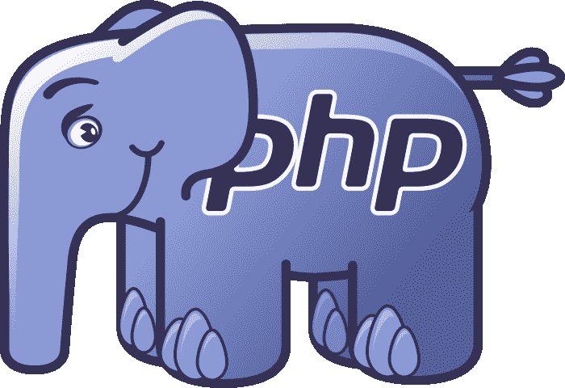
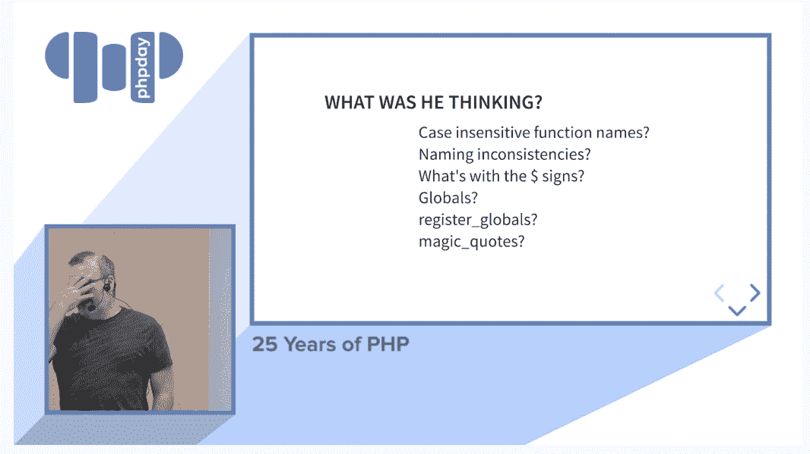

# PHP 开发者拉斯马斯·勒德尔夫分享了过去 25 年的经验教训

> 原文：<https://thenewstack.io/php-creator-rasmus-lerdorf-shares-lessons-learned-from-the-last-25-years/>

今年在维罗纳举行的年度 [phpDay](https://2019.phpday.it/) 意大利 PHP 大会以 PHP 创始人令人惊讶的反思性演讲而结束。

作为闭幕发言人，50 岁的[拉斯马斯·勒德尔夫](https://twitter.com/rasmus)回顾了 web 后端编程语言的过去 25 年，并提供了从一个不起眼的超文本预处理器演变为 web 基础设施中的主要参与者的一些经验教训。

但是除了分享他在技术领域的一生和震撼我们世界的变化的故事，勒多夫还提供了他自己对这一切意味着什么的看法，甚至为新一代充满希望的年轻黑客提供了一些好的建议，他们可能也想改变世界。

[https://www.youtube.com/embed/wCZ5TJCBWMg?feature=oembed](https://www.youtube.com/embed/wCZ5TJCBWMg?feature=oembed)

视频

## 什么改变了一切

勒多夫首先分享了一些 20 世纪 80 年代的记忆。有一次，他甚至展示了他的 Timex Sinclair 1000 家用电脑的幻灯片，并回忆起拨号调制解调器的时代，以及使用旧的 Gopher 协议检索在线研究论文的时代。"这是我在大学里见过的最接近网络的一次."

但是，是 1994 年第一个马赛克网络浏览器让他走上了这条路。“这改变了一切，”勒多夫强调地告诉观众。“不仅仅是对我，对所有人……当时周围的所有人，都在玩这个东西，有过 UUCP 的地址，玩过新闻组和公告板——很容易看到这将改变世界。”

尽管他把自己描述成一个不太喜欢编程的“平庸的程序员”, Lerdorf 还是拼凑了一套 C 二进制文件，形成了一套有用的工具[,用于简化网站管理员的一些基本功能，包括格式良好的访问日志和将服务器生成的内容添加到网页中的能力。](https://groups.google.com/forum/#!msg/comp.infosystems.www.authoring.cgi/PyJ25gZ6z7A/M9FkTUVDfcwJ)

他的最终想法是拥有一个标签的模板解析系统，它对应于用户可以自己编写的小型 C 函数。他认为这会很受欢迎，但是“我完全错了。没有人想写 C 代码。”人们会给他发电子邮件请求更多的标签，他会试着展示自己写标签是多么容易。他会用电子邮件回复他们需要的简单 C 代码，“他们会说谢谢你。然后说，‘现在我们需要这个。我们不知道如何做这件事。我会这么做的。

"基本上，他们会骗我建立他们的网站."

一张幻灯片的标题是“他在想什么？”勒多夫称之为“这些年来人们一直问我的一些事情。”

首先是？PHP 为什么使用不区分大小写的函数名？“这在今天没有太多意义，但对于所有这些决定，你必须记住上下文……当 web 刚开始时，关于 HTML 标签是否应该大写、小写，甚至混合大小写，有一场巨大的宗教斗争。因为我的模板系统想要适应这个世界，所以我不想偏袒任何一方…

“现在，当每个人最终都开始使用小写字母时，我可能应该把它换掉。但我记得当时想，‘这将影响数百个网站……’”

然后他笑着向他的观众坦率地承认，“现在回想起来，就像是，‘我*应该*当时给几百个网站带来了不便。"

## 在一个没有容器的世界

四分之一个世纪后，勒多夫仍然记得那个决定在当时看起来是多么的无辜。“我完全不知道……在这一路上的每一点上，我都认为 PHP 的生命只剩下六个月了。因为我认为这大约是某人写一些真实的东西来代替它所需要的时间，这对我也有用。我一直等着……但什么也没等到。”

他在后面的演讲中重申了这一点。“我从未想过 25 年后我还会谈论这件事。”

他还记得一个重要的里程碑:Apache web 服务器开始与 PHP 一起发布。其他语言实际上比 PHP 更快，但是作为一个单独的进程启动它们的开销使得 PHP *相比之下看起来*更快。“Lerdorf 讲述了一个 90 年代才有的故事，讲述了 Perl 最终也为 Apache web 服务器发布了自己的可选可嵌入模块— **mod_perl** 。”他们让它变得太强大了…如果你在 Apache 服务器上的虚拟主机上，并且你有 **mod_perl** 访问权限，如果你想的话，你可以从每个其他虚拟主机窃取请求…”由于这个漏洞，ISP 不会在一个 Apache 实例中提供 **mod_perl** 以及其他客户端。

“因此，如果你找到一家 ISP，说‘我想要**mod _ perl**’，他们会说，‘好吧，一个月 600 美元’，因为那时我们还没有虚拟机、容器之类的东西。所以你必须为 mod_perl 准备一个单独的物理裸机。而在 PHP 上，你可以在一台机器上放置 3000 个客户，而不是一个 **mod_perl** 客户。”

### 我在实习中学到了什么

Lerdorf 还讲述了他在 PHP 之前的一个有趣的故事，描述了在多伦多北电电信的实习经历——以及它如何直接影响了他设计 PHP 的方式。每隔几个月，该公司的电话路由系统就会从队列中丢弃每一个电话——这是一个他们从未能修复的缺陷。“他们试着找了好几年，都没找到。”所以他们让年轻的勒多夫去调查。几十年后，他把自己的任务——修复那个无法修复的漏洞——视为一种玩笑。“他们认为我不会有任何进展。他们认为我应该通过追踪来了解这个系统。”

勒多夫把源代码的每一行都打印出来，贴在走廊的墙上，跟踪它的流程，并试图手动调试。"我有一把椅子，可以站在上面够到更高的东西。"他记得代码是“讨厌的”，但报告了他所学到的东西。

“最终，三个半月后，竟然是一场全局变量碰撞。两段完全不相关的独立代码，对一个变量使用了相同的名称。它是全球性的。在完全错误的时间在一个地方进行更改，会导致其他代码变得疯狂。而当时的 C 编译器没有办法通知我们发生了这种情况……”

“当我开始向 PHP 添加变量和范围时，我记得这一点。在 PHP 中，我不可能花三个半月的时间去追踪这样的东西……所以在 PHP 中，如果你要踩上全局变量，你必须在方法或函数中声明你要踩上全局变量的事实……这样你就不会在 PHP 中意外地踩上全局变量。”

在要求举手表决时，Lerdorf 惊讶地发现有那么多人还在运行 PHP 5。“你要杀了我……”他笑着说。“我以为会有一两个人举手。可是整个屋子后面都亮了！”

然后他耐心地向观众介绍了 [PHP 7.3](https://www.php.net/releases/7_3_0.php) 的所有改进。例如，5.3 版本需要 140MB 来运行 WordPress，但是 7.3 版本只需要 15MB。

### 深思熟虑的回顾

但是勒道夫的演讲以一个鼓舞人心的结论结束。他愉快地回忆起 2005 年对斯里兰卡的访问——不仅仅是因为那一年他遇到了亚瑟·C·克拉克。那是大地震和海啸后的一年，导致了一个名为 Sahana 的救灾项目。“当我在那里的时候，我和那里的人谈了谈，讨论了他们可以用 PHP 做的一些事情……”

最终，一个被他描述为“一个大学里的孩子和一个为政府工作的人”的团队使用 PHP 组装了一个被勒多夫称为“一个灾难救济的盒子管理型系统”它允许迅速传播关于救援物资的信息——或关于失踪人员状况的信息。“有七、八、九个类似的不同模块。它的价值在于，它可以在三分钟内旋转起来……现在它已经在世界各地的 50 多起灾难中得到应用。

“知道 PHP 实际上可能挽救了某人的生命，让所有网上的悲伤变得完全无关紧要…”

虽然有些人很自然地遵循这种发展，但他认为其他人这样做是“因为他们觉得自己跟不上……这是一种代码，他们已经失去了兴趣。他们没有足够的动力在晚上真正坐下来阅读一些东西。”但勒多夫认为，即使有家庭的约束，也应该有时间去激发激情和动力，“如果你没有这些，你就会筋疲力尽。”

他引用了菲律宾国防部长的一句话——没有比拯救生命更重要的创新了。

“我们不能忘记我们在这里做什么，以及我们为什么要编程。我们编程是为了解决一个问题。希望这是一个真正重要的问题。

“所以，努力做对你来说重要的事情。请。”

* * *

## WebReduce

<svg xmlns:xlink="http://www.w3.org/1999/xlink" viewBox="0 0 68 31" version="1.1"><title>Group</title> <desc>Created with Sketch.</desc></svg>