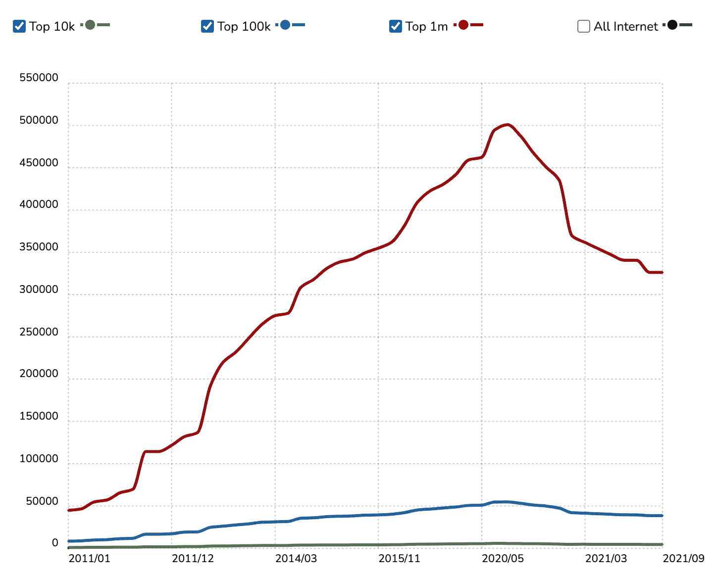

# PHP 已经存在了 26 年，因为它一直在发展

> 原文：<https://thenewstack.io/php-has-survived-for-26-years-because-it-keeps-evolving/>

在开源 PHP 项目中一位有影响力的开发人员[尼基塔·波波夫](https://twitter.com/nikita_ppv?lang=en)决定离开后，促使[成立了一个新的基金会](https://thenewstack.io/php-gets-a-foundation-to-work-on-php-core)来运营这个项目:[PHP 基金会](https://opencollective.com/phpfoundation)。这引发了几个问题。首先，当其他编程语言和框架似乎更适合现代 web 时，为什么 PHP 仍然是 web 的一个重要部分？第二，组建这个新基金会的公司背后的动机是什么？

 [理查德·麦克马努斯

Richard 是 New Stack 的高级编辑，每周撰写一篇关于 web 和应用程序开发趋势的专栏文章。此前，他在 2003 年创立了读写网，并将其打造为全球最具影响力的科技新闻和分析网站之一。在 Twitter @ricmac 上关注他。](https://twitter.com/ricmac) 

上周，JetBrains [公司在其博客](https://blog.jetbrains.com/phpstorm/2021/11/the-php-foundation/)上宣布成立 PHP 基金会。JetBrains 是一家位于捷克共和国的公司，为软件开发人员提供工具，包括一个名为 PhpStorm 的 PHP IDE(集成开发环境)。所以它的动机很明确:它希望确保 PhpStorm 继续保持相关性。至于 PHP 基金会，JetBrains 写道，其目标是成为“一个非营利组织，其使命是确保 PHP 语言的长久生命和繁荣。”

新基金会新宣布的合作伙伴之一是 Automattic，WordPress 背后的公司。尽管在过去的几年里，WordPress 在一定程度上转向了 JavaScript 技术——特别是它的模块化 Gutenberg 编辑器——但它仍然非常依赖 PHP。如果你碰巧运行一个 WordPress 博客，你可以看到整个管理界面是由 PHP 页面组成的(wp-admin/edit.php 等)。

## PHP 为什么还这么受欢迎？

上个月,[我写了一篇专栏文章](https://thenewstack.io/why-outdated-jquery-is-still-the-dominant-javascript-library/),探讨了 jQuery 这个早在 2006 年首次亮相的 JavaScript 库为何仍然广受欢迎。根据 BuiltWith 的数据，排名前 100 万的网站中，有 76%以某种方式使用 jQuery(自那篇专栏文章发表以来，实际上已经下降了几个百分点)。根据同一来源，PHP 目前被 100 万个顶级网站中的 36%所使用——这个数字从去年年中开始下滑。虽然有趣的是，PHP 在排名前 10，000 的网站中使用更广泛——这些网站中有 49%使用它。

来源:BuiltWith

虽然 PHP 看起来可能会稍微受欢迎，但至少当它开始进入网站的长尾时，该技术将在未来许多年内保持不变。它经久不衰的原因类似于 jQuery——两者都是 WordPress 平台的核心技术。

PHP 也被其他大型平台广泛使用，特别是脸书。马克·扎克伯格使用 PHP 编写了最初的脸书网站，但现在该公司使用 PHP 的一个变种，名为 [Hack](https://en.wikipedia.org/wiki/Hack_(programming_language)) 。

## PHP 年来的曲折历程

和 jQuery 一样，PHP 也是一个方便易用的工具，可供 web 开发人员使用。这种情况一直存在，[可以追溯到 1995 年](https://webdevelopmenthistory.com/1995-php-quietly-launches-as-a-cgi-scripts-toolset/)，当时来自加拿大的独立开发者拉斯马斯·勒德尔夫发布了第一版个人主页工具(PHP Tools)。当时，PHP Tools 是一个小型工具集，用于创建服务器端的、连接数据库的 web 应用程序。它不是一种编程语言，尽管那年晚些时候 Lerdorf 确实在他的工具集中添加了一种脚本语言。

事实上，勒多夫基本上已经开始创建我们今天所说的框架——想想 React 或 Vue，减去现代的复杂性。PHP 工具在早期获得了广泛的关注，主要是因为它是 web 开发人员可以重用的一组有用的模板和代码片段。它还很好地集成到 HTML 中，并且很容易连接到数据库( [MySQL 也在 1995 年](https://webdevelopmenthistory.com/1995-mysql-lamp-stack/)首次亮相，所以 PHP 很快就与它紧密联系在一起)。

正如 Lerdorf 自己多年来多次指出的，他在 1995 年创建并在 1996 年继续工作的是一个与今天的 PHP 完全不同的系统。事实上，PHP 在 1996 年后有了显著的发展，许多其他有影响力的开发人员帮助塑造了它的未来——特别是 Zeev Suraski 和 Andi Gutmans 为 PHP 3 开发的程序，它是在 1997 年开发的，并于 1998 年 6 月发布。根据 JetBrains 关于 PHP 前 25 年的深入信息图，PHP 3 是“第一个非常类似于 PHP 的版本”。

具有讽刺意味的是，勒多夫一直说他不喜欢编程，[声称](https://twitter.com/woketopus/status/1447150924846313475)他“不是一个真正的程序员”。但是这必须要有所保留——有多少“真正的程序员”曾经开发过像 PHP 这样重要的东西？JetBrains 似乎在[的信息图](https://venngage.com/)中承认了这一点，当它说 PHP 在 1996 年开始变成一种编程语言，这要归功于 Lerdorf 添加了“对 DBM、mSQL 和 Postgres95 数据库的内置支持、cookies、用户定义的函数支持等等”

在成功的网络创新或公司中，发明者或创始人通常会在他们离开后很长时间内继续提供技术存在的理由。我想勒多夫就是这种情况。他仍然是 PHP 背后的指导精神，尽管他不再是首席开发人员之一。“我们不能忘记我们在这里做什么，以及我们为什么要编程，”他在 2019 年 PHP 大会上说([被大卫·卡塞尔](https://thenewstack.io/php-creator-rasmus-lerdorf-shares-lessons-learned-from-the-last-25-years/)引用)。“我们编程是为了解决一个问题。希望这是一个真正重要的问题。”阿门。

我应该补充一点，JetBrains 在宣布 PHP 基金会的帖子中提到了 Lerdorf，他参与了最初的“临时管理”。一个有希望的迹象。

## 继续坚持

我提到 PHP 的所有这些历史，是因为一些 web 技术似乎有留下来的诀窍——可以说，它们成为了 web 家具的一部分。就 jQuery 而言，这些年来它并没有太大的变化。它仍然做着它设定要做的工作，它仍然是一个方便开发者使用的 JavaScript 库。

其他 web 技术也随着时代不断发展 PHP 就是其中之一。但无论它与 1995 年的原始版本偏离了多远，DNA 都是一样的。PHP 本来就是为 web 开发人员准备的一个方便易用的框架。不管是框架(顺便说一句，这是 BuiltWith 对它的分类)还是编程语言，这都不重要。PHP 已经深深嵌入了 WordPress、脸书和许多其他的网络平台和网站——所以它会一直存在下去。

与 jQuery 不同，PHP 还在继续发展。它与时俱进，PHP 基金会希望这将是未来许多年的情况。

<svg xmlns:xlink="http://www.w3.org/1999/xlink" viewBox="0 0 68 31" version="1.1"><title>Group</title> <desc>Created with Sketch.</desc></svg>