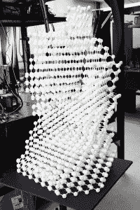

# 物理学家使用新的量子计算架构创造“时间晶体”

> 原文：<https://thenewstack.io/physicists-create-time-crystals-using-new-quantum-computing-architecture/>

“时间水晶”这个词让人想起科幻小说和游戏行业中各种由来已久的比喻。但是，尽管时间晶体听起来像是由过度活跃的想象力想象出来的东西，但事实上，它们现在是来自 [QuTech](https://qutech.nl/) 的研究人员——来自[代尔夫特理工大学](https://www.tudelft.nl/)和 [TNO](https://www.tno.nl/en/) 、加州大学伯克利分校和工业钻石公司[Element Six](https://www.e6.com/)——在[量子计算机](https://thenewstack.io/googles-quantum-computer-can-exponentially-suppress-errors/)的帮助下创造的东西。

我们大多数人在日常生活中已经熟悉晶体，从食盐、冰块到翡翠和钻石——基本上，任何固体物质，只要原子排列成稳定、高度有序的三维晶格。

但是时间晶体有一点不同:它们不是只在空间中重复这些模式，而是在时间和空间中重复。简单来说，时间晶体是一种新的奇异物质状态，类似于[超固体](https://interestingengineering.com/scientists-created-supersolid-state-of-matter-new-dimension)、[超流体](https://news.illinois.edu/view/6367/730694)和[玻色-爱因斯坦凝聚体](https://www.livescience.com/46506-states-of-matter.html)。时间晶体的新颖之处在于，它们的原子以规则的时间周期振荡，即使是在最低能量状态下，也不需要外部能量输入来保持它们的节奏运动。时间晶体被比作“[永不停止抖动的果冻](https://www.youtube.com/watch?v=ucwmGZ51X7E&ab_channel=JoeScott)”，它们的粒子量子系统将保持翻转状态，不会向其环境损失能量或最终完全停止，因为它已经处于最低能量状态。

最终，时间晶体可能有一天会有一些有趣的甚至是不可预见的应用，比如设计超精确的时钟，或者被用作量子计算机的[量子存储器](https://www.unige.ch/gap/qic/qram/quantum-memories)的一种形式。

## 违法晶体

正如你可能想象的那样，有了这样的一系列特征，时间晶体违背了几个物理定律，比如热力学定律。热力学第一定律指出，能量既不能被创造也不能被消灭，给予一个系统的能量和从其周围环境中获取的能量是一样的。

热力学第二定律指出，熵或无序倾向于随时间增加。时间晶体打破了所有这些定律，因为它们的粒子能够在不同状态之间永久翻转，而不会消耗能量，并且它们倾向于稳定，而不是无序。此外，时间晶体打破了所谓的[时间平移对称性](https://physics.stackexchange.com/questions/614757/intuitive-explanation-for-why-time-symmetry-implies-conservation-of-energy)，这表明今天成立的物理定律在过去和未来也应该成立。

时间晶体是由物理学家和诺贝尔奖获得者弗兰克·维尔泽克在 2012 年首次提出理论的[，从那以后，世界上许多不同的实验室试图创造符合两个理论标准的时间晶体。第一，真正的时间晶体必须对波动具有鲁棒性，第二，推动它的能量不能导致系统升温，否则会破坏时间晶体。](https://arxiv.org/pdf/1202.2539.pdf)

根据 QuTech 团队的[论文](https://www.science.org/doi/10.1126/science.abk0603)，最近发表在*科学*上，该团队能够使用基于钻石的量子计算机，从可编程自旋量子位(量子位)链中创建一种称为离散时间晶体(DTC)的时间晶体。至关重要的是，研究人员的新时间晶体系统展示了所谓的[多体局域化](https://www.pks.mpg.de/condensed-matter/research-areas/many-body-localization) (MBL)，这是量子系统中的一种动力学现象，它阻止了离散时间晶体的热化(或升温)，从而证明这确实是真的，一种真正的时间晶体。

同样重要的是，QuTech 的时间晶体持续了相对较长的 8 秒，即大约 800 次振荡。

“虽然一个完全隔离的时间晶体在原则上可以永远存在，但任何真正的实验实施都会由于与环境的相互作用而衰减，”该研究的第一作者 QuTech 的 Joe Randall 在一份新闻稿中说。"进一步延长寿命是下一个前沿."

该团队从碳-13(一种由六个质子和七个中子组成的稳定碳同位素)的核自旋中创造了他们的离散时间晶体，这些晶体被嵌入由第六元素生长的“T2”超纯钻石中。该团队使用了其中的九种碳同位素，它们位于钻石晶格中的缺陷附近，因此该团队可以使用激光来替代操纵他们的核自旋。

用于制作团队时间水晶的钻石模型。(摄影:恩斯特·德格鲁特)

由于晶格内碳 13 同位素的核自旋是无序的，这导致了自旋之间的自然变化，导致系统保持其无序状态，这意味着系统将满足多体定位所需的标准，同时也允许核自旋像充分隔离的量子比特一样工作，可以轻松控制和检测它们的量子状态。

兰德尔解释说:“我们开始使用一种基于钻石自旋的量子处理器来构建离散时间晶体。”"这些自旋形成了非常好的隔离和单独控制的量子比特，我们可以通过编程来模拟其他物理系统."

然后，研究小组通过平衡所有的核自旋极化来建立系统的初始状态，然后通过用射频脉冲轰击系统来修改这些初始状态。有了正确的参数，核自旋被协调成不受任何外部干扰影响的周期性反转模式。在一个循环完成后，多体系统被复位到初始状态，以便它可以再次启动。无论时间晶体系统的初始状态是什么，系统的内部相互作用最终都趋于稳定——这是一个重要的指标，表明该团队确实创造了一个离散的时间晶体，并将这个实验与之前的研究区分开来。

在未来，研究小组希望延长他们的时间晶体的寿命。此外，他们计划进一步研究三维系统中时间晶体的行为，而不仅仅是这项研究中开发的一维设置，以及探索物质从一种形式转变为另一种形式时，在其他新的物质相中时间晶体行为的潜力，例如在[拓扑相](https://physics.aps.org/topological-phases)中发现的那些。

正如加州大学伯克利分校物理学家诺曼·姚(Norman Yao)指出的那样:“时间晶体可能是物质非平衡态的最简单例子。QuTech 系统完全可以探索其他失衡现象，例如，Floquet 拓扑相位。”

更多阅读团队[论文](https://www.science.org/doi/10.1126/science.abk0603)。

<svg xmlns:xlink="http://www.w3.org/1999/xlink" viewBox="0 0 68 31" version="1.1"><title>Group</title> <desc>Created with Sketch.</desc></svg>