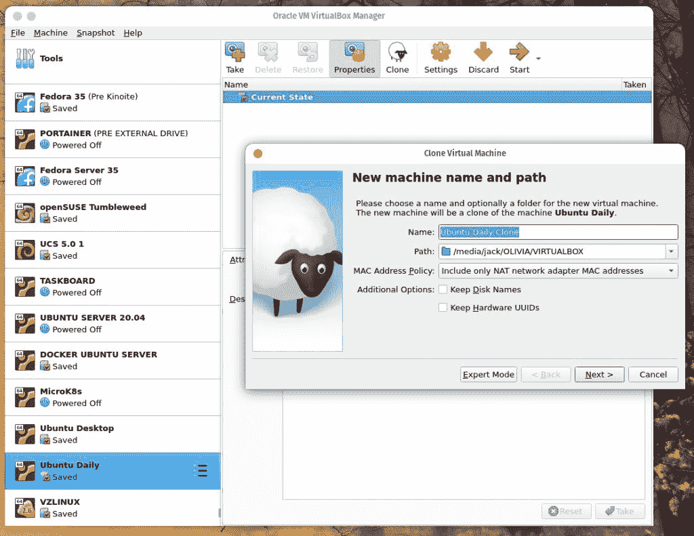

# 在 Linux 上拼凑一个可重复的前端开发环境

> 原文：<https://thenewstack.io/piece-together-a-repeatable-frontend-dev-environ-on-linux/>

开发环境是非常个性化的，因为每个开发人员和每个项目都有自己需要或喜欢的特定工具。一旦您构建了完美的环境，您将希望能够使它易于重复。

我什么意思？

请这样想:如果您可以创建一种易于构建、复制和运行的模板环境，那将会节省您大量的时间。您不再需要首先部署操作系统，然后安装所有必需的软件。这只是在您的环境中重复使用“模板”的问题。

听起来很棒，对吧？

幸运的是，有一些简单的方法可以做到这一点。第一个显而易见的方法是使用虚拟机技术，比如 Oracle 的 VirtualBox，构建你的基础虚拟机，然后根据需要克隆它。另一种方法是创建一个基本容器映像，然后可以根据需要进行部署。不管怎样，这都是用 Linux 创建可重复的前端(或后端)开发环境的好方法。

我要做的是演示如何使用 Linux Server 20.04 和 Docker 容器来实现这一点。虽然我们已经完成了从容器创建映像的[过程，但是这里重要的事情是演示如何通过在操作系统上安装某些开发工具来完成这个过程(然后创建“模板”映像供以后使用)。](https://thenewstack.io/tutorial-create-a-docker-image-from-a-running-container/)

## 安装 Docker

在我们做任何事情之前，你必须先安装 Docker。为此，请登录到您的 Ubuntu 实例，并使用以下命令安装必要的依赖项:

`sudo apt-get install ca-certificates curl gnupg lsb-release -y`

添加码头工人 GPG 键:

`curl -fsSL https://download.docker.com/linux/ubuntu/gpg | sudo gpg --dearmor -o /usr/share/keyrings/docker-archive-keyring.gpg`

使用以下命令添加 Docker 存储库:

`echo "deb [arch=$(dpkg --print-architecture) signed-by=/usr/share/keyrings/docker-archive-keyring.gpg] https://download.docker.com/linux/ubuntu $(lsb_release -cs) stable" | sudo tee /etc/apt/sources.list.d/docker.list > /dev/null`

更新 apt 并安装 Docker 社区版，包括:

`sudo apt-get update`

`sudo apt-get install docker-ce docker-ce-cli containerd.io -y`

将您的用户添加到 docker 组(以避免与使用 sudo 部署容器相关的安全问题):

`sudo usermod -aG docker $USER`

注销并重新登录，以使更改生效。

## 创建“模板”容器

我们现在将部署一个容器作为我们的模板。我们将使用最新版本的官方 Ubuntu 映像来实现这一点:

`docker run -ti --name=ubuntu-dev-base ubuntu:latest`

当这个命令完成时，您会发现自己在容器的 bash 提示符下。

## 安装我们的“基础”软件

你需要的软件显然取决于项目和/或你的工作方式。但是让我们安装几个相当常见的软件用于前端开发。在容器的 bash 提示符下，用以下内容更新 apt:

`apt-get update`

让我们首先使用以下命令安装 Node.js 和 npm (Node.js 包管理器):

`apt-get install nodejs npm -y`

回答区域设置问题(您所在的位置和您的时区)，安装将会完成。有了 npm 包管理器，我们可以使用以下命令安装 SaSS(语法上很棒的样式表):

`npm install -g sass`

现在让我们用以下代码安装 git:

`apt-get install git -y`

然后，您可以将您需要的任何其他工具(只要它们没有 GUI)安装到运行容器上。完成该过程后，使用以下命令退出容器:

`exit`

我们现在将使用以下命令提交更改:

`docker commit ubuntu-dev-base`

这将创建一个无标签的图像。如果您发出命令 *docker images* ，您将看到一个列出了存储库和标签字段的图像，列为< None >。我们需要标记该图像，以便可以使用它。为此，复制与未标记图像相关联的图像 ID，然后用以下内容标记它:

`docker tag ID ubuntu-dev-base`

其中 ID 是未标记图像的图像 ID。

您现在应该有一个类似如下的图片列表:

```
ubuntu-dev-base latest b926321b0096     About  a  minute ago     703MB

```

然后，您可以部署一个全新的容器，使用这个新的“模板”,命令如下:

`docker run -it -d --name ubuntu-projectX ubuntu-dev-base`

一旦容器开始运行，您可以使用如下命令来访问它:

`docker exec -it ubuntu-projectX bash`

您可以随心所欲地构建这些环境，因为您知道原始的“模板”将保持不变。

## 如果你需要 GUI 工具怎么办？

如果您的开发环境需要 GUI 工具，您最好的选择是使用虚拟机工具，比如 VirtualBox。您需要创建一个新的虚拟机(使用您选择的桌面)，安装必要的软件，然后根据需要克隆该虚拟机。

例如，要在 VirtualBox 中克隆一个虚拟机，您需要执行以下操作。在左侧导航中选择要克隆的虚拟机，然后单击克隆。在出现的窗口中(**图 1** ，给克隆一个名字(比如 Dev Base)，选择一个位置，然后点击 Next。



图 1:每天克隆一个 Ubuntu 22.04 的实例。

在下一个窗口中，选择完整克隆，然后单击克隆。克隆需要一些时间(2-5 分钟，取决于虚拟机的大小和主机的速度)。完成后，启动克隆，登录到桌面，并开始安装您需要的软件。这个过程和上面概述的一样，只是你需要在命令中使用 *sudo* 。

安装完所有需要的软件后，关闭操作系统。然后，您可以根据需要克隆这个新的虚拟机，以获得完全满足您需求的可重复开发环境。

<svg xmlns:xlink="http://www.w3.org/1999/xlink" viewBox="0 0 68 31" version="1.1"><title>Group</title> <desc>Created with Sketch.</desc></svg>