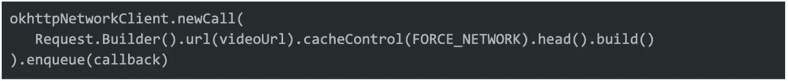
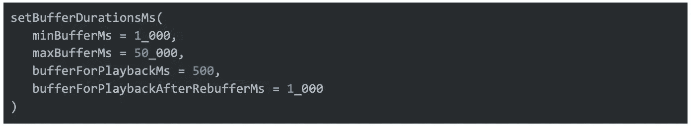
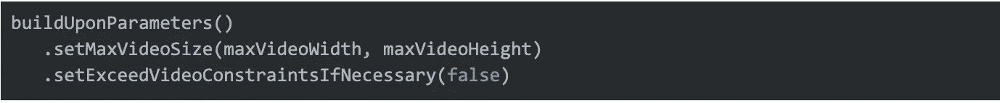
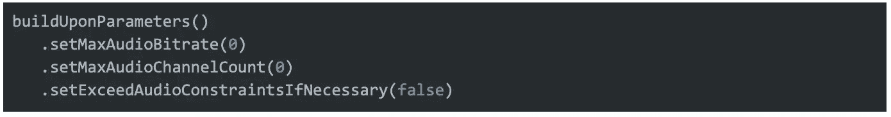

# Pinterest:通过这些简单的步骤增强 Android 视频

> 原文：<https://thenewstack.io/pinterest-turbocharge-android-video-with-these-simple-steps/>

社交媒体巨头 Pinterest 公司的工程师最近在博客中写道，该公司通过几个简单的步骤优化了预热、配置和玩家池，从而提高了 Android 视频的性能。

该网站的工程师认为他们的工作是对 [ExoPlayer](https://github.com/google/ExoPlayer) 内部运作的“永无止境”的调查，这是他们首选的 Android 应用级媒体播放器。

虽然是面向 Android 的，[的博文](https://medium.com/pinterest-engineering/improving-the-player-on-android-8b7faf9009cf)——由前 Pinterest Android 视频工程师[格雷·斯科尔德](https://www.linkedin.com/in/grey-sk%C3%B6ld-76781224/)、Android 性能工程师[王麟](https://www.linkedin.com/in/lwang70/)和 Android 性能工程师[刘胜](https://www.linkedin.com/in/sheng-liu-610ba62b/)撰写——突出了适用于其他领域的基本概念。

让我们来看看:

## **预热**

这里的关键学习是立即建立网络连接。它们不是等待从服务器返回视频 URL，而是在应用程序启动时通过一个伪 HTTP HEAD 请求建立网络连接。这个相同的连接用于播放未来的视频。

同样的策略也适用于 UI 呈现。

类似的预先建立的策略被用于 UI 呈现。ExoPlayer 默认将视频 URL 解析为:

*   计算纵横比
*   在*oncontentaspatriochanged()上调用*
*   通知 *AspectRatioFrameLayout* 宽高比。

由于大多数视频的宽高比是预先确定的，以下功能可以防止这种情况发生:

*   通过*aspectationframelayout . setaspectratio()*设置视频宽高比
*   用空体覆盖*player view . oncontentasperationchanged()*方法(这样可以防止播放器试图重新计算长宽比)。

## **配置**配置 **s**

### **短期缓冲**

缓冲会延迟播放，直到缓冲了足够的数据。由于 Pinterest 的大部分视频都是短片，工程师们选择了更短的缓冲时间。结果是等待时间更短，加载时间更快。 *setBufferDurationMs()* 是用于设置缓冲持续时间的函数。再缓冲速率提高了，但整体视频 UX 有所改善。

### **限制大小和声音**

下面的两个参数加载视频输入，并将大小限制为正确的视口大小。这消除了 360 像素视窗中的任何 1080p 视频大小。

这组参数禁用音频渲染，允许 Pinterest 同时播放多个静音视频。这节省了下载的网络带宽和处理的内存消耗。

### **清理脏缓存**

ExoPlayer 提供了一个缓存接口，将下载的媒体文件保存在磁盘上。然而问题是，当 Pinterest 遇到后端错误导致的致命错误时，错误内容也会在错误修复后很久仍滞留在缓存中导致错误。

解决方法是当 *[播放器返回以下致命 IO 错误时，使用](https://exoplayer.dev/doc/reference/com/google/android/exoplayer2/Player.Listener.html#onPlayerError(com.google.android.exoplayer2.PlaybackException))*[simple cache . remove resource()](https://exoplayer.dev/doc/reference/com/google/android/exoplayer2/upstream/cache/SimpleCache.html#removeResource(java.lang.String))*清除脏缓存。listener . onplayererror()*:

*   错误代码 IO 未指定 2000
*   错误代码 IO 无效 HTTP 内容类型 2003
*   错误代码 IO 错误 HTTP 状态 2004
*   错误代码 IO 文件未找到 2005
*   错误代码 IO 读取位置超出范围 2008

## **汇集玩家**

Pinterest 根据需要构建缓存来汇集玩家。历史上，它会动态实例化新的播放器实例，但这会导致大量的内存和带宽开销。他们的高级知识如下。

### **按编码分开**

在不同的解码器之间切换上下文需要大量的工作。播放器实例基于最后呈现的媒体的编码类型保持底层解码器引用。Pinterest 开始将玩家池建立在初始解码格式的基础上。这消除了由编码器切换引起的延迟，持久的播放器被与媒体编码匹配的编码器回收。

### **智能调整大小**

寻找理想的池大小也是一个挑战，需要多次迭代才能找到容纳多个视频播放所需的理想空间，并避免内存不足(OOM)和应用程序无响应(ANR)错误。他们使用了以下两个 API 来帮助实现这一点。

这个回调通知 Pinterest，当他们接近发送 OOMs 时，是时候清空他们的播放器缓存池了。

该标志让 ExoPlayer 保留对视频解码器的直接引用，并将其保存在内存中，即使在空闲状态下也是如此。这确实对内存和设备稳定性造成了很大影响。为了保护这两者，Pinterest 基于当前应用程序生命周期和设备上的可用内存，围绕该方法建立了保守的逻辑。

<svg xmlns:xlink="http://www.w3.org/1999/xlink" viewBox="0 0 68 31" version="1.1"><title>Group</title> <desc>Created with Sketch.</desc></svg>