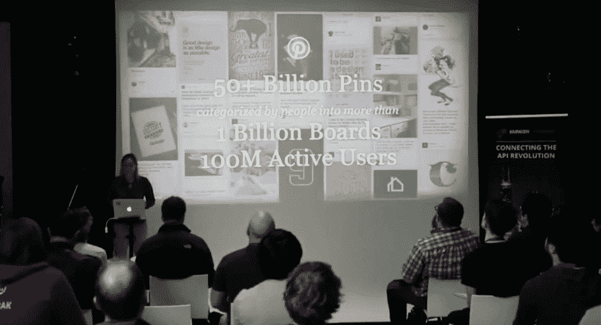

# Pinterest 使用 Varnish VCL 每月管理 500 亿个 pin

> 原文：<https://thenewstack.io/pinterest-uses-varnish-vcl-manage-50b-pins-month/>

"哦，看在瓦肯人的份上，你的意思是我必须学习另一种专有语言？"我听到你问了。对于清漆工程师来说，这个问题是经过深思熟虑的，他们的结论是，是的，我们需要这种语言。来自 Pinterest 和特斯拉的工程师们对此表示赞同。

Varnish 是一个用于大型 web 站点的开源 HTTP 加速器。“放在应用服务器前面，非常简单，因此速度也快了 200 到 1000 倍。因此，每次你将数据从缓存层移动到应用服务器，Varnish 将在 30-40 微秒内提供数据，而典型的缓存为 10-20 毫秒，” [Varnish 软件](https://www.varnish-software.com)的创始人兼首席技术官佩尔·帕尔在今年早些时候的 Varnish 峰会上说。

当天晚些时候，Varnish Software 的高级软件工程师[雷扎·纳吉比](https://www.linkedin.com/in/reza-naghibi-35a8643)解释了为什么他们决定创建一种特定领域语言(DSL)，以及为什么你应该关注它。“我们给你所有的权力来定义你自己的规则。VCL 给了你完全的控制权，”他说。

## **VCL 的特点**

Naghibi 解释说， [Varnish 配置语言](https://www.varnish-cache.org/docs/trunk/users-guide/vcl.html) (VCL)是基于 C 语言的，因此对大多数开发人员来说感觉很熟悉。他们保持了非常简单明了的语法。他称 VCL 是一个有着非常严格规则的自动防故障系统。除非满足所有缓存规则，否则它不会缓存任何内容。

此外，VCL 不是解释性的——没有 if 语句，没有循环。该功能被分组在不允许参数也不允许返回值的子例程中。数据只能通过 HTTP 头交换，VCL 有权操纵 HTTP 头，包括覆盖 TTL、剥离 cookies 和重写 URL 的权力。Naghibi 说，一个关键的区别是能够在运行时更新 VCL。您可以在不重新启动服务器的情况下更改 VCL 和状态效果。

他说，如果你在 VCL“不能”这么做，有变通办法可以实现这个功能，但是语言本身非常简单。多个 VCL 可以同时运行，并且它们之间的切换是即时和无缝的。

纳吉比说，VCL 做的不仅仅是缓存。

## **Pinterest**

珍妮弗·辛纳在清漆峰会上

一家已经广泛使用 VCL 的公司是 Pinterest。Pinterest 流量和网站可靠性工程师珍妮弗·辛纳在峰会上讲述了 Pinterest 如何创建内容交付网络(CDN)的细节，该网络利用了 Varnish 功能，尤其是 VCL，并提供了许多关于升级到最新 Varnish 版本的有用提示。你可以在这里观看她的完整演讲。

Zinner 说，Pinterest 是一个可视化书签工具，允许你将一个链接加入书签或“固定”。当引脚被保存时，它们被收集到板中。

不要被网站朴素的本质所迷惑；Pinterest 正在大规模运作，每月有 1 亿活跃用户，10 亿个论坛上有 500 多亿个 pin。该服务通过 Varnish CDN 每秒处理 180，000 个请求，大部分是非缓存命中，代表每分钟超过 1，000 万个独立用户操作。

辛纳说，Pinterest 在亚马逊网络服务(AWS)上运行 Varnish，并取得了很好的结果。他们在 2010 年开始使用 AWS，自那以后，Zinner 说 AWS“在我们的领导下发展了”，所以他们现在开始使用亚马逊的虚拟私有云(VPC)。

该公司在设计云计算时主要关注的是弹性。该公司依赖由 Varnish 提供并由 VCL 控制的自动扩展和配置管理功能。自动扩展根据负载自动在管理组中添加或删除实例。

Pinterest 云根据用户流量主动扩展主应用层，每天有超过 60 个跨应用层的自动扩展事件，所有这些都是通过 VCL 编程自动完成的。作为一种关联，Zinner 说，运营团队每天创建 60 个独特的 VCL 配置。

因为自动扩展每月产生大约 12，000 次服务器更新，她解释说，如果只探测后端服务器，该服务的流量可能很快就会超过内核的总 TCP 套接字分配。Pinterest 发现负载平衡器 integration point 修复 VCL 不稳定的后端功能非常有价值。

对于这些数字，可靠性至关重要。“每月的正常运行时间令人惊讶，”辛纳说。

她说，该服务还使用 VCL 的 HTTP 加速器功能来处理 HTTP 报头，并发现 TCP 内核调整“非常棒”。

在峰会的早些时候，特斯拉网络平台架构师 [Rajasekar Jegannathan](https://www.linkedin.com/in/rajasekar-jegannathan-9b566242) 解释了[他如何创建特斯拉的私人 CDN](https://thenewstack.io/single-tesla-engineer-uses-varnish-create-private-cdn/) 。他对 VCL 的能力以及这种语言如何给予特斯拉管理其全球网络所需的控制力充满热情。“我爱 VCL，”他说。

你还需要学习另一种 DSL 吗？如果它能做到这一切，你可能会想。

<svg xmlns:xlink="http://www.w3.org/1999/xlink" viewBox="0 0 68 31" version="1.1"><title>Group</title> <desc>Created with Sketch.</desc></svg>