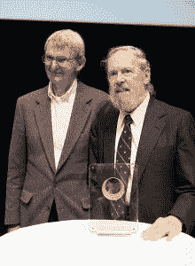

# Pipe:将 Unix 联系在一起的系统调用是如何产生的

> 原文：<https://thenewstack.io/pipe-how-the-system-call-that-ties-unix-together-came-about/>

这是各地开发人员、系统管理员和 Unix 爱好者生活中的日常命令。因此，值得注意的是，Unix 的 *pipe* 命令是在一天内实现的，这不仅代表了计算历史上的一个伟大时刻，也是对 Unix 的*文化*产生深远影响的一个独特的重要时刻。

从那以后，它改变了我们编程的方式。

## 设想于 20 世纪 60 年代

事实上，早在 50 多年前，从 1965 年到 1986 年领导贝尔实验室著名的“计算技术研究部门”的道格·麦克洛伊就写道，“我们应该有一些耦合程序的方法，就像花园软管一样。”这是在 1964 年——他[在打字机上敲出这些字](http://doc.cat-v.org/unix/pipes/)——说这种方法将让程序员“在需要以另一种方式处理数据时，拧入另一段”

普林斯顿大学的科学历史学家 Michael S. Mahoney 在 1989 年编写了一部 Unix 口述历史，他认为管道实际上是 Unix 哲学的一个重要转折点。所以当他最终找到麦克洛伊时，这位历史学家说他想问麦克洛伊关于管道的问题有一个特殊的原因:因为 Unix 的共同创造者丹尼斯·里奇说过“这不仅仅是你的建议，事实上，他认为是你的坚持。”

2011 年，麦克洛伊(左)和丹尼斯·里奇在一起

麦克洛伊承认 pipes“是我几乎能对 Unix 进行管理控制的唯一地方之一，也是推动这些事情的地方之一。”麦克洛伊记得，是的，在接下来的九年里，他在不同的时间点不断地在内部提出这个问题，直到 1973 年的最后一天，肯·汤普森说“我要做了”

“他听厌了所有这些东西……他没有完全按照我提议的那样去做管道系统调用；他发明了一个稍微好一点的……由于大多数常用命令仍然从文件中获取输入——比如 *grep* 和*cat*——“他在同一个晚上修改了所有这些程序。我不知道怎么回事…第二天早上我们就开始了一场俏皮话的狂欢…

“第二天绝对是美妙的一天。”

在他们随后的谈话中，历史学家确定这是真正产生 Unix 是工具集合的想法的时刻。

****马奥尼:**工具箱的概念在管道之前就存在了吗…？**

麦克洛伊:没有

还是管道创造了它？

麦克洛伊:管道创造了它。

Mahoney: 有了管道之后，Unix 看起来不一样了？

**麦克洛伊:**是的，每个人都开始提出的理念，“这就是 Unix 理念。写程序做一件事，并把它做好。写程序一起工作。编写处理文本流的程序，因为那是一个通用接口。”所有这些想法，加起来就是工具方法，可能在管道出现之前就以某种未成形的方式存在了，但它们确实是后来才出现的。

在那决定性的一天过去五年后，麦克洛伊甚至在“贝尔系统技术杂志”上仔细地阐述了“Unix 哲学”，这是一种为做好一件事的单个程序辩护的哲学。“期望每个程序的输出成为另一个未知程序的输入。不要用无关的信息扰乱输出。”

令人惊讶的是，这份 41 年前的文件[的副本仍然可以在网上找到。](http://emulator.pdp-11.org.ru/misc/1978.07_-_Bell_System_Technical_Journal.pdf)

虽然马奥尼的采访表明管道的原始符号是“ *>* ”，但在 1994 年的书《Unix 的四分之一世纪》中，麦克洛伊记得汤普森决定管道的符号应该改为“|”汤普森“为了在伦敦的一次演讲”做了这个改动，因为他无法忍受暴露我丑陋的语法

## 柯尼根的回忆

很难夸大这个新功能给 Unix 世界带来的影响。马奥尼后来还找到了操作系统的另一位共同创造者布莱恩·柯尼根，他也强调了那个时刻的重要性。他回忆道:

突然出现了竖线，一切都在那一点上点击了。那时我就可以开始编写这些非常简洁的例子，来展示这样的事情——你知道，运行`who`和和 *d 来收集一个文件的输出，然后用`word-counting`这个文件来表示有多少用户，然后说，“看看有了`who`进入`wordcount`有多容易，”然后运行`who`进入`grep`， 并开始展示一些从未想过的组合，然而这些组合是如此简单，你只需在键盘上组合，每次都能做对。*

我想这就是我们开始有意识地思考工具的时候，因为那时你可以把东西组合在一起，如果你已经把它们做好了，它们就可以一起工作了。那时，人们回过头来，有意识地把从文件列表中读取的想法放到程序中，但如果没有文件，他们就从标准输入中读取，以便可以在管道中使用。

它不仅仅是另一个工具。它很快变得不可或缺。1985 年，该团队的同事 Dick Haight 也在 August Mohr 的*Unix Review*上发表了一篇文章，分享了他对那个特殊日子的记忆(这篇文章被 1996 年的电子书《网民:关于新闻组和互联网的历史和影响》引用))

“每个人都很清楚，几乎在系统开始工作几分钟后，这是一件很棒的事情。如果可以的话，没有人会回去放弃它。”

对于那些在那里的人来说，这是一个注定会被永远怀念的时刻。

<svg xmlns:xlink="http://www.w3.org/1999/xlink" viewBox="0 0 68 31" version="1.1"><title>Group</title> <desc>Created with Sketch.</desc></svg>