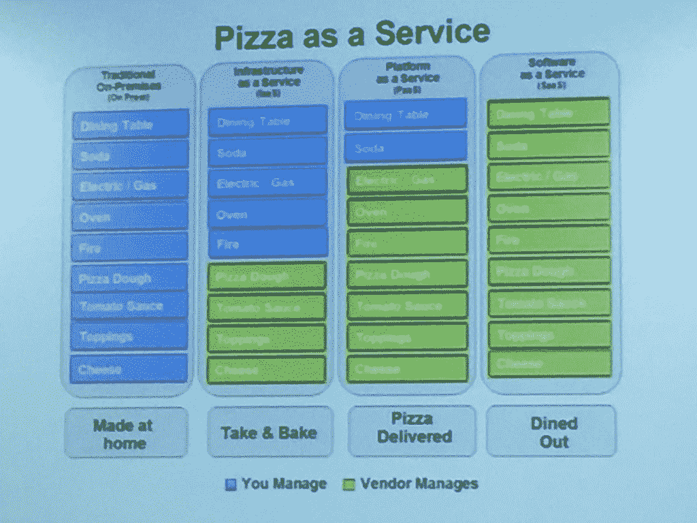

# 平台即服务:运行持续部署管道的关键

> 原文：<https://thenewstack.io/pipelines-paas-continuously-delivering-continuous-delivery/>

作为一名在各种平台即服务环境中持续部署大量微服务的六年老手， [Ben Dodd](https://twitter.com/bendodd) 在最近的[伦敦持续交付会议](http://londoncd.org.uk)上提问 :你希望与你的平台即服务(PaaS)保持什么样的关系？

他用下面这个“披萨即服务”的比喻说，你应该只专注于你想完成的事情，只关注眼前的任务:“只关心我们的披萨，其他的都是别人关心的事情。”

“作为开发人员，我们希望把时间花在创建和推广功能上，我们不希望担心平台和与运营部门沟通。他说:“这一切都是为了获得反馈，让用户获得这些功能。”。

“我们希望部署应用程序，我们需要平台即服务来构建部署微服务的平台，”他说。“有效管理高风险平台的唯一方法是持续部署。”

## 不构建自己的 PaaS 的理由

多德提供了许多借口，让团队编造出自己的 PaaS，最终，  真的拖慢了业务，让团队中的几个“超级英雄”脱颖而出。一旦您的团队或基础设施发生变化，所有这些都会崩溃。构建您自己定制的 PaaS 会带来以下挑战:

### 问题#1:平台工作是人工工作

多德说，你可能有几个超级英雄可以做任何事情，但这需要时间。一般来说，就像 [猴子和梯子实验](http://www.wisdompills.com/2014/05/28/the-famous-social-experiment-5-monkeys-a-ladder/) 一样，人们会通过说“它总是这样工作的”来承诺事情但只是因为它一直都是，并不意味着它会更好。

### 问题#2:“我们是超级特别的雪花”

类似地，许多团队倾向于认为他们的组织是如此特殊，有着不同于其他任何人的需求，所以他们必须创建一个新的 PaaS。然后会有几个超级英雄来设置它，但当他们离开时，没有人知道如何使用您的 PaaS。

### 问题#3:“我们是一个有风险的行业”

同样，如果你只构建自己的 PaaS，你会创建更多的共享请求和一个完整的针对 PaaS 请求的票务系统。多德说，这只会制造“更多的超级英雄，制造更多的障碍。”当你更多地使用安全借口来构建自己的 PaaS 时，他说你实际上只是在构建一个缓慢而复杂的平台，就像一个*筒仓*。

### 问题#4:我们需要扩展和更新"

“每四周更新一次，每两周测试一次，那么我什么时候能得到我的新功能？我们花了两周的时间进行测试，因为我们已经手动部署、扩展和分发—它最终停滞不前，只是在更新，”多德说。

### 问题#5:它变得昂贵

Dodd 指出，尤其是在企业中，一旦部署了某些东西，大约六个月内不会重新访问，所以人们部署并保持这些东西正常运行，以防万一，因为它需要很长时间才能部署到位。他支持像 Bosh 这样的部署工具，这些工具可以在几个小时内完成工作。

Dodd 见证了许多组织要么创建自己的 PaaS，要么使用手动部署的现有 PaaS，但只能在上线时进行测试。

他说，通过所有这些途径，“测试很少发生，所以没有真正的方法知道这些平台没有严重的问题。”

## PaaS 拯救高风险，一年一次的筹款活动

多德的公司运营着庞大的年度[喜剧救济](https://www.comicrelief.com/)筹款活动背后的捐款平台，在每年的一个盛大的夜晚，每秒钟可以收到 300 笔捐款，仅今年就筹集了 7600 万英镑。

多德说:“如果我们那时不收集，人们就不会回来。”他指出，当人们被该计划感动而捐款时，如果付款没有通过，他们第二天就不会那么渴望了。

为了保持每年一次的反馈循环，所有的一切都在一个全球性的、开源的、多云的基础设施上运行，这使得项目的风险非常高。it 中的备份和规划层促使 Gartner 将 Comic Relief 作为多云架构的一个示例。

他们在世界各地都有服务器和备份，运行在所有主要品牌上，所以即使其中一个崩溃，一切都是一样的。

多德说:“所有的部分都是一样的，无论是 AWS、谷歌还是 on-premise，都是一样的——这些都可以做到每秒 300 次。

为了实现这一点，他们不得不做出取舍。

他说:“Comic Relief 不需要数据的一致性，他们需要可用性。”。“以前，他们可以看到里面的确切金额，但很难分配。他们需要从一致的数据存储转变为架构解决方案来实现目标。”

他继续说，它“也有一个生产前持续部署环境，但是该环境在一个成功的状态后被破坏，因为它非常昂贵，PaaS 记得什么是最后的良好状态。”

为了实现这一点，他们使用了开源部署和生命周期工具链 [Bosh](https://bosh.io/) ，以及 [Cloud Foundry](https://www.cloudfoundry.org/) PaaS 和 [Concourse CI](https://concourse.ci/) 来实现高度声明性的持续集成。

他表示，外包给现有的平台即服务(PaaS)可以让他们对自己的应用进行 **$cf 推送**:“把你的应用给我。我会为你运行它，你不需要知道如何运作。”

Dodd 继续说道,“Bosh 从虚拟机进行滚动部署更新，并测试其更新是否成功。这可以是成百上千个虚拟机，而且基本上没有停机时间。如果出现问题，它会自动回滚并停止。”

这种多云架构也建立在测试驱动的合规性、测试驱动的开发和测试驱动的弹性的混合之上。

多德说:“像备份这样的弹性需求必须是你的管道的一部分，每当有人做出改变时就断言，这样他们就可以知道谁改变了什么，发生了什么。” “然后你需要跟踪这一切，看看你的流水线在哪个点慢下来。”

## 利用平台即服务构建成功的管道

Dodd 在结束讲话时总结了以下关于建立强大而稳定的渠道的经验:

1.  “你必须坚持下去，不要通过走捷径来减慢你的进度——只要对你的组织说不，坚持你的原则。但你必须考虑组织面临的风险，以及如何向业务部门证明这一点。”
2.  使用测试驱动开发使用 [BATS。](https://github.com/sstephenson/bats)
3.  “我们关注的是‘什么’和‘为什么’，而不是‘如何’不要参与当前的工作方式。这个想法是去问那些利益相关者:你的实际需求是什么，比如风险和法规遵从性。“通过回答这些问题，你可以进入一个完全自动化的过程。
4.  开发团队没有指定的生产和试运行环境，允许在接到通知后立即拍摄。
5.  他说:“我们在社交时间部署，因为我们在每次提交时都做这些更新，并且持续不断地做——这样我们就可以不再让支持团队在半夜进来了。”。
6.  不断优化短反馈循环
7.  将开发人员和运营人员结对，从一开始就互相学习。

[云铸造基金会](https://www.cloudfoundry.org/)是新堆栈的赞助商。

<svg xmlns:xlink="http://www.w3.org/1999/xlink" viewBox="0 0 68 31" version="1.1"><title>Group</title> <desc>Created with Sketch.</desc></svg>