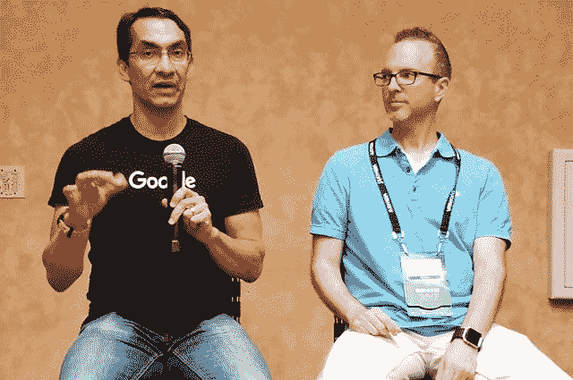
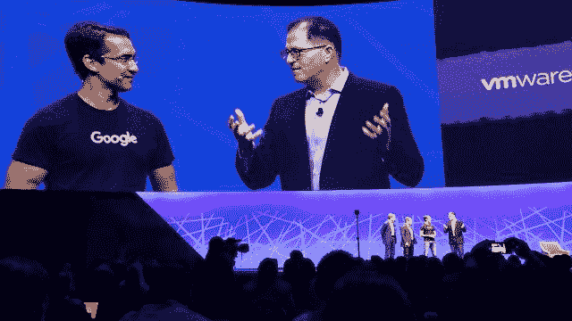
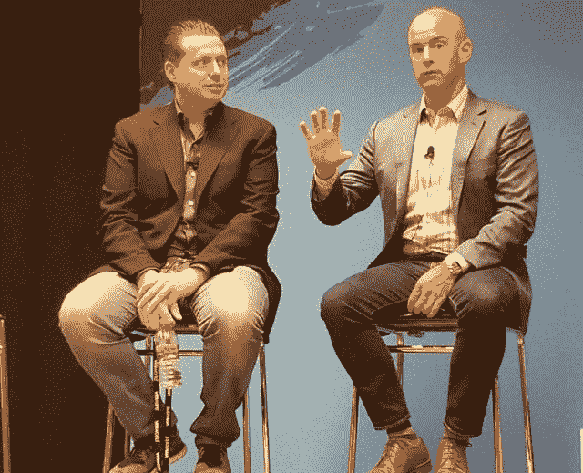

# pivotal Container Service Hardwires Cloud Foundry、Kubo 到 Google Cloud

> 原文：<https://thenewstack.io/pivotal-container-service-hard-wires-cloud-foundry-kubo-google-cloud/>

为了巩固 Kubernetes 在容器部署市场的核心地位，VMware 与 Pivotal 和 Google 联合宣布推出一个基于 Kubo 项目的商业容器部署和管理系统，名为 T2 Pivotal 容器服务 T3(PKS)。

这项服务承诺让开发者非常容易——特别是有了[Cloud Foundry](https://www.cloudfoundry.org/)——只需要一个 YAML 文件和一个 **kubectl** 命令就可以立即部署大规模的容器化应用。

“PKS 将永远包含 Kubernetes 的最新稳定版本，”Pivotal 首席执行官 Rob Mee 在 VMware 在拉斯维加斯举行的两个主题演讲中宣布，“保持与谷歌云引擎的持续兼容性”。它被设计成运行效率极高。它内置了 NSX，因此非常注重应用程序的安全性。它与谷歌云和谷歌云平台服务集成，开箱即用。”

[Kubernetes](/category/kubernetes/) 是 Google 开发的开源容器编排引擎，现在由[云原生计算基金会](https://www.cncf.io/)管理； [NSX](https://www.vmware.com/products/nsx.html) 是 VMware 的虚拟网络和安全平台。

“能够做到这种持续的兼容性，”谷歌云平台产品管理副总裁萨姆·拉姆奇说。“所有运营数据中心的人都知道，不一致是敌人。因此，如果我们能够为您提供相同的服务，同时，每当这个发展异常迅速的社区更新其软件时，我们将为您提供以相同方式运行的通用服务，这将使您的生活更加轻松。但是每个应用程序都需要服务来运行。所以我们也将谷歌云服务直接引入 PKS。”

正如坐在 Pivotal 高级产品总监理查德·塞罗特左边的拉姆奇*后来告诉新堆栈的那样，PKS 还将采用[开放服务代理 API](https://openservicebrokerapi.org/) ，用于以一致的方式连接多个后端系统。这种包含将得益于建立在 BOSH 发布管理工具之上的[——他称之为“来自云铸造社区的礼物”](https://bosh.io/)*

## 紧密集成的特殊优点

周二的事态发展显然呈现出明显的偏好。正如 VMware 代表周二在台上演示的那样，运营商现在可以从该公司历史悠久的虚拟化管理平台 [vSphere](https://www.vmware.com/products/vsphere.html) 中即时实例化 Kubernetes 集群。在与开发人员共享适当的凭证后，他们中的任何一个人都可以使用 **kubectl** 从 YAML 模板实例化一个应用，就像往常一样，并立即将该应用自动部署到该集群，Pivotal 的 [Kubo](https://pivotal.io/partners/kubo) 在后台处理自动部署。

这里至关重要的是，VMware 的网络虚拟化系统 NSX 已经到位，可以跨内部和 Google 云资源分布可用的基础架构。去年在同一个展会上，VMware 将 vSphere Integrated Containers、Photon Platform 及其与 IBM Cloud 的新合作关系作为向企业提供 NSX 的三重威胁。今年，VMware 正在为 NSX 交付做一个完全不同的案例，首先是周一宣布与亚马逊建立紧密的合作关系，然后是周二与谷歌建立同样强大的合作关系，由 Pivotal(戴尔技术领域与 VMware 的姐妹公司)提供便利。

在周二的新闻发布会上，Pivotal 负责 PKS 产品的高级副总裁[**詹姆斯·沃特斯**](https://pivotal.io/team/watters)**在回答新堆栈的问题时表示:“重要的是，我们正在阐明一种独特的混合伙伴关系。”。“谷歌、Pivotal 和 VMware 之间的重要共识是，谷歌在如何调配和管理 Kubernetes 消费方面拥有一些专业知识。我认为这是他们给这种合作带来的真正重大的事情:作为 Kubernetes 的创造者，他们正在验证我们的设计，并在 PKS 安排工程师来确保我们继续保持同步。这就是为什么我认为在谷歌的指导下，这将是在内部运行 Kubernetes 的最有吸引力的方式，当然，VMware 的一切都融入其中，确保没有比在 VMware 上运行更好的方式，因为 VMware 参与其中。”**

 **> “你必须明确两件事:围绕互操作性、思想的纯粹性、开源以及多云和混合的开放系统有一个社区活动。然后是它的商业应用。”—谷歌产品管理副总裁萨姆·拉姆奇

沃特斯提醒记者和分析师，Kubernetes 的开发人员正在不断创新 orchestrator 的 API，增加可以通过 **kubectl** 调用的功能的术语。“每个季度，ku bectl API surface 都有所有这些开发人员想直接使用的新特性。举个例子，如果你想更新你的代码，有一个命令 **kubectl rollingupdate** ，它允许你在容器间逐步推出你的代码。自定义资源定义的整个生态系统都显示在那个… API 中。一旦你意识到这具有网络效应，并且是开发者想要消费 Kubernetes 的地方，你就会意识到仅仅在它上面随意地放置一些东西来阻止它访问 Kubernetes 的 API 可能不是市场想要的。"

PKS 承诺为开发商和运营商提供持续更新的 Kubernetes 平台，该平台本身也通过 Kubo 进行更新。这样，任何正式发布的新 API 特性都可以在 PKS 立即使用。

## 互操作性的终结和认证的开始

这种特定级别的功能可能会自动赋予一个商业 Kubernetes 平台相对于其他平台的优势。这是一个事实，谷歌的山姆·拉姆奇在周二回应新堆栈的一个问题时没有忽略这一点。

“随着谷歌和 Pivotal 的一系列产品商业化，以及 VMware 和戴尔技术的商业化，你必须抓住两件不同的事情:围绕互操作性、思想的纯洁性、开源以及多云和混合的开放系统的社区活动。然后是商业应用，这需要专门的工程设计、专业服务和一定规模的生态系统，实际上可以实现这些——如果你要去现场，它还包括原始设备制造商的生态系统，无论你是在寻找基础设施的[*谷歌云引擎*还是其他东西。”

Ramji 继续说，这四家公司之间的商业协议特别支持工程设计，以便在不同类别的数据中心环境之间移动工作负载，或者——正如他所说，最终可能会变得更加常见——克隆这些工作负载，以帮助实现可扩展性。

他说，商业协议是特别必要的，以使谷歌云服务——例如，其用于分配大规模 NoSQL 工作负载的 [Bigtable 服务](https://cloud.google.com/bigtable/)——能够跨越谷歌的边界，进入客户场所和客户拥有或租赁的环境。

然而，当被要求澄清他关于“围绕互操作性的社区活动”的说法时，Ramji 同意互操作性实际上是开源社区的工作——一旦那些互操作性努力的产品被合并到商业产品中，这项工作就会发生转变。

“标准是为互操作性创造必要条件的社区实践，”谷歌的 Ramji 告诉新堆栈。“商业协议给了你足够的钱，因为你实际上必须付钱给人来做所有的测试。因此应该启用它，但我们将改进它，我们将支持它，就像我们与谷歌的网站可靠性工程组织一起改进和支持 Pivotal Cloud Foundry 一样。”(在加入谷歌之前，[拉姆奇是 Cloud Foundry 基金会的第一任 CEO](https://thenewstack.io/tns-makers-sam-ramji-commodore-pet-and-the-strange-road-to-microsoft/) 。)

换句话说，开源互操作性计划都很好，直到他们需要正现金流来资助必要的工程，使平台能够跨多个云大规模工作。这种规模的交易才能使 Kubernetes 走出婴儿期，使其成为可以认证的产品的一部分，并且 It 操作员可以接受专业培训来支持该产品。

## 光子向何处去

即使是去年 VMworld 的[亮点之一的](https://thenewstack.io/vmware-prepares-data-centers-for-the-onslaught-of-containers/)[VSP here Integrated Containers](https://www.vmware.com/products/vsphere/integrated-containers.html)(VIC)，也不足以让这种规模的 Kubernetes 开花结果，正如 VMware 自己的云原生应用总经理 [Paul Fazzone](https://www.linkedin.com/in/paulfazzone/) 在周二的新闻发布会上承认的那样。

正如坐在 Pivotal 的 James Watters 右边的 Fazzone[*上图所示，VIC 告诉分析师 Kurt Marko，“适合基本的应用程序重新打包用例，其中不需要容器编排和调度。一旦你进入任何更复杂的用例或场景，PKS 包括 Kubernetes 调度程序。因此，您现在在 vSphere 之上获得了一个成熟的容器编排和调度机制，并与 NSX 进行了深度集成，因此，当您调度那些支持您的特定应用的 pod 集合时，它不仅会部署在您基于 vSphere 的基础架构上，而且 NSX 技术会自动设置网络连接和安全策略，以符合企业标准的方式将所有这些微服务联系在一起。”*

维克在《PKS》中扮演角色吗？VMware 的 Photon 平台发生了什么变化？就在去年 2 月[，该平台似乎是该公司的下一代容器平台](https://thenewstack.io/vmware-foresees-future-photon-kubernetes-nsx-work-bare-metal/)，用于在 vSphere 之外实现基于 NSX 的部署。

“随着我们进入基于容器的应用的新时代，”Fazzone 对新堆栈做出回应，“vSphere 将继续支持各种传统和更现代化的操作系统，如其中一些容器框架。在这方面，我们正在与许多合作伙伴合作。

“具体来说，VSphere Integrated Containers 的开发旨在将本机容器主机和实例功能引入 VSphere，”总经理继续说道。“因此，您将看到它作为 vSphere 本身的核心功能集继续发展。它包含在 vSphere 中…您可以获得内置的基本功能。[ *但是*它不包含更高级别的容器调度器或编排机制。这就是 PKS 的用武之地。PKS 是一个成熟的基于 Kubernetes 的解决方案，侧重于第一天的部署和开发体验，以及在生产环境中运行 Kubernetes 应用程序所需的第二天功能。”

在随后的采访中，Fazzone 以过去时态提到了光子平台，这是他即将在[的新堆栈制造商](https://thenewstack.io/podcasts/makers)播客中露面的原因。虽然他目前无法提供细节，但他隔离了该平台的两个组件——其 Photon Controller 多租户控制平面和其 [Photon OS](https://vmware.github.io/photon/) 基于容器的最小化 Linux——作为两个组件，它们有可能在以后过渡到 Pivotal Cloud Foundry 平台时被用作“学习”。

我们看到的不是一个围绕容器编排的单一开源生态系统，而是一个围绕可伸缩应用程序部署的竞争市场，这个市场正在迅速发展。

[Cloud Foundry Foundation、](https://www.cloudfoundry.org/) [Google Cloud](https://cloud.google.com/kubernetes-engine) 和 [VMware](https://www.vmware.com/cloud-solutions/app-modernization/cloud-native-apps.html) 是新堆栈的赞助商。

图片来自斯科特·富尔顿。

<svg xmlns:xlink="http://www.w3.org/1999/xlink" viewBox="0 0 68 31" version="1.1"><title>Group</title> <desc>Created with Sketch.</desc></svg>**