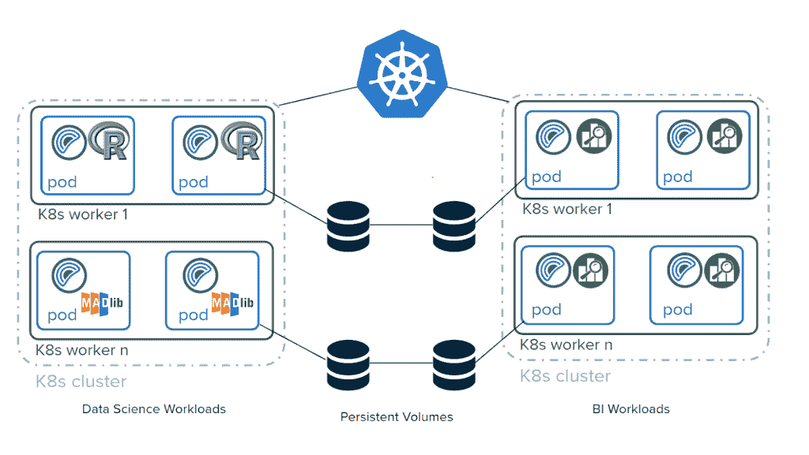

# Pivotal 为 Kubernetes 准备了 Greenplum 并行处理数据库

> 原文：<https://thenewstack.io/pivotal-readies-the-greenplum-parallel-processing-database-for-kubernetes/>

云原生平台提供商 [Pivotal Software](https://pivotal.io/) 将其旗舰级大规模并行处理分析数据库 Greenplum 带入了 Kubernetes 时代。

在上周的 [Greenplum 峰会](https://pivotal.io/event/greenplum-summit)上，该公司发布了用于 Kubernetes 的 [Greenplum，根据一篇介绍新产品的](https://greenplum-kubernetes.docs.pivotal.io/2-2/index.html)[博客文章](https://content.pivotal.io/blog/pivotal-postgres)，该产品“让数据专业人员和应用程序开发人员能够在安装 Kubernetes 的任何地方部署、操作和升级自助服务集群，无论是在云和云原生场景中”。

该公司还发布了 Greenplum 6 的新测试版[，并推出了全新的产品](https://content.pivotal.io/blog/pivotal-greenplum-postgres) [Pivotal Postgres](https://content.pivotal.io/blog/pivotal-postgres) ，这是开源 [PostgreSQL](https://www.postgresql.org/) 项目的完整打包和支持版本。

基于 PotsgreSQL，Greenplum 旨在管理大规模分析数据仓库和商业智能工作负载。

根据这篇博客文章，为 Kubernetes 启用 Greenplum 的关键在于 [Greenplum 操作员](http://engineering.pivotal.io/post/greenplum-for-kubernetes-operator/)，该操作员“代表 Kubernetes 用户创建、配置和管理复杂的有状态应用程序的实例，通知应该如何配置和部署 Greenplum。”这将帮助用户“避免较低级别的配置任务。”像许多为 Kubernetes 发布的同类产品一样，Greenplum for Kubernetes 适用于 Kubernetes 部署的任何地方，无论是 Pivotal 自己的 Pivotal Container Services (PKS)还是其他云提供商，如 Google Kubernetes Engine (GKE)，甚至是内部部署。

适应 Kubernetes 并没有真正影响 Greenplum 的体系结构，只要记住某些参数，“对性能几乎没有影响，”Pivotal 数据副总裁 Jacque Istok 解释道。

“Greenplum 的体系结构相对一致。在基本级别，如果您有一台主机、一台虚拟机或一台服务器，Greenplum 在该服务器上进行并行化的方式是安装十个 Postgres 实例。然后，你的查询将分布在同一台服务器上的 10 个 Postgres 实例中，所有的数据只有你的十分之一，”他说。

通过 Kubernetes，Pivotal 将每个 Postgres 数据库容器化，然后在它们之间移动数据的编排中进行烘焙。“通过 Kubernetes 运营商，我们允许这些容器中的每一个都与没有容器之前的功能非常相似，”Istok 说。

“所有的 SQL 数据库，包括 Postgres 和 Greenplum，通常运行得和底层基础设施一样快，”他进一步解释道。“您的 Greenplum 群集将与您的底层基础架构一样运行，这意味着您的 Kubernetes 体系结构需要能够在这些容器之间连接快速网络和快速磁盘 I/O，以便获得与非容器化相同的体验。”

除了新的 Kubernetes 产品之外，Istok 还重点关注了 Pivotal 最近在版本方面将 Greenplum 与开源 PostgreSQL 项目相提并论的努力，以及 Pivotal Postgres 的发布，这是“由 Pivotal 打包并提供商业支持的开源 PostgreSQL 二进制文件。”

当 Greenplum 在 2005 年创建时，它是从 Postgres 8.2 派生出来的。Greenplum 5 将其带到 Postgres 8.3，Greenplum 6 现在基于 Postgres 9.4，其优势是 Greenplum 获得了 Postgres 中引入的所有基本功能，可以专注于创新自己的功能。

“这是非常重要的，首先，因为 9.4 带来了 8.3 的所有创新，但它也允许我们更像传统的单处理器、单实例数据库那样运行，并且它还允许我们利用生态系统中存在的几乎最新的 Postgres 连接——这将是开源和商业的，”Istok 说。“我们花了大约两年半的时间才升级了一个版本。这段时间我们学到的是如何真正加速它。大约一年后，我们能够提前推出几个版本。对于 Greenplum 7，当它从现在起一年后推出时，我们将更加接近当前水平。”

至于 Greenplum 6 的具体新功能，Istok 指出了 Greenplum 5 的两个亮点。首先，Greenplum 6 采用了预写日志(WAL)，他说这使他们能够“开始提供高级功能，如时间点恢复和站点到站点复制。”其次，Istok 提到了针对更新和删除的行级锁定的引入，他说这使得混合工作负载的性能比 Greenplum 5 提高了 50 倍。

虽然 Greenplum 6 目前仅提供测试版，但预计将于 2019 年 6 月正式上市。

Pivotal 是新堆栈的赞助商。

通过 Pixabay 的特征图像。

<svg xmlns:xlink="http://www.w3.org/1999/xlink" viewBox="0 0 68 31" version="1.1"><title>Group</title> <desc>Created with Sketch.</desc></svg>