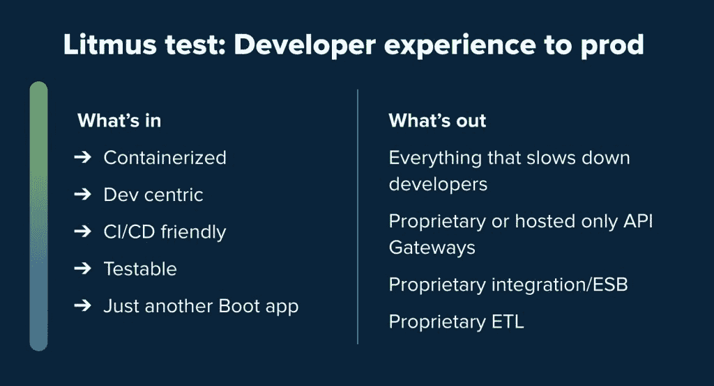

# Kubernetes 和以开发者为中心的石蕊测试

> 原文：<https://thenewstack.io/pivotal-springone-platform-keynote-overview-is-kubernetes-boring-yet/>

[Pivotal](https://tanzu.vmware.com/) 赞助了这个播客。

这是基础设施软件和开发平台的新的试金石:如果您不能为您的编码人员提供满意的体验，它可能不值得在您的企业中存在。当经历很糟糕时会发生什么？开发者避之不及，束之高阁。

良好的开发者体验是我们最新一集[新堆栈制造商](https://thenewstack.io/podcasts/makers)播客的生动对话的主题之一，该播客是在今年于得克萨斯州奥斯汀举行的 SpringOne 平台大会上录制的。Pivotal 产品高级副总裁 [James Watters](https://www.linkedin.com/in/jamesjwatters) 是嘉宾，VMware 首席工程师，Kubernetes 的联合创始人 [Joe Beda](https://www.linkedin.com/in/jbeda/) 也是嘉宾。TNS 创始人兼主编亚历克斯·威廉姆斯主持录制。

[Pivotal SpringOne 平台主题演讲概述:Kubernetes 无聊了吗？](https://thenewstack.simplecast.com/episodes/pivotal-springone-platform-keynote-overview-is-kubernetes-boring-yet)

大部分讨论都围绕着改善开发人员体验的最佳方式，以使从事企业软件工作的编码人员的生活更加轻松。当出现故障或问题时，开发人员的体验会怎样？“我的经验之一是，开发、试运行和生产之间的每个差异最终都会导致错误和中断。因此，只要你能使你的整个开发和发布完全一样，你就能更可靠地构建和发布软件，”Beda 说。

贝达接着解释。“所以 Kubernetes，这是一个复杂的系统，我认为其中一些是必要的复杂性。[……]作为一个基础设施，Kubernetes 在明确性方面存在错误，当你试图理解正在发生的事情时，这是一个很好的品质，但当[用户]第一次尝试学习它时，它会造成许多障碍，”他补充说，Kubernetes 的组件，如 pods 和副本集，部署管理版本，都是在彼此之上的。创建者指出，虽然这种分层在组件相互交互方面是有益的，但继续向 Kubernetes 核心添加东西是不可扩展的。

对话还谈到了 [Pivotal 应用服务 2.7](https://pivotal.io/platform/pivotal-application-service) 的发布如何反映了 Watters 主题演讲的主题。“CF 推送体验在 2.7 中继续发展。我们添加了一些功能，让您能够以更简单的方式进行蓝绿色部署，因为这也是关于开发人员的体验，让迭代变更进入生产环境。继续向前滚动。当我们引入 Kubernetes 作为容器层时，获得正确的开发者体验仍然是神圣的。这是我们说的第一批项目之一，“让我们从开发者的角度开始吧，”沃特斯说。

[https://www.youtube.com/embed/nRXD6OlBw9Q?feature=oembed](https://www.youtube.com/embed/nRXD6OlBw9Q?feature=oembed)

视频

### 在这个版本中:

[1:43:](https://thenewstack.simplecast.com/episodes/pivotal-springone-platform-keynote-overview-is-kubernetes-boring-yet?t=1:43) James，也许你可以总结一下你在主题演讲中所讲的内容？
[5:37:](https://thenewstack.simplecast.com/episodes/pivotal-springone-platform-keynote-overview-is-kubernetes-boring-yet?t=5:37) 一些主要的主题根据那石蕊测试。
[11:52:](https://thenewstack.simplecast.com/episodes/pivotal-springone-platform-keynote-overview-is-kubernetes-boring-yet?t=11:52) Kubernetes 作为“平台的平台”
[15:12:](https://thenewstack.simplecast.com/episodes/pivotal-springone-platform-keynote-overview-is-kubernetes-boring-yet?t=15:12) 自定义资源定义(CRD)及其适用性。
[18:03:](https://thenewstack.simplecast.com/episodes/pivotal-springone-platform-keynote-overview-is-kubernetes-boring-yet?t=18:03) 你对 CRDs 这个利器的定义是什么？你会如何描述他们？
[22:04:](https://thenewstack.simplecast.com/episodes/pivotal-springone-platform-keynote-overview-is-kubernetes-boring-yet?t=22:04) 你的思想在向哪里前进？

VMware 是新体系的赞助商。

<svg xmlns:xlink="http://www.w3.org/1999/xlink" viewBox="0 0 68 31" version="1.1"><title>Group</title> <desc>Created with Sketch.</desc></svg>