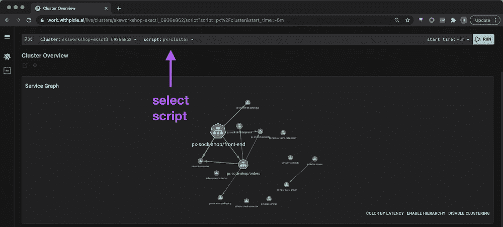

# Pixie 将集群内 Kubernetes 调试引入 CNCF

> 原文：<https://thenewstack.io/pixie-brings-in-cluster-kubernetes-debugging-to-cncf/>

12 月，可观测性服务提供商 [New Relic](http://newrelic.com/?utm_content=inline-mention) 收购了 [Pixie Labs](https://pixielabs.ai/) ，后者提供了一个 Kubernetes 集群内调试平台。现在，该公司已经在 Apache 2.0 许可下[开放了源代码](https://searchsoftwarequality.techtarget.com/news/252500281/New-Relic-open-sources-Pixie-observability-platform) Pixie，并且已经[开始了将该技术捐赠给](https://containerjournal.com/kubeconcnc/new-relic-to-donate-pixie-observability-platform-to-cncf/)[云本地计算基金会](https://cncf.io/?utm_content=inline-mention)的过程(并且签约成为 CNCF 的成员)。

Pixie 联合创始人兼首席产品官 Ishan Mukherjee 告诉 The New Stack，该公司对该项目的雄心是让它成为“默认的可观察性平台，类似于 Prometheus 的 metrics 和 Kubernetes 的容器编排”。

在本周的 kube con+cloudnativecon EU 期间，Pixie 联合创始人兼首席执行官 [Zain Asgar](https://www.linkedin.com/in/zasgar) 在与 CNCF 总经理 [Priyanka Sharma](https://www.linkedin.com/in/pritianka) 的主题演讲中指出，该项目将如何帮助扩展可观测性，以帮助用机器学习和其他方式处理大量数据“这还没有真正发生”

这个项目势头很大。

Pixie 的董事会成员是 [Kelsey Hightower](https://twitter.com/kelseyhightower?lang=en) ，Google Cloud 的首席开发者代言人；Pixie 的慕克吉和亚马逊网络服务的首席工程师亚娜·多安(T21)。

Pixie 是在 2018 年慕克吉和阿斯加尔离开苹果和谷歌后开始的一个项目。慕克吉说:“这个项目背后 New Relic 的核心能量是赋予数据爱好者权力的想法——这就是它真正的由来。”。

阿斯加尔说，Pixie 开发团队的一个主要目标是“为运行在 Kubernetes 上的任何应用程序提供即时的基线可见性”。

“我们希望我们的用户在几秒钟内就能准确了解他们的系统，而不是几个月。通过运行一个 CLI 命令，Pixie 将自动开始收集全身请求、指标、网络数据等信息，”Asgar 说。

通过 Pixie，Asgar 描述了用户如何查看他们的整个集群，注意到特定 pod 中的 HTTP 延迟，“并深入到该 pod 的堆栈跟踪，以查看导致延迟的原因——所有这些都被收集起来，并在无需任何代码更改的情况下供用户访问，”Asgar 说。

不需要修改代码的方面来自于 eBPF 支持的自动插装[，它允许程序在 Linux 内核中运行而不需要修改源代码。](https://thenewstack.io/how-ebpf-turns-linux-into-a-programmable-kernel/)

## CNCF 升压

CNCF 有望作为一个开源项目为平台提供更多可见性，同时提供云原生项目支持，这对于可观测性平台至关重要。

除了开源项目提供的既定优势之外，Asgar 还描述了加入 CNCF 的决定代表着“更进一步”

“今天的开发人员和组织足够精明，能够理解并非所有的开源软件都是平等的。最有影响力的开源工具保持了开源软件的完整性和精神，即使它们是由一家公司维护的，”Asgar 告诉 The New Stack。“我们不想成为一个‘装饰性的’开源软件工具，与付费产品紧密相连，所以我们启动了将 Pixie 贡献给 CNCF 的进程。”

阿斯加尔说，新遗迹也在“全力以赴”CNCF [开放遥测](https://opentelemetry.io/)可观测性框架，并补充说 Pixie 将兼容开放遥测。

阿斯加尔说，New Relic“正在围绕 OpenTelemetry 进行标准化，以使 New Relic 产品与我们用户喜爱的其他工具更具互操作性”。为此，New Relic 还在其 New Relic One 平台上开源了代理、集成、SDK、CLI 和定制可视化，“使工程师更容易访问和构建定制仪器，”阿斯加尔说。

Pixie 的主要功能包括:

*   **自动检测:** Pixie 将自动开始收集请求、指标和网络数据。如上所述，eBPF 为自动仪器提供了动力，Asgar 指出这是“通过网飞的内核和性能工程师 Brendan Gregg 的开创性工作而普及的”
*   **完全脚本化的控制:**受团队开发经验的启发，Pixie 的目标是使可观察性和故障排除更加基于代码。“对于那些希望自动化更多工作流程的人来说，这是一个巨大的胜利。我们的查询语言和 API 使得对 Pixie 数据进行分析并导出结果变得很容易，”Asgar 说。“我们已经看到非常聪明的 Slackbots 在 Pixie 上运行查询，我们很高兴看到用户还能提供什么。”
*   **集群内边缘计算:**“这个平台的目的是识别和解决生产应用中的问题，”阿斯加尔说。“这在理论上听起来很棒，许多其他项目也有这个目标，但历史上有一些障碍。”

例如，阿斯加尔描述了与收集正确数据相关的困难，他说这些困难“非常重要”。虽然系统指标是相当容易访问的，但是从应用层访问相关数据，比如数据库调用或 HTTP 请求，通常需要代码级的更改来检测系统。“当您试图对生产中的问题进行故障排除时，却发现您的仪器存在缺陷，这可能是一个很大的难题。数据分析也是一个挑战，”阿斯加尔说。

作为一个解决方案，Pixie 开发人员的主要目标之一是“为运行在 Kubernetes 上的任何应用程序提供即时的基线可见性，”Asgar 说。

<svg xmlns:xlink="http://www.w3.org/1999/xlink" viewBox="0 0 68 31" version="1.1"><title>Group</title> <desc>Created with Sketch.</desc></svg>