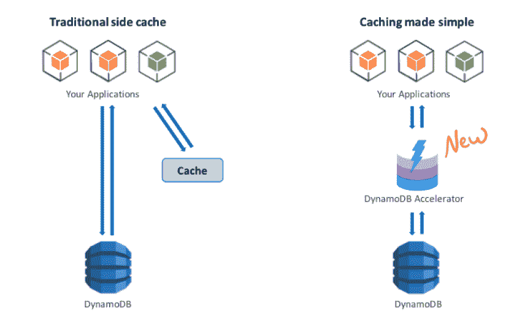
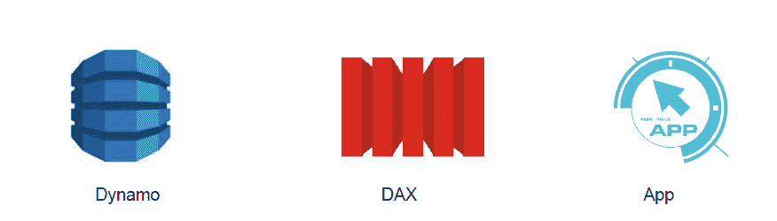
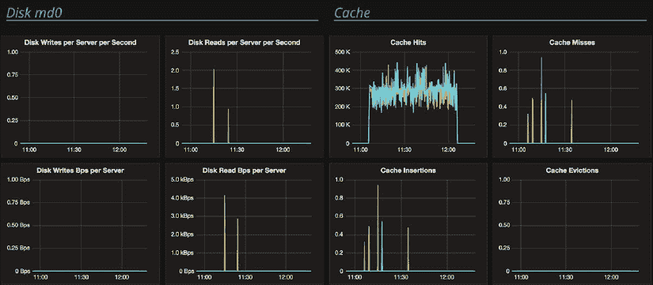

# 为什么不在数据库前放置缓存的 7 个理由

> 原文：<https://thenewstack.io/place-ccache-front-database-like-amazon-dynamodb-accelerator-dax/>

 [多尔劳尔

多尔劳尔。Dor Laor 是 ScyllaDB 的联合创始人兼首席执行官，ScyllaDB 是一个替代由 C++驱动的 Apache Cassandra 的开源 drop。之前，Dor 是被 Red Hat 收购的 Qumranet 下的 KVM hypervisor 的创始团队的一员。在 Red Hat，Dor 管理了 KVM 和 Xen 开发好几年。他拥有 Technion 硕士学位和单板滑雪博士学位。](http://www.scylladb.com/) 

最近，亚马逊网络服务发布了一个托管缓存解决方案，[亚马逊 DynamoDB 加速器](https://aws.amazon.com/dynamodb/dax/) (DAX)，在其[数据库](http://www.allthingsdistributed.com/2017/06/amazon-dynamodb-accelerator-dax.html)前
。这篇文章将讨论外部[数据库](https://thenewstack.io/category/data/)缓存的利弊。当当前的数据库部署无法满足所需的 SLA 时，开发人员通常会考虑缓存。这是一个明显以业绩为导向的决策。

缓存可能看起来像是一个简单快捷的解决方案，因为部署可以在没有很多麻烦的情况下实现，并且不会在数据库扩展或更糟的情况下导致大量成本、数据库模式重新设计甚至更深层次的技术转换。

通常，缓存部署以副缓存的形式实现，如下图左侧所示，引用自 [DynamoDB](https://aws.amazon.com/dynamodb/) 。缓存独立于数据库，应用程序负责缓存一致性。应用程序对缓存和数据库执行双重写入。首先从缓存中读取数据，只有当数据不在缓存中时，才会单独读取数据库。

可以想象，关于一致性、高可用性和复杂性的问题会立即出现。

图 1:简化的缓存。

上面的图 1 显示了像 DAX 这样的透明缓存的优势:它不需要应用程序更改，并且是自动一致的。DAX 消除了主要的数据一致性问题。但是，即使像 DAX 这样的直写式缓存实施在其内部实施中也存在挑战。例如，考虑并行写+读请求的情况(图 2)。

在 t1，客户端发出写操作 w1。
在 t2，客户端发出读 r1。
在 t3，客户端发出写入 w2。

DAX 要求遵循 DynamoDB 的精确锁定和一致性方案，因此 r1 的结果将与 Dynamo 的保证一致。当面临涉及 DAX 缓存节点或 DynamoDB 的数据节点的故障时，结果需要相同。对于饱受延迟问题困扰的 DynamoDB 用户来说，好消息是他们不再需要担心应用程序的一致性或复杂性。

但这是最好的行业标准吗？数据库注定要有一个缓存吗？我们 ScyllaDB 认为这些缓存效率低下，至少可以这么说，用户应该避免使用缓存，除非他们别无选择。以下是七个原因:

## 1.外部缓存增加了延迟

一个单独的缓存意味着路上的另一跳。当缓存包围数据库时，第一次访问发生在缓存层。如果数据不在缓存中，那么请求被发送到数据库。结果是增加了本已缓慢的非缓存数据路径的延迟。有人可能会说，当整个数据集适合缓存时，额外的延迟不会起作用，但大多数情况下，会有多个工作负载/模式命中数据库，其中一些会带来额外的跳成本。

## 2.外部缓存是额外的成本

缓存意味着 DRAM，这意味着每千兆字节的成本高于固态硬盘/硬盘。在额外的 RAM 可以存储频繁访问的对象的情况下，最好利用现有的数据库 RAM，并尽可能增加它，以便将其用于内部缓存。在其他情况下，工作集大小可能太大，有些情况下达到数 Pb，因此另一种 SSD 友好的实现是首选。

## 3.外部缓存降低了可用性

缓存的高可用性(HA)解决方案通常不如数据库自己的 HA。现代分布式数据库有多个副本；它们还具有拓扑意识和速度意识，能够承受多种故障。

例如，Scylla 中常见的复制模式是三个本地副本，确认回复需要一个仲裁。此外，副本驻留在远程数据中心，可以进行查询。

缓存没有良好的高可用性属性，很容易出现故障，或者出现部分故障，这在一致性方面更糟糕。当缓存出现故障时(所有组件注定会在某个时候出现故障)，数据库将达到最大吞吐量，您的 SLA 以及您对最终用户的保证将无法得到满足。

虽然 DAX 的设计和实现是专有的，但我倾向于相信 DAX 开发人员没有牺牲可用性，但是很难说在三个可用性区域的情况下会发生什么。

## 4.应用程序复杂性—您的应用程序需要处理更多案例

复杂性当然不是 DAX 的情况，但它适用于标准的外部缓存。一旦有了外部缓存，就需要保持缓存与客户端和数据库同步。例如，如果您的数据库运行修复，缓存需要同步(或失效)。您的客户端重试和超时策略需要与缓存的属性相匹配，但也需要在缓存完成时发挥作用。通常，这样的场景很难测试。

## 5.外部缓存会破坏数据库缓存

现代数据库有内部缓存和管理缓存的复杂策略。当您在数据库前面放置一个缓存时，大多数读取请求只会到达外部缓存，数据库不会将这些对象保存在内存中。因此，数据库缓存是无效的，当请求最终到达数据库时，它的缓存将是冷的，响应将主要来自磁盘。

## 6.外部缓存不安全

同样，安全性不是 DAX 的问题。但是自然地，对放在缓存中的数据的加密、隔离和访问控制可能与数据库层本身的不同。

## 7.外部缓存忽略了数据库知识和数据库资源

数据库非常复杂，会给系统带来很高的磁盘 I/O 工作负载。任何查询都访问相同的数据，为了节省磁盘访问，可以在内存中缓存一定量的工作集大小。一个好的数据库应该有多个复杂的逻辑来决定应该缓存哪些对象、索引和访问。

数据库还应该有各种回收策略(最近最少使用的策略就是一个简单的例子)，这些策略决定新数据何时应该替换现有的旧缓存对象。另一个例子是抗扫描缓存。扫描大型数据集时，会从磁盘中读取大量对象，或者在缓存中接触大量对象。数据库可以意识到这是一次扫描而不是常规查询，并选择将这些对象放在其内部缓存之外。

数据库自动将缓存的内容与磁盘和传入的请求同步，因此用户和开发人员不需要做任何事情就可以实现这一点。

如果由于某种原因，您的数据库响应不够快，这意味着 a)缓存配置错误，b)没有足够的 RAM 用于缓存，c)工作集大小和请求模式不适合缓存，或者 d)数据库缓存实现很差。

我们在 ScyllaDB 投入了大量的精力，使我们的内部嵌入式缓存摇滚。这是你的 RAM 投资将会大放异彩的地方。我们的缓存可以跨越主机的整个内存，从仅仅 16GB 到 1TB。不需要配置，我们动态的把 RAM 分成几个区域。

因为我们的 malloc 算法是日志结构的，所以内存利用率很高——不需要将内存放入两个 bulks 中。分配是可复制的，我们可以压缩内存，这样它就不会随着时间的推移而变得支离破碎。分配是仅附加的，因此速度很快。关于分配器的更多细节可以在这里找到。

Scylla 不依赖于外部缓存，如 Linux 页面缓存，所以它可以存储对象本身而没有开销。如果数据不在缓存中，Scylla 会知道，不会导致页面错误；相反，它发出一个异步 DMA 操作来从磁盘中检索数据。

[Henrik Johansson](https://twitter.com/dahankzter) ，搜索服务 [Eniro](https://www.eniro.se/) 的高级开发人员，由于速度原因，领导了从 [Redis 到 Scylla](http://www.scylladb.com/users/case-study-eniro-choses-scylladb-over-redis-and-kafka-for-data-streaming-application/) 的迁移。“是快了。我们已经开始习惯于看到微秒级的延迟，而不是毫秒级。”

[全球最大的推荐引擎 Outbrain](http://www.outbrain.com/) ，缩小了其 Cassandra 集群的规模，取消了其前面的 memcache 服务，甚至改善了[过程](http://www.scylladb.com/users/case-study-outbrain-manages-2-billion-records-with-persistence-and-always-on-availability-with-scylla/)中的延迟。我们在 AWS 上的 i2.8xl 基准测试中可以找到一个有效缓存的例子。来自[基准](http://www.scylladb.com/product/benchmarks/aws-i2-8xlarge-benchmark/)的下图显示了 Scylla 在小范围读取测试中的磁盘和缓存行为。几乎所有的请求都由 Scylla 的缓存提供服务，没有理由将缓存放在数据库的前面、旁边或后面。

图 3: Scylla 的磁盘和缓存行为。

<svg xmlns:xlink="http://www.w3.org/1999/xlink" viewBox="0 0 68 31" version="1.1"><title>Group</title> <desc>Created with Sketch.</desc></svg>