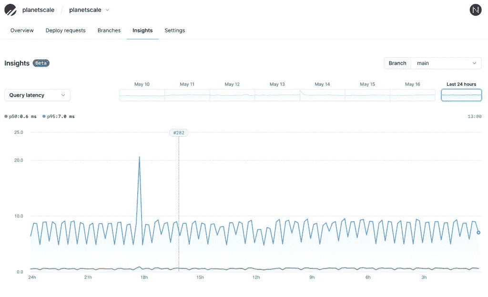

# PlanetScale:为数据库服务提供更多的监控、连接和区域

> 原文：<https://thenewstack.io/planetscale-more-monitoring-connections-and-regions-for-the-database-service/>

PlanetScale 是由 [Vitess](https://vitess.io/) 提供支持的同名[无服务器](https://thenewstack.io/category/serverless/) MySQL 数据库的幕后公司，该公司宣布了新的功能，以交付其所谓的[未来数据库](https://principles.preview.planetscale.com/) ，一套概述数据库应该是什么样子的原则。

“有些事情我们已经做了，有些事情我们还没有做，但会涉及到。这就是我们认为的未来数据库的样子，” [PlanetScale](https://planetscale.com/) 的工程副总裁 [Nick Van Wiggeren](https://github.com/nickvanw) 上周在 [KubeCon EU](https://www.cncf.io/kubecon-cloudnativecon-events/?utm_content=inline-mention) 接受采访时说。

该公司坚持认为，最近在数据库方面的所有创新都没有把开发者的需求放在心上。这就是它的重点所在。

“有一些基本的东西，比如它很容易操作之类的。但也有一些更大的原则范式，如它应该是全球可用的，可由任何端点修复，非常线性可扩展。但我认为，我们还有很多工作要做，不仅要使它可扩展，不仅要使它能工作，还要使开发者在任何时候都能轻松使用，达到那个规模，然后在此基础上构建人们期望的所有功能，”他说。

今天宣布的新功能包括:

**Insights** 基本上是一个内置在产品中的应用监控平台。

“它旨在帮助您更好地了解数据库查询性能和数据库性能。我们有一个非常非常基本的版本，我们今天称之为查询统计，我们正在做得更好。…您可以获得各种人正在运行的非常棒的、细粒度的统计数据。因此，我们将开始展现单个查询的性能，比如它扫描了多少行，你的 p50 是多少，p99 是多少等等，”Van Wiggeren 说。

PlanetScale 记录每个查询的能力为用户提供了详细的性能指标，使他们能够在几秒钟内识别出有问题的查询。它消除了安装第三方 APM 的需要，并允许用户实时查看哪些查询可以优化。这也让用户可以看到他们的查询扫描了多少行，从而更好地了解他们的计费使用情况。带有部署请求和模式更改时间戳的图表显示了版本如何影响性能。

**门户**使用户能够创建只读数据库区域，以支持全球分布的应用程序，并更好地为全球用户服务。

“你只需在我们的网络用户界面上点击两次按钮，就可以启动一个只读数据库，并为你在欧洲的客户获取本地数据，基本上是除南极洲以外的任何大陆，”他说。

尽管名为 PlanetScale，但在过去，planet scale 并没有在全球范围内使用。这一新特性提供了较低的操作开销、较低的数据库读取延迟和增强的全局性能。

通过 **Connect，**公司发布了 API 和 Airbyte connector，让你可以将数据同步到你的数据仓库和其他数据存储中。它使整个组织都可以访问数据，从而支持高速分析，让用户可以更好地利用数据。用户将能够从 PlanetScale 提取数据并安全地加载到其他平台，如雪花、红移和 BigQuery，支持分析工作流，而不用担心破坏生产数据。

“我们看到了开发人员体验的一场革命，现代基础设施平台提供了更高水平的集成、开发人员生产力和运营能力。然而，在适应现代软件工程实践的过程中，数据库是最后的支柱，”RedMonk 的联合创始人 James Governor 说。“随着其最新版本的发布，PlanetScale 正在推动数据库设计，以满足与云一起成长的开发人员的需求及其设定的期望。”

今年 3 月，该公司宣布了回卷(T7 ),它被认为是一个“简单的按钮”,可以立即撤销模式迁移。11 月，在六个月的测试后，它发布了零宕机的模式迁移技术。它还引入了基于 Vitess vReplication 特性的技术，使用户能够轻松地从任何现有的 MySQL 数据库导入数据。

“我想到了一些真正一流的科技公司，它们面临着巨大的数据库问题，对吗？你想推进业务的公司，你想走得更远的公司，因为你的数据库而受到限制的公司。而且这是一个超级普通的故事；每个人都会碰到这些问题。

“所以当我们开始时，我们说，‘如果我们可以建立一个数据库，它可以扩展到我们已经看到的其他数据库无法扩展到的东西，而且还可以让开发人员在实现这种规模的同时，可以建立得更快，更好，比任何其他技术都更远，会怎么样呢，”范·威格伦说。

“所以我们认为我们结婚的结合规模令人发指，对吗？Vitess 技术是在 YouTube 上开发的。它已经扩展到数千台机器、数百万个连接等等。它已经得到了大规模的证明，我们正在把它做得足够小，让你可以从它开始，并在年复一年的业务建设中不断扩大。

“然后，我们将构建连接、洞察、门户、模式撤销等功能，甚至分支和部署请求。我们正在一个经过规模验证的数据库上构建所有这些开发人员体验功能。因此，我们为开发人员提供了更快、更安全地构建的两种方式，同时也让他们能够永远不必寻找新的数据库，因为 PlanetScale 将与他们一起成长。”

<svg xmlns:xlink="http://www.w3.org/1999/xlink" viewBox="0 0 68 31" version="1.1"><title>Group</title> <desc>Created with Sketch.</desc></svg>