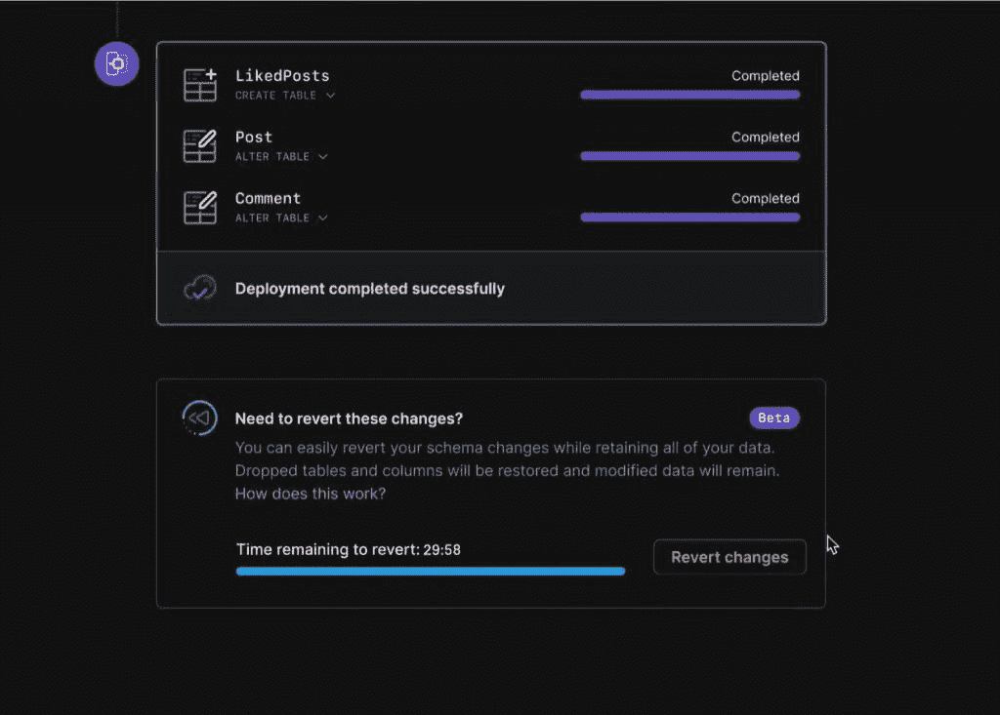

# PlanetScale Rewind:一个针对糟糕模式迁移的“撤销”按钮

> 原文：<https://thenewstack.io/planetscale-rewind-an-undo-button-for-bad-schema-migrations/>

在担任 GitHub 数据库管理员的第一周， [Sam Lambert](https://www.linkedin.com/in/isamlambert) 在修改模式时使网站崩溃。

“我想给人留下超级深刻的印象。这是我的第一周。我想帮忙。他们认为他们已经清理了访问某些数据库列的所有代码片段，比如，你知道，我们不再使用的这个列，我想全部清理，让应用程序中的模型看起来不错，”他愉快地走到命令行进行请求的更改。

该平台停机了两个小时，当它恢复运行时，发生变化时的数据已经丢失。

“我又能感觉到回应了，现在在我的胃里。太恐怖了。真的很可怕，” [PlanetScale](https://planetscale.com/) 的首席执行官回忆道。

这是一个常见的错误，也是 PlanetScale 通过 Rewind 瞄准的一个错误，Rewind 是一个“撤销”按钮，使用户能够在几秒钟内从破坏生产数据库的模式更改中恢复。实际上，它相当于 Control-Z，允许您回滚模式更改，但不会丢失从该断点收集的任何[数据](https://thenewstack.io/category/data/)。

“这很常见吧？”PlanetScale 工程副总裁[尼克·范·威格伦](https://www.linkedin.com/in/nicholas-van-wiggeren-85444528/)解释道。“工程师认为，‘我可以删除这个列，因为没有任何东西在使用它，或者我可以改变这个表，我的代码会处理它。’常见的错误。他们认为自己是对的；他们不是。然后突然之间，他们陷入了生产中断或数据库崩溃的境地。"

他把倒带描述为让你回到过去的“魔法按钮”。

“所以你想注册新用户——你总是在注册新用户。…但是，如果您破坏了网站的不同部分，您不希望只是回到进行模式迁移的时候，因为那样您会丢失在此期间进行的所有新注册。因此，Rewind 能够做的实际上是规划出我如何能够撤消我刚才做的迁移，同时仍然确保数据库是可操作的。所有写入的数据都是有效的。”

## 治理野生动物

PlanetScale 是一个建立在 [Vitess](https://vitess.io/) 之上的[无服务器](https://thenewstack.io/category/serverless/) MySQL 数据库，Vitess 是 YouTube 开发的开源项目，用于在 YouTube 高速增长期间水平扩展其数据库。基本上，Vitess 是一个分片中间件系统，位于您的应用程序和 MySQL 的分片之间，将数据库呈现为一个单独的实体，因此您的应用程序不必担心跟踪哪个分片保存了被查询的数据。

Vitess 成为 2019 年毕业的[云原生计算基金会](https://cncf.io/?utm_content=inline-mention)项目。其用户包括 GitHub、HubSpot、Slack、SoundCloud 和 Square。

在六个月的测试后，该公司于 11 月宣布了其零停机时间模式迁移技术的全面上市。

它还引入了一项基于 Vitess vReplication 功能的测试技术，使用户能够轻松地从任何现有的 MySQL 数据库中导入数据。Van Wiggeren 称之为 MySQL 和 Vitess 之上的“jetpack”。倒带是由这项技术构建的。

“它能够获取变更日志，就像来自 MySQL 的二进制日志一样，当您执行模式迁移时，它能够转换这些更改，并说，‘这是迁移后数据的样子。这是数据在迁移前的样子，”他解释道。

在迁移后的 30 分钟内，它可以确保您有一个准确、最新的数据库事务图。你可以在一秒钟之内在两者之间切换，以确保一切都是正确的。

这一切都建立在 Vitess 理解和操作 MySQL 的能力之上。“对用户来说，它只是看起来像一个数据库应该如何工作，”范·威格伦说。

这些模式更改是一些公司停机的主要原因，这些公司通常需要数小时(如果不是数天的话)的手动过程来比较数据库备份，并通过二进制日志来查找表被删除的确切时间点。据该公司称，Rewind 为开发人员提供了这个“简单的按钮”来快速修复它，而不是让 DBA 团队来处理这个问题。

## 消除开发人员风险

[Vercel](https://www.linkedin.com/in/leeerob/)的开发者关系总监 Lee Robinson 称之为令人兴奋的功能。

“从我作为前端开发人员的角度来看，PlanetScale 有助于降低任何想要使用数据库的开发人员的门槛。像 Rewind 这样的功能通常只有那些具有丰富后端或 DBA 经验的人才能使用，现在越来越多的开发人员都可以使用了，”他说。

“倒带也类似于前端开发。你推动了一个打破你前端的改变，你就退回去了。现在，你推动一个改变，打破了你的后端，你倒带。它降低了开发人员创新和尝试新事物的风险。”

PlanetScale 与面向前端开发人员的平台 Vercel 进行了集成。11 月，它还推出了 Next.js 入门应用程序，可以轻松地将 PlanetScale 部署到 Netlify，并与 [Prisma](https://www.prisma.io/) 、Node.js 和 JavaScript ORM 集成。

该公司在 6 月份宣布了由 Insight Partners 牵头的 3000 万美元的 B 轮融资，并在 11 月份宣布了由 Kleiner Perkins 牵头的 5000 万美元的 C 轮融资，现有投资者 a16z、SignalFire、Insight Partners 和其他人参与了融资。新堆栈是 Insight Partners 的全资子公司。

## 关注用户体验

PlanetScale 自称是开发者第一的数据库，不需要任何知识或云区，集群大小和其他以数据库为中心的细节增加了开发者的复杂性。它认为回滚是其他数据库所没有的特性。

RedMonk 分析师 [Stephen O'Grady](https://www.linkedin.com/in/sogrady/) 说，据他所知，这是真的。

“从历史上看，数据库设计更多地关注性能、存储过程、触发器等核心特性，而较少关注用户体验。因此，与应用程序开发领域不同的是，这些年来，使用数据库的体验并没有太大的变化，”他说。

兰伯特坚持认为，即使是过去几年推出的数据库——它们包括 [Azure Cosmos DB](https://thenewstack.io/cosmos-db/) 、[cockoroach DB](https://thenewstack.io/cockroachdb-1-0/)、 [Fauna](https://thenewstack.io/faunadb-harnesses-serverless-cloud/) 、 [MongoDB Atlas](https://thenewstack.io/mongodb-unveils-managed-graphql-for-mongodb-atlas/) 、 [DataStax Astra](https://thenewstack.io/datastax-astra-offers-a-serverless-option-for-cassandra/) 等——也采取了一种“音盲”的用户体验方式，过多地关注数据存储，而对开发人员的痛苦关注太少，尽管这些人[会对此进行争论](https://thenewstack.io/cockroachdb-serverless-launches-aspires-to-be-developers-database/)。

Van Wiggeren 补充道:“在过去的 10 年或 15 年里，整个行业，你知道，数万亿美元的价值都是通过让开发人员的生活变得更容易而创造的——Kubernetes，Lambda 推动的无服务器…你知道， [AWS](https://aws.amazon.com/?utm_content=inline-mention) 和谷歌云允许你做的所有事情都是为了让开发人员和公司更有效率。"

他说，然而数据库是栈中保持最少的部分。

“对于许多改变工作流的公司来说，我仍然建议进行模式迁移，我开一张票，把它交给我的 DBA 团队，我的 DBA 团队针对它运行一个 Perl 脚本，并说，‘好吧，我认为我们应该添加索引。’您添加了索引，他们说在您的模式迁移进入之前需要五到七个工作日。"

他说，即使在 GitHub 这样的公司，这在很大程度上也是一个过程，但这不是 2022 年企业需要的执行速度。

“在 PlanetScale，我们试图抛弃人们经历过的、我们自己也经历过的许多顽固不化的东西，实际上是在构建一种能够跟上其他地方软件开发的东西，这种东西能够跟上无服务器的发展。这将跟上从 Vercel 和 Netlify 到 Fargate 和其他 Amazon 原语在大小云中取得的所有惊人进步。我们不只是想给人们提供存储数据的最佳场所。我们希望给人们带来数据库，让他们以所需的速度建立自己的公司，”他说。

他们说，自去年 11 月宣布正式上市以来，该公司经历了令人惊讶的爆炸式增长。他们今年要做的事情之一是将 Kubernetes 的复杂性从用户那里抽象出来。

Vitess 被迁移到了 Kubernetes 的前身[博格](https://kubernetes.io/blog/2015/04/borg-predecessor-to-kubernetes/)，支持了 [PlanetScale 的断言](https://thenewstack.io/planetscale-hyperscale-cross-cloud-mysql-for-rapid-growth/)，即 Vitess 在 Kubernetes 存在之前就为 Kubernetes 做好了准备。但是 Lambert 和 Van Wiggeren 认为，虽然 Kubernetes 非常复杂，因为它非常强大，但这并不意味着每个组织都需要处理这种复杂性。它不一定只是传递给客户的东西。

“我们的目标是为我们的用户吸收一些复杂性，……无论他们是小用户还是大用户……为客户提供一些他们可以在一分钟内开始使用的东西。Van Wiggeren 说:“对我们来说，在堆栈的所有这些层中都有持续的创新是至关重要的。

<svg xmlns:xlink="http://www.w3.org/1999/xlink" viewBox="0 0 68 31" version="1.1"><title>Group</title> <desc>Created with Sketch.</desc></svg>