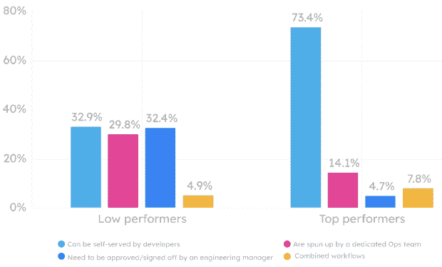
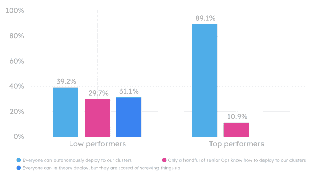

# 规划、开发平台是 Kubernetes 的关键:Humanitec 研究

> 原文：<https://thenewstack.io/planning-dev-platforms-key-to-kubernetes-humanitec-study/>

了解一个工具是很好地使用它的关键，这个概念不仅仅适用于你的周末爱好项目。对于像 [Kubernetes](https://thenewstack.io/category/kubernetes/) 这样的必需品来说，就像艺术家最喜欢的画笔或木工车床一样。培养对你的系统的透彻理解可以提高你的工作效率。

 [卢卡·加兰特

卢卡是 Humanitec 的产品经理。他每个月都要给几十个工程团队做例行演讲。他总结了他从查看数百个 DevOps 设置中获得的知识和收获，并将其整理成简明易懂的读物，供业内人士阅读，无论是新手还是云专家。](https://www.linkedin.com/in/luca-galante/) 

…或者至少应该如此。许多开发人员几乎没有足够的时间来学习他们喜欢的工具包的基础知识，更不用说深入研究使它们具有企业价值的复杂性了。现实是，掌握 Kubernetes 不是一件小事。尽管对于这样一个强大的工具来说，它的复杂性还不算过分，但它往往会对那些试图找到自己立足点的人产生不利影响。

这正是我们发布 2022 年 Kubernetes 基准研究内容的原因。随着采用率的稳步增长，越来越多的团队正在利用云原生工作流，但并不总是能获得他们预期的结果。

以下是我们发现的 K8s 迁移状况以及如何在 2022 年从集装箱化中获得最大收益的简要概述。

我们花了几个月的时间与整个行业的 1160 多个开发团队合作，对他们的 K8s 设置和实践进行基准测试。在此过程中，我们探讨了以下问题:

*   高绩效组织的 K8s 使用有何不同？
*   一个团队的结构、文化和方法如何影响其在 Kubernetes 的成功？
*   从表现不佳的 K8s 新手到成功的集装化高手，有没有可行的路径？
*   有没有正确的方法来创建一个面向未来的 K8s 设置？

我们的研究纳入了一个自定义的 Kubernetes 绩效评分，或 KPS。根据他们对我们问题的回答和大量的数据点，我们给组织的 KPSes 评分从 0(低绩效者)到 100(高绩效者)不等。

接下来，我们对回答进行了过滤，只考虑提供完整信息的团队。虽然这极大地限制了回答者群体，但我们认为它描绘了当前 K8s 生态系统中更公平的使用情况。

## 成功需要的不仅仅是良好的意图

我们的工作揭示了低绩效者和高绩效者之间的许多明显区别。最令人痛苦的一点在于实施领域:超过 66%的优秀领导者已经将他们的所有服务集装箱化，而只有 22%的低绩效领导者紧随其后。

Kubernetes 的采用也有同样的趋势，这意味着适应集装箱化是充分利用 K8s 的关键。这非常有意义，因为 K8s 是一个容器编排系统，但是在推动成功的 K8s 迁移时，我们也听到了其他一些常见的说法:

*   **低估 K8s 的复杂性:**高表现者和低表现者都经历过这种情况，两组之间的差异很小。在您开始构建集群或购买云提供商之前，进行深入的培训可能是值得的。
*   **在采用之前抱有不切实际或不准确的期望:**许多潜在的采用者遇到了问题，比如发现 K8s 很难使用——或者至少比他们想象的要难。其他人发现他们节省的钱比预期的少，或者在此过程中被云服务的不兼容性绊倒。

简而言之，如果你坚持脚踏实地，你可能会过得更好。K8s 可以解决许多问题，但只有适当的规划，更重要的是，愿意致力于集装箱化。

## 障碍:安全性、团队管理、自助服务

我们发现的一件有趣的事情是，一些常见的技术障碍在 K8s 迁移过程中反复出现。您的收获可能有所不同，但在考虑采用时，您应该牢记这些潜在的挑战:

### 实现适当的安全性比看起来要难

对于超过 70%的受访者来说，K8s 安全性是一个重要的话题，但这并不意味着他们都处理得当。尽管所有的领导者都使用了秘密管理工具，但相当一部分表现不佳的人犯了一些严重的错误。例如，许多人在他们的存储库中存储纯文本机密，手动应用更改，或者无法区分特定于环境和与环境无关的配置。有些人只是对什么是最佳实践缺乏清晰的认识。

### 组织文化可能会使 Kubernetes 迁移停止

迁移到 K8s 可以是一个巨大的文化转变。与大多数此类变革一样，这些变革自上而下发生时，似乎会取得更好的效果。

相比之下，表现差的人通常会犯这样的错误:在需要知道的基础上传播 K8s 知识，引入关键个人依赖性，这可能会成为以后的主要弱点。与高绩效者相比，低分者也无法准确地记录和可视化他们的设置。他们花在 K8s 上的时间也更少了。

### 自助服务需要更好地为开发人员服务

自助服务是另一个巨大的界定因素。尽管几乎 90%的高绩效者声称他们的开发人员可以独立部署或按需部署，但只有 39%的低绩效者这么说。

令人担忧的是，超过 31%的低绩效者认为他们的大多数团队成员都太害怕了，不敢部署到 K8s 集群，因为他们害怕破坏东西！从组织的角度来看，这并不是一个好兆头，但与其他领域相比，这给集装箱化操作带来了更多的潜在问题。依赖于人力资源瓶颈的集中式工作流否定了集装箱化的一些主要优势，例如能够自主工作和快速供应基础设施。

## 克服棘手问题

那么车队如何着手提高 K8s 的性能呢？我们发现大多数成功的部署都是在更大的[内部开发者平台](https://internaldeveloperplatform.org/) (IDP)的框架内进行的。换句话说，高绩效者构建工具、支持系统和基础设施，使他们的开发人员能够有效地自助服务。

这不足为奇。我们的 2022 基准测试并不是第一项将开发运维熟练程度与支持自助服务的内部平台相关联的研究。

与此同时，我们必须指出有效的开发者生态系统必须为整体理想而奋斗。有效的 IDP 默认执行标准化和最佳实践。在这个过程中，他们让开发者与 K8s 交互，同时避免其不可否认的复杂性的陷阱。这样，他们最小化你的开发团队的[认知负荷](https://platformengineering.org/blog/cognitive-load)，解放他们去关注重要的事情。

## 获取更多的信息，让自己处于最佳状态

Kubernetes 是一个复杂而强大的系统，可能会改善你的团队的运作方式。问题是您是否准备好付出必要的努力来掌握它，并在采取这些关键的第一步之前为成功的迁移之旅构建框架。

从更广泛的角度来看，Kubernetes 只是一个起点。它本身不能作为你的整个开发者平台，但它可以成为构建伟大事物的坚实基础。通过[下载完整的 Humanitec Kubernetes 基准测试研究 2022](https://humanitec.com/whitepapers/kubernetes-benchmarking-study-2022) ，了解更多有关以最有效的方式使用 K8s 的信息。

<svg xmlns:xlink="http://www.w3.org/1999/xlink" viewBox="0 0 68 31" version="1.1"><title>Group</title> <desc>Created with Sketch.</desc></svg>