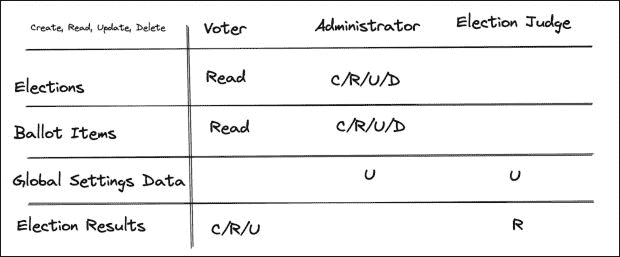

# 为您的应用程序规划用户角色

> 原文：<https://thenewstack.io/planning-user-roles-for-your-application/>

当使用经过身份验证的用户构建 web 应用程序时，定义哪些用户可以执行哪些操作非常重要。最常见的方法之一是给用户分配角色。每个角色都允许某些功能，用户只能执行与其特定角色相关的操作。角色和功能应该允许具有相似权限的用户之间的重叠，同时仍然允许用户之间的不同级别。

在本文中，我们将深入探讨如何最好地设置您的用户角色。您还将了解如何确保这些角色足够细化，以及如何考虑随着时间的推移改变用户角色。最后，我们将简要介绍将角色管理委托给 [Cerbos](https://cerbos.dev/) 的好处，这样您就可以专注于您的应用程序逻辑。

## 规划用户角色

假设我们正在设计一个允许用户对不同的工作场所问题进行投票(是或否)的应用程序。如果更改没有通过，则要么进行更改，要么放弃更改，以得分较高为基础。

在确定我们希望这样的应用程序扮演什么样的角色时，考虑应用程序的所有不同工作流以及什么类型的用户将完成这些工作流是很有帮助的。

例如，我们已经确定员工可以对问题投赞成票或反对票。此外，大多数应用程序都有某种管理员角色。管理员角色可以执行与应用程序中的数据相关的高级操作，以及与用户管理和全局设置相关的操作。

## 规划资源

一旦我们对应用程序中存在的角色有了大致的了解，我们就可以考虑拥有这些角色的用户将与不同的资源进行交互。

我们已经确定了我们的应用程序中的主要资源类型是投票。这个投票需要是可创建的(当它第一次被放入系统时)，可更新的(如果投票项目需要编辑)，可读的(因此用户可以对投票项目投票)和可删除的(一旦所有的投票在投票后被记录，或者如果投票被错误地创建)。

此外，我们还需要提问。这些是属于调查本身的是或否问题、整个应用程序的全局设置数据和调查结果数据(来自用户的是或否投票的集合)。

一旦我们制定了资源和角色，我们就可以将它们放在一起。在本例中，管理员需要权限来执行以下操作:

*   **投票**:创建/读取/更新/删除
*   **提问**:创建/读取/更新/删除
*   **全局设置数据**:更新
*   **投票结果**:无权限

员工需要获得许可才能执行以下操作:

*   **投票**:读取
*   **问题**:阅读
*   **全局设置数据**:无权限
*   **投票结果**:创建/读取/更新

将这些映射出来后，我们可以更好地确定缺少了什么。当前没有角色有权更新设置数据以及查看投票结果。基于此，我们可能会创建一个“投票法官”的角色。该角色可以查看投票结果并进行统计(但不能自行投票)，还可以更新设置数据。

在现实世界中，投票裁判可能是人力资源部门的个人，而管理员可能是副总裁或高管。我们希望让他们担任不同的角色，这样他们就有不同的权限，特别是如果这个系统用于对高影响力的问题进行投票。

## 把所有的放在一起

现在，我们已经规划了我们的角色和他们运营所需的资源，是时候将它们整合在一起了。

为了实际实现这个应用程序，我们已经确定的一些资源(特别是轮询)将需要属性来确定它们是否应该被不同的角色访问。例如，投票不应该对投票法官角色可见，除非他们有结果，这意味着员工已经在特定的投票中投了票。因此，如果投票法官试图访问选举，您的应用程序需要检查该选举是否具有`voting_complete`属性或类似的属性。

理论不同于实践。许多授权系统可能会变得复杂，因此我们之前定义的漂亮整洁的角色开始被打破。随着任何应用程序的扩展，将认证和授权分离到两个系统中是有意义的。

## 授权管理系统:购买还是构建

随着系统变得越来越复杂，授权逻辑也变得越来越复杂。当应用程序的不同部分过于复杂地耦合在一起时，一个系统可能不是最佳的。

将功能分解成小块是微服务的核心原则之一。但是，构建自己的微服务和依赖专用的访问控制提供商有很大的不同。这就是像 [Cerbos](https://cerbos.dev/) 这样的工具的用武之地。

通过将 Cerbos 插入到我们之前定义的授权模型中，我们可以抽象出[授权层](https://thenewstack.io/what-do-authentication-and-authorization-mean-in-zero-trust/)，转而专注于添加应用程序的业务逻辑。此外，使用自托管的开源访问控制提供程序可以对您的授权模型实施合理的约束，并确保您不会在应用程序的安全逻辑中留下任何漏洞。

像 Cerbos 这样的平台也允许您测试您的授权设置。这在您的平台必须发展的情况下非常有用；它让你在前进的过程中避免打破某些东西。

随着角色和授权策略变得越来越复杂，手工测试变得越来越困难。您可能给了一个用户太多的权限，或者拒绝了应该拥有权限的人的权限。但是通过为策略定义一个[测试套件，您可以确保您的策略是有意改变的，而不是偶然改变的。没有第三方的帮助，您需要自己构建这个测试框架的变体，这只会增加复杂性。](https://docs.cerbos.dev/cerbos/policies/compile.html)

## 包扎

授权对您的应用程序至关重要；在你写一行代码之前，你需要一个全面的计划。通过确定您的角色、资源以及它们之间的对应关系，您将能够构建一个适合您的系统，同时确保您的用户和应用程序的安全。随着它的继续增长，您的身份认证系统很可能会变得过于复杂，无法在内部管理。像 [Cerbos.dev](https://cerbos.dev) 这样的工具可以帮助管理这种复杂性，从而使您的应用程序变得更好。

<svg xmlns:xlink="http://www.w3.org/1999/xlink" viewBox="0 0 68 31" version="1.1"><title>Group</title> <desc>Created with Sketch.</desc></svg>