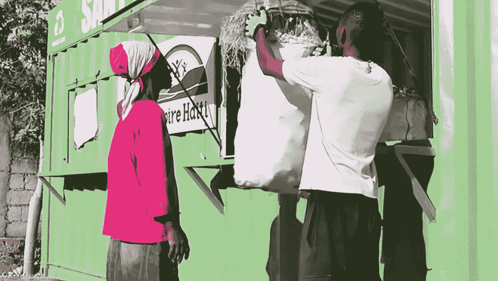

# 塑料银行利用区块链技术将塑料垃圾货币化

> 原文：<https://thenewstack.io/plastic-bank-using-blockchain-tech-to-monetize-plastic-waste/>

我们很多人都知道塑料污染是一个巨大的问题。据估计，每年有 800 万公吨的垃圾被丢弃在海洋中——或者每分钟大约有一卡车的塑料垃圾。较大的塑料碎片分解成较小的[微塑料碎片](https://en.wikipedia.org/wiki/Microplastics)，它们最终被水流带走，在全球五个所谓的[塑料漩涡](https://en.wikipedia.org/wiki/Great_Pacific_garbage_patch)中打转。因为塑料不容易生物降解，这些微小的塑料碎片将在未来许多年里伤害海洋生物并污染脆弱的生态系统，包括最终成为我们人类食物的东西。

从海滩清理、宣传活动到颁布新法规，人们已经做出努力来解决这个大问题。但是据加拿大温哥华的创业公司[塑料银行](https://www.plasticbank.org/)称，这只是权宜之计，并不能从根本上解决问题。相反，他们的方法是通过创造一种商业模式来将塑料垃圾货币化，这种商业模式寻求收集者的帮助，在回收基础设施不足或不存在的地方收集塑料。塑料垃圾然后在当地经营的收集中心进行交易，换取现金、数字代币或日常必需品的代金券。其目的不仅是清洁环境，还通过为低收入人群提供体面的收入机会来产生社会影响，这些人是所谓的“不可银行”人口，他们可能无法获得银行账户来存款和增值，甚至无法获得传统贷款。

[https://www.youtube.com/embed/mT4Qbp89nIQ?feature=oembed](https://www.youtube.com/embed/mT4Qbp89nIQ?feature=oembed)

视频

## 社会塑料

“我们为赤贫者建造了世界上最大的连锁商店，商店里的所有东西都可以用塑料垃圾来购买，”塑料银行的联合创始人大卫·卡茨告诉记者。“最值得骄傲的是，我们提供学费、医疗保险、Wi-Fi、电力、可持续烹饪燃料、高效炉灶以及世界需要但负担不起的一切。”

这些塑料然后被回收成该公司所谓的[社会塑料](http://socialplastic.org/)，这是一种对社会更负责任的塑料形式，然后被出售给国际公司用于包装或产品，作为一种更可持续的替代品，可以让公司比竞争对手更具优势。希望能创造一个更加 T2 的循环经济，让塑料垃圾成为有价值的商品，改善数百万人的生活。

到目前为止，塑料银行已经在海地建立了回收中心，并计划扩展到埃塞俄比亚、南非、印度、印度尼西亚和巴西。它与其他公司如壳牌、马克斯&斯潘塞和汉高合作，努力将由对社会负责的塑料制成的产品推向市场。

## 基于区块链的奖励系统

此外，Plastic Bank 正在与 IBM 和 Cognition Foundry 合作，努力扩大该项目的规模。到目前为止，他们已经创建了一个可以在塑料收集者的手机上运行的银行应用程序——这是一项在发展中国家越来越普遍的技术。随着塑料在世界各地被交易为数字代币，该应用程序在 IBM 的 [LinuxONE](https://www.ibm.com/it-infrastructure/linuxone) 服务器上使用区块链技术来创建数字钱包，以跟踪、存储和保持交易安全。

“有了区块链，我们看到了如何防止使用基于现金的系统所涉及的危险和不信任，”[塑料银行联合创始人肖恩·弗兰克森解释道。“区块链奖励系统使人们能够安全地赚取和消费塑料银行数字代币。现在，这些地区没有其他资源的人们可以收集足够的塑料垃圾来养活他们的家人。他们带到已建立的回收中心的大量塑料可以交换数字代币，使他们能够购买商品:食物，水，手机充电信用等。任何经营任何类型商店的人都可以使用我们的应用程序，允许用数字代币交换商店中的商品。”](https://www.ibm.com/blogs/systems/plastic-bank-deploys-blockchain-to-reduce-ocean-plastic/)

https://youtu.be/p0WH-EJ8FTA

塑料银行的期望是将业务扩展到 20 多个国家，每个国家都有一个独立的收藏家和商店系统。现在的目标是进一步开发这款应用，增加额外的分析功能，并可能纳入 IBM 视觉识别技术，帮助用户根据潜在价值识别和分类不同种类的塑料。通过提供工具、技术和激励措施，该项目为范式转变奠定了基础，塑料可以从“垃圾”转变为机遇。

在[塑料银行](https://www.plasticbank.org/)、[社会塑料](http://socialplastic.org/)和 [IBM](https://www.ibm.com/case-studies/plastic-bank) 了解更多信息。

图片:由 [Dustan Woodhouse](https://unsplash.com/photos/RUqoVelx59I?utm_source=unsplash&utm_medium=referral&utm_content=creditCopyText) 在 [Unsplash](https://unsplash.com/search/photos/plastic-trash?utm_source=unsplash&utm_medium=referral&utm_content=creditCopyText) 上拍摄；国际商用机器公司

<svg xmlns:xlink="http://www.w3.org/1999/xlink" viewBox="0 0 68 31" version="1.1"><title>Group</title> <desc>Created with Sketch.</desc></svg>