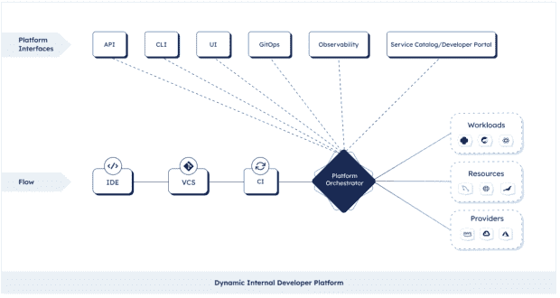

# 平台即产品:真 DevOps？

> 原文：<https://thenewstack.io/platform-as-a-product-true-devops/>

平台工程正在开发运维及基础设施领域掀起风暴。许多人认为这是 DevOps 自身基础上的“您构建它，您运行它”范式的自然演变。Gartner 最近将其添加到软件工程的宣传周期中，作为行业中崭露头角的关键趋势之一。

它周围的社区在过去两年里一直在爆炸。19 个 Meetup 团体在全球各地涌现，像平台工程师奥斯汀这样的个人团体拥有 2000 多名成员。[平台工程松弛](https://platformengineering.org/slack-rd)有超过 5000 名参与贡献者，今年第一届[平台大会](https://platformcon.com/)于 6 月举行，超过 6000 人参加了[第一天的活动](https://www.youtube.com/watch?v=_cc11dV73yU)。

云计算领域的一些领导者将平台工程称为 DevOps 杀手。DevOps 指令的主持人 Sid Palas 最近插话说:

好吧，可能已经开始升温了。让我们后退一步。[平台工程](https://humanitec.com/blog/gartner-internal-developer-platforms-platform-engineering)到底是什么？Gartner 的高级主管分析师 Bill Blosen 和研究副总裁 Paul Delory 将其描述为“为软件交付和生命周期管理构建和运营自助式内部开发人员平台(IDPs)的学科。”他们解释说“平台工程改善了开发人员的体验，从而减少了员工的挫折感和流失。”

虽然分析师和业内其他成熟的参与者正在帮助定义总体概念，但当涉及到这一新学科的核心原则时，仍然存在一些混乱。然而，如果你仔细观察，很快就会发现平台工程的基本原则是平台即产品。

颇具影响力的《团队拓扑》一书的合著者 Manuel Pais 一直在研究这个问题:[你需要把你的内部开发者平台当成你的工程团队正在构建的任何其他产品](https://platformengineering.org/talks-library/platform-as-a-product)。产品思维是在您的组织中成功设计和推出平台的关键。正如 AWS 企业策略师兼作家 Gregor Hohpe 在他的 [PlatformCon 主题演讲](https://www.youtube.com/watch?v=WaL3ZbLgMuI)中解释的那样，你可以尝试“比其他人更聪明，预测他们的所有需求，或者你可以根据用户需求来发展平台。”

这需要你建立一个[平台团队](https://humanitec.com/blog/internal-platform-teams-what-are-they-and-do-you-need-one),进行用户研究，并从他们的内部客户，即开发者那里收集用户反馈。在平台工程组织和开发团队之间建立一个紧密的反馈回路对于确保 IDP 继续对所有用户有用是至关重要的。稍后会详细介绍。

请务必记住，平台团队不是您的开发团队或基础架构团队。回到 2017 年，[Thoughtworks Technology Radar](https://www.thoughtworks.com/en-de/radar/techniques/platform-engineering-product-teams)指出，“考虑建立这样一个平台团队的组织应该非常谨慎，不要意外地创建一个单独的 DevOps 团队，也不应该简单地将他们现有的托管和运营结构重新标记为一个平台。”

在他最新的 Gartner 报告中， [Manjunath Bhat](https://www.gartner.com/analyst/55907/Manjunath-Bhat) ，围绕[为什么以及如何建立你的 IDP](https://humanitec.com/blog/gartner-internal-developer-platforms-platform-engineering) 关注三个关键支柱:

1.  通过构建内部开发平台来减少认知负荷、开发人员的辛劳和重复性的手动工作，从而改善开发人员的体验。
2.  平台不强制执行特定的工具集或方法。它是关于让开发人员更容易构建和交付软件，同时不抽象出底层核心服务的有用和不同的功能。
3.  平台工程团队将平台视为一种产品(由开发人员使用),并设计以自助服务方式消费的平台。

让我们潜入更深的地方。

## 如何在平台化设置时应用产品管理最佳实践

作为产品的平台在实践中真正意味着什么？这意味着你应该应用传统产品管理中的原则和最佳实践。

1.做用户调研！在 PlatformCon 上，网飞的 Michael Galloway 展示了如何采访工程团队，以获得关于他们工作流程和挑战的适当背景，从而确保你[建造人们实际使用的东西](https://www.youtube.com/watch?v=tJNRV_u2ilA)。他还在[平台工程松弛](https://platformengineering.org/slack-rd)频道分享了一些带问题的[文档。](https://community.platformengineering.org/t/441574/Hi-folks-as-part-of-my-talk-at-PlatformCon-I-talked-about-do)

2.想出一个路线图——不要与“最好拥有”的积压混淆——与你的使命宣言一致。明确的使命和愿景是关键。

3.如上所述，很重要的一点是，您应尽早确定，您的平台团队不应被视为站点可靠性工程或 ops 组织的延伸，而应被视为其自己的产品团队，致力于将应用程序(IDP)交付给其内部客户(开发人员)。

4.打造引人注目的产品。你会问，是什么让一个平台引人注目？以下是 Thoughtworks 的埃文·鲍彻的一些想法:

*   对于绝大多数使用情形，该平台都是自助式的。
*   该平台是可组合的，包含可以独立使用的离散服务。
*   这个平台不会强迫交付团队采用一种不灵活的工作方式。
*   该平台可以快速、廉价地开始使用，并且易于入门(快速入门指南、文档、代码示例等)。).
*   该平台有一个丰富的内部用户共享社区。
*   默认情况下，该平台是安全且符合规范的。
*   该平台是最新的。

最终，当使用平台功能比构建和维护自己的东西更容易时，交付基础设施平台是有吸引力的。

5.推销你的平台。无论是建立，尤其是推出您的 IDP。你需要一个强大的平台团队，对他们的产品负责。好的产品管理不仅仅指制造一个伟大的产品，它还意味着好的产品营销。你需要赢得所有利益相关者的支持:项目支持主管，基础架构团队(专业提示:将平台定位为在日常生活中帮助他们而不是取代他们的东西)，最后是你的最终用户——开发人员。

如果你想从实际做过这件事的人那里获得更多的专业技巧，请查看 [Galo Navarro 的《销售技巧》](https://www.youtube.com/watch?v=ApEOiNC4GrA)，他在这里讲述了他的策略，让高管买入和自下而上的开发者采用他的平台。简而言之:

*   高管——向他们推销该平台如何以可衡量的方式帮助他们实现整体组织目标。注重价值创造，而不是降低成本。
*   开发人员和系统管理员—明确平台是机遇，而不是威胁。
*   开发者——确保他们明白这个平台是为他们准备的，这样他们就能赢得比赛。

6.最后还有一个经常被忽略的点:保养。团队通常会对构建新的东西感到兴奋，并专注于闪亮的新技术，但长期维护和持续改进对于保证稳定和不断发展的产品更加重要。

## 构建与购买

我几乎能听到你。平台作为一种产品，听起来很棒。但是，我真的需要从头开始构建一个 IDP 吗，还是应该直接购买一个？

让我明确一点，平台作为一个产品并不意味着你买了一个声称覆盖整个软件开发和交付生命周期的东西就收工了。有许多解决方案承诺提供这种端到端的解决方案，所以让我们说得更确切一些。

如果你是一个小团队或处于种子阶段的初创公司，像 Heroku 这样的平台即服务(PaaS)是一个构建和发布 MVP 的好方法，而不需要雇佣 DevOps 团队。

如果您是一个由 20 名开发人员组成的中型工程团队，一个端到端的 DevOps 平台可能能够解决您的大多数问题。

但是，如果您的规模超过这个数字，当然如果您是一家企业，那么您极不可能找到一个能够与您的传统技术集成的通用解决方案，同时允许您设计您想要建立的现代云原生工作流。

许多供应商给自己贴上“DevOps 平台”或“软件交付平台”的标签，试图以完整的“一刀切”的解决方案来吸引企业购买者。实际上，这些工具只是团队 IDP 的组成部分。他们通常接管专门的领域，例如持续集成、持续交付或持续部署，或者将 git repo 中的状态与集群同步。

但是，特别是对于复杂的棕地设置，你需要**建立**一个内部开发平台。然而，这并不意味着你需要从头开始。

根据我们首席执行官 Kaspar von Grü nberg 的说法，“[内部开发者平台(IDP)](https://humanitec.com/blog/what-is-an-internal-developer-platform) 是一个平台工程团队绑定在一起为开发者铺平黄金道路的所有技术和工具的总和。”

这包括从 IDE 到产品的一切，包括版本控制系统、CI 工具、云基础设施，如 Kubernetes 集群、DNS、数据库等。

如果您决定构建 IDP，而不是购买端到端 PaaS 或类似 PaaS 的 DevOps 解决方案，这仍然不意味着您会认真考虑构建自己的 ide 或 CI 工具。对于所有这些类别，商业供应商都提供了很好的开源工具或产品。

因此，这不是好的、旧的构建与购买的辩论，而是真正关于构建**和**购买。困难的工作是找到一个很好的工具组合，这些工具可以很好地相互作用，并以一种有意义的方式将它们粘合在一起。

## 平台设计:点击与基于 Git 的工作流

“有意义”是什么意思，你应该如何设计你的 IDP？目前市场上有两种主要的方法:基于 Git 的工作流与所谓的点击操作和 UI 繁重的工作流(或者我喜欢称之为点击糟糕)。

当您构建您的 IDP 时，您需要考虑这两者，并理解哪种抽象级别适合您的组织——您希望为您的开发人员提供多少上下文？

虽然对于经验不足的开发人员或没有 DevOps 功能的小型初创公司来说，具有 click-ops 用户界面的平台设置可能是很好的第一步，但它在大型企业设置中变得越来越难以管理。

我们都熟悉众所周知的云供应商平台糟糕的用户界面体验(在 [AWS](https://www.reddit.com/r/aws/comments/h09wl5/dear_aws_stop_ruining_the_freaking_console_ui_rant/) 、 [GCP](https://kilabit.info/journal/2020/things_that_i_dislike_from_gcp/) 、[微软 Azure、](https://developercommunity.visualstudio.com/t/terrible-user-interface-please-fire-your-ui-design/823190)上的有趣咆哮，如果你在你的日子里错过了这些)。问题是复杂系统的用户界面很快变得很难导航，需要大量的专业知识和大量的猜测(和恐惧)“当我点击这个按钮时会发生什么？”这还不是主要问题。丑陋的事实是开发人员讨厌 ui，并且这样的设置不能在有多个团队的组织中扩展。所以，注意不要把自己局限在一个只会“咔嚓咔嚓”的方法中，否则你就有可能像这样结束[。](https://www.reddit.com/r/SoftwareEngineering/comments/stugca/weve_spent_months_building_this_platform_devs/)

ui 也非常不灵活，使得事情很难跟踪和追溯。在点击式设置中，越来越多的工具通常意味着越来越多的 UI，或者说，越来越不可用的单一 UI。这将导致开发人员进行大量的上下文切换，并增加认知负荷、等待时间等。你又回到了起点。

一种不同的方法是使用基于 git 的工作流，并清晰地分离关注点。平台团队拥有工具链并建立基线配置。开发人员呆在他们的 IDE 和 git 中，对应用程序配置、底层基础设施等进行更改。，以声明的方式。

团队可以获得与使用 IaC 或 GitOps 时相同的优势，但应用于他们的整个交付设置:

1.  可重用性和可共享性:配置和基线模板在整个组织中共享，防止不同的团队不断重复，而平台团队保持控制。
2.  版本化和可追溯性:应用程序和基础架构配置文件的版本化方式与您的代码版本化方式相同，允许您轻松回滚、调试或升级热修复程序以投入生产。
3.  设计标准化:配置模板使平台团队能够推动整个组织的标准化，同时仍然让开发人员选择他们喜欢的接口和抽象级别。
4.  可伸缩性:基于 Git 的工作流允许更加灵活和可伸缩的企业设置，其复杂性不会随着工具链或用户数量的增加而线性增长。

## 使用平台编制器构建动态 IDP

您可能已经注意到了，我更倾向于基于 git 而不是基于 UI 的工作流，尤其是对于企业设置(是不是咔嚓声泄露了它？).然而，在 Humanitec，我们相信为团队提供一个非个性化的引擎来构建您自己的个性化工作流。因为由您来决定您的团队需要的工具的理想组合，以及他们首选的界面和上下文级别。

这个引擎被称为[平台协调器](https://humanitec.com/blog/what-is-a-platform-orchestrator)，它是动态 IDP 的核心，一个以声明方式支持[动态配置管理](https://humanitec.com/blog/what-is-dynamic-configuration-management)的平台。

使用 Platform Orchestrator 构建的动态 IDP 为您提供了接入点和接口方面的所有灵活性。该设置可以与 ui 集成，并支持 GitOps 和基于 git 的工作流。您可以轻松地将像 Backstage 这样的服务目录连接到您的 IDP 上，或者为某些用户组构建专用的用户界面。如果你真的想的话，这甚至可以让你走上一条完整的点击操作之路。

动态 IDP 自动记录所有配置更改。每次部署时，都会创建清单和 IaC 文件并存储在存储库中。您可以获得所有应用和基础架构配置更改的完整版本历史记录，从而实现高度可追溯性和轻松回滚。

将您的平台设计为一个产品，让您可以完全控制您的工具链，这与使用 PaaS 或端到端 DevOps 解决方案不同，让您可以根据需要集成旧工具和新工具。它还允许您定义工作流，无论是基于 UI 还是基于 git，以便最终产品，即您的 IDP，真正满足您的组织和开发人员的需求。

如果您想更深入地了解平台工具领域和平台最佳实践，以及了解平台工程师比他们的 DevOps 同行多赚多少钱，请查看我们最新的“[平台工程状态报告](https://humanitec.com/whitepapers/state-of-platform-engineering-report-volume-1)”

<svg xmlns:xlink="http://www.w3.org/1999/xlink" viewBox="0 0 68 31" version="1.1"><title>Group</title> <desc>Created with Sketch.</desc></svg>