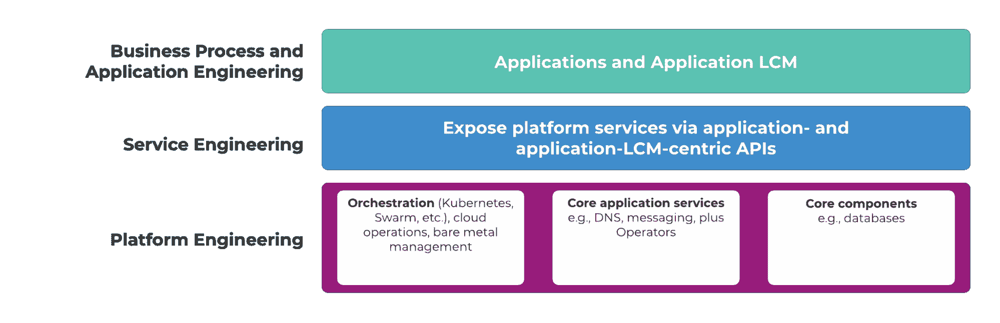

# 平台工程:挑战与解决方案

> 原文：<https://thenewstack.io/platform-engineering/platform-engineering-challenges-and-solutions/>

混合云和多云可以打破推动平台工程兴起的人类工程学和经济学常识。以下是一些有助于应对这些新挑战的模式。

在过去的两年里，已经有很多关于平台工程的文章。这是一项涉及设计、构建、维护和扩展自助服务、自动化和抽象框架的工作，该框架制造平台组件(例如，Kubernetes、数据库、底层云框架提供的服务等)。)可由服务开发人员、应用程序开发人员和站点可靠性工程师(SREs)消费、执行和管理。下图显示了平台工程在工作描述“堆栈”中的位置

【T2

平台工程工作真的是必需的吗？它与其他工作(例如，DevOps，SRE)有区别吗？绝对的。像 Kubernetes 这样的健壮但对新来者来说复杂的平台上容器编排的兴起创造了巨大的机会。

 [亚当·帕尔科

Adam 是 Mirantis 的首席技术官，负责所有的产品执行、战略和成功。在 Mirantis 之前，Adam 是 Docker 的工程总监，负责安全边缘、物联网和多架构。Adam 的背景是计算机科学和工程，他是安大略省的特许专业工程师。亚当位于加拿大安大略省滑铁卢市的中心，是加拿大蓬勃发展的科技产业区。](https://www.linkedin.com/in/adamparco/) 

Kubernetes 作为应用程序的通用平台和底层基础设施和服务的铺路框架(加上工具、标准和最佳实践)越来越受欢迎，这也是创造机会的原因之一:

*   **关注点的清晰分离**:平台工程师可以创建一个面向上的 API，让服务工程师消费和使用 NoSQL 数据库，如 Cassandra 或高基数时序数据库和可视化框架(例如，Amazon open search——你以为我会说弹性，对吗？).在这个过程中，API 被构造成允许应用程序开发人员以完全抽象的方式消费和使用服务。他们可以帮助 sre 创建运营 API 和自动化，以便在 K8s 之上或之后/之下部署和监控这些服务。然后，他们可以让真正的 Cassandra 专家调整和调整 Kubernetes 运营商，这些运营商自己维护、监控和扩展特定的组件和/或服务。
*   **工具和最佳实践的深度标准化**:在这个以 Kubernetes 为中心的环境中，关注点的清晰分离更多的是关于实际的(对业务有意义的，外行人可以解释的)关注点，而不是工具孤岛。每个人都可以使用几乎相同的工具，可以有很多共享、标准化、政策等。，即:
    *   *让一个团队的工作可以被发现，一般来说，让其他团队可以理解。*阅读:更轻松的协作、更快速的人员入职、更少的危机混乱、更快的解决时间。
    *   *限制怪异的爆炸半径。当然，卡珊德拉专家可以破解一个卡珊德拉(希望只是在舞台上)。但是如果他们在平台工程师建立的线内着色，其他的都不会失败。需要 Cassandra 的新应用程序应该找到一个健康的。*
*   **抽象和外部简化**:在这个模型中，API 和自动化隐藏了复杂性，并消除了平台内部和周围功能/语义等同的服务之间的微小差异(进一步的 API 决定了这些服务如何向开发人员公开和工作)。生活因此变得更简单:在应用层、在应用程序生命周期管理工具中的可移植性，等等。，是增加了。潜在的锁定因素减少了。
*   **Kubernetes 服务认证** : Kubernetes 提供了一个声明式配置模型、关于基本事物如何工作的强大契约、集成第三方解决方案的不断增长的标准(例如 LB、DNS、ingress、CNI、CSI 等)。)加上围绕这种模式的大量定制方式。在许多情况下，平台工程师和服务工程师应该能够有效地协作，以便所有平台组件和提供的服务“就像 Kubernetes 一样”工作。

## 但是有一个问题

上面描述的模型充满了希望，但只有当一个组织能够做出艰难的选择，并在 Kubernetes 的特定旋转和配置以及 Kubernetes 可以运行的特定环境上下大赌注时，它才是直截了当和有效的。如果你做了这些选择，平台工程师就可以在有限的领域内工作，一次性解决每个问题。之后的任何事情都是关于优化和新特性(即构建价值)。

然而，可悲的是，做出这些选择的结果往往是某种形式的锁定。“Kubernetes 和它在什么上运行”是“平台”的最大部分改变平台本身可能是复杂、耗时和昂贵的。考虑在内部 IaaS 数据中心(比如 VMware)上运行完全平台化的品牌 A Kubernetes 设置。现在，您希望转向混合云，在 AWS 上构建同样的东西，提供所有相同的平台服务，并使用这些服务来支持开发人员的相同服务级别 API。

当然，这是可行的。但是在这项工作完成之前，在您的应用程序可以从 VMware 环境轻松移植到 AWS 环境之前，您将会 a)学到比您想学的更多的 AWS 知识，b)接触到您的平台和服务工程堆栈的每个部分。添加另一个公共云、裸机云、边缘服务器模型，您的平台和服务工程师正在学习新的方法来做应该是商品的事情(或雇用越来越多具有基础架构特定技能的人)，并一次又一次地解决相同的问题。每次他们解决这些问题，都是另一个代码库、工具包、过程模型，也许是每个人都需要学习使用和维护的监控框架。

随着您的多云构建，这一切都消耗时间，增加风险(更分散的、特定于平台的自动化工具和代码总是意味着更大的风险)，潜在地增加攻击面(更多“未知的未知”)，并将平台工程的日程锁定在基本实现上，而不是增加战略价值和帮助堆栈中的每个人更快地交付代码。

## 大量平庸的解决方案

当然，面向 DIY 的终端用户、云服务提供商、厂商等。已经站出来为这个日益混乱的问题提供部分解决方案。一些例子:

“我们有技术！” —鉴于支持多种云的声明式和混合声明式/过程式部署工具的广泛可用性和优雅性(waves to Pulumi！)在那里，很多人觉得能够在没有外部或产品支持的情况下构建一个容器多云。这里有 99 个潜在的问题，最大的问题是它需要集中精力，需要彻底的学习或雇佣专家，不仅仅是关于 Kubernetes，而是关于底层基础设施的细节。DIY 多云往往会将平台工程师拖入底层基础设施，而不是专注于让服务工程师的生活更轻松。当平台工程栈很浅很简单时，它工作得最好(可以说只有*有效)。事实上，DIY 方法加深了对平台工程作用的误解——它实际上只是 K8s 的基础设施工程。*

**“谁需要平台工程？这里是你的平台！”** —用厚厚的 PaaS 层覆盖 Kubernetes 似乎完全消除了对平台工程师的需求。如果 PaaS 作为 K8s 上的应用程序运行，它将为某些类型的日常开发(如 web 应用程序)创建一个更高级别的平台，并且可以说为平台和服务工程师节省了一些为这些应用程序托管和提供服务的工作——这是一个合理的目标。但是，除非 PaaS 作为一个应用程序在 K8s 上运行，面向 PaaS 的“引擎盖下的 Kubernetes”解决方案往往会强制几种类型的锁定:

*   应用程序被锁定在专有平台上。
*   平台被锁定在供应商的 k8s 上，通常还有操作系统。
*   如果你想要多云，将复杂的平台堆栈从一个基础设施转移到另一个基础设施的巨大挑战仍然存在。是的，供应商将帮助您在他们支持的底层平台上实现这一点，但是不要期望比供应商的路线图走得更快。

**“将我们的云放在您的场所！”** —这是亚马逊前哨站和类似产品背后的基本原理，这些产品支持与您的公共云资产混合的私有云体验。方便吗？也许吧。资本支出对运营支出？当然可以。但它不利于公共云服务的商品化，并使转换云提供商变得几乎不可能。准备非常非常深入地了解你的供应商的一个真实的方式。此外，它往往会使您局限于供应商支持的有限的内部硬件和网络设置选项。

**“让我们为你部署吧！”** —也有很多解决方案可以在多个基础设施上部署一致的 Kubernetes。然而，这些往往会限制底层基础设施的运营支持——您可能能够在 cloud X 上轻松部署 K8S，但无法扩展它。简单的扩展只能发生在云 Y 上——并且可能会也可能不会提供对特定云提供商服务的简单、细微的访问，而这些服务会带来巨大的价值。事实上，这些产品似乎是为了将公共云和基础设施商品化而设计的，这是错误的方法。此外，他们可能根本不支持裸机数据中心或边缘服务器，这意味着你可以假装自己是平台工程师，同时强调如何 PXE 启动一批刀片式服务器，而不是现代视野中的平台工程工作。

## 真正的解决方案是什么样的

解决这些问题需要不同类型的解决方案，并且可能需要不同类型的供应商合作关系。真正的解决方案是什么样的？

**他们专注于 Kubernetes**——Kubernetes 继续以光速发展成为一个开发者和运营商渴望学习的完整解决方案，其抽象和功能是有意义的，并被广泛理解。如果你想要 PaaS 或者无服务器，那太好了。在 Kubernetes 上运行良好的解决方案是存在的，平台和服务工程师可以在许多方面建立他们的价值，但由于恐惧、不确定性和怀疑，将 Kubernetes 的优雅隐藏在专有外表下没有太大的价值。

相反，从 Kubernetes 本身转移注意力会让你慢下来。平台工程的战略价值很大一部分取决于开发“平台”方面的专业知识，并围绕利用该平台推动创新。只要该平台(即 Kubernetes)是开放的、不受约束的，并因此能够受益于云计算原生计算基金会生态系统范围的创新，这就是有效且有益的。至于让它变得可消费——这是平台和服务工程师希望集中精力的地方。去建立安全的软件供应链吧！去为几十个有用的组件策划容器图像和舵图！

**他们使 Kubernetes 生产就绪** —虽然平台工程师应该关心 Kubernetes，但卸下责任和降低风险的安全方法是将关键的最佳扩展的选择和集成留给供应商。不言而喻，在平台工程真正启动之前，您需要一个结构良好的 Kubernetes 集群模型，该模型具有一流的入口、网络、分布式存储和基本的监控/可观察性，以及一套服务于您的应用用例的“自以为是但灵活”的配置。您需要一个集群模型，其中包括必需的元素和核心功能，如强化的容器运行时和私有注册中心。理想情况下，这种群集模型应该尽可能不受主机操作系统和环境/基础架构的限制，在“平台”和“平台下和平台周围的东西”之间划出一条清晰的界限，实现基础架构之间的可移植性，并帮助解决方案为群集可用性和性能提供“单一平台”。

事实上，整个实践的目标是找到可以交付和生命周期管理这种功能的解决方案——完整、强化、安全，但仍然以上游为中心，在任何基础设施上的标准 Kubernetes。这最终会让您的开发人员和开发人员轻松地移植应用程序和服务自动化，从私有云到公共云到裸机再到边缘。

**他们专注于运营 Kubernetes** —需要为平稳、无风险的运营规划集群配置。对于 Kubernetes 来说，这主要意味着坚持，或者至少强烈鼓励，创建具有高可用性管理器节点集和足够的工作器容量(每种关键任务节点类型:例如，Windows 工作器、Linux 工作器、GPU 节点等)的集群。)使自我修复、滚动更新和其他过程能够快速进行，而无需使 API 或应用程序离线。

**他们利用 Kubernetes 来管理基础设施** —当供应商喝他们自己的 Kool-Aid(或康普茶)并使用 Kubernetes 对象和最佳实践来配置、部署、重新合并、扩展和管理托管您的集群的任何基础设施时，这是一个好迹象。这与其说是一种宗教声明，不如说是承认 Kubernetes 提供了使事情正确(动态地)的方法和行为，这些方法和行为比老派的自动化工具更强大，尽管让操作员调用 Ansible 也没有什么错。对于平台工程师来说，这一层互连的集群和基础设施自动化是，或者应该是，如何跨基础设施进行平台工程的教科书。

**他们利用这一点来提供简单的云原生体验** — **一个 WebUI，一个 API** — **让您可以跨所有集群和基础架构部署、扩展、观察和生命周期管理 Kubernetes**—简而言之:这是平台工程的一部分，对您的组织而言，它提供的价值最少，需要最多的时间和专业知识，并且风险最大。您希望将此外包给一个有实力的负责任的供应商，并获得:

*   只需几次点击，即可在任何基础架构上进行简单的自助式集群部署和多次点击扩展，提供一致、完整的集群，可随时投入使用，并实现应用的可移植性和围绕您的多云的应用生命周期自动化。
*   简单、无中断、无风险、直截了当的集群升级，最理想的是以持续更新的方式进行，以实现最低限度的评估和应用，而无需使应用或集群 API 离线。
*   将通知、公司目录和其他集中式设施与集群管理轻松集成，降低运营开销。
*   最重要的是:一个完成大量战略平台工程工作的 API。这意味着一个 REST API 可以让您以简单、可靠的方式跨所有基础设施部署、升级和扩展集群。

有了这种单一的 API，你和你的平台工程团队就可以专注于，例如，构建高效的、标准化的、跨平台的方法来帮助你的开发人员使用蓝/绿或金丝雀部署。这实际上有助于您的企业更快地交付软件。

<svg xmlns:xlink="http://www.w3.org/1999/xlink" viewBox="0 0 68 31" version="1.1"><title>Group</title> <desc>Created with Sketch.</desc></svg>