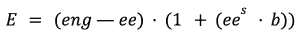
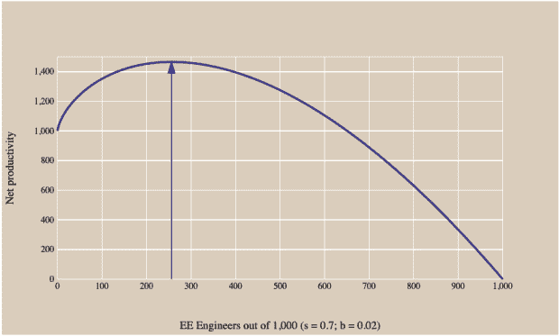

# 平台工程:DevOps 成功之路

> 原文：<https://thenewstack.io/platform-engineering/platform-engineering-the-path-to-devops-success/>

这是 KubeCon + CloudNativeCon 系列文章的一部分。

公司被要求以前所未有的速度向客户提供价值。云、SaaS 和不间断服务的持续增长意味着客户期望新功能、更少的错误和 99.99%(或更高)的正常运行时间(T3)。

为了满足这些需求，许多组织试图采用 DevOps，但是采用 DevOps 实践说起来容易做起来难。“[团队拓扑](https://teamtopologies.com/book)”这本书描述了组织业务和技术团队实现快速流程的领先方法，为组织设计和团队互动提供了一个实用的、循序渐进的、自适应的模型。平台团队是书中概述的一个构建模块。

Puppet 的 2021 年“DevOps 状态”报告提到了这种特定类型的团队，并明确指出 DevOps 成熟度的水平与平台团队构建的平台的使用及其在扩大高增长工程组织中的关键作用有关。

平台团队在[所做的一切](https://www.giantswarm.io/blog/what-do-platform-teams-do-and-what-should-they-do-giant-swarm)中的共同主线是:

*   支持整个组织的开发人员自助服务，以及
*   保持系统的可靠性和可维护性
*   而不影响开发人员(最终用户)使用基础设施的体验。

许多组织正在建立平台团队，并为此而奋斗，有些是因为组织和文化主题，这不是本文要解决的。其他人有一个更普遍的问题:有多少工程师应该在“平台”上工作？

由于云原生平台的基本思想是它将使开发人员更加有效，我们可以使用 Peter Seibel(Twitter 工程有效性小组的技术负责人)创建的模型。高顺[描述了](https://gigamonkeys.com/flowers/)以下模型:

其中 **E** 是总效率， **ee** 是平台工程师总数， **b** 是第一个平台成员的效率提升， **s** 是提升的比例。有效性的单位是 fte。

在你的组织中，工程师的数量是给定的。这个模型有趣的参数是缩放因子， **s** ，以及升压， **b** 。在他的模型中，赛贝尔用 0.7 代表 **s** ，用 2%代表 **b** 。

图表 1:千人工程组织的模型图

如果这些参数是正确的，对于一个 1000 人的工程组织，我们应该将超过四分之一的工程师(255 人)投入到工程效率中，这是平台工程的一个重要部分。这就以 1000 英镑的价格产生了相当于 1465 名工程师的总效率。

成功来自规模，这要求优化不是为了个人，也不是为了团队，而是为了更广泛的组织。以之前的千人工程组织为例，如果平台只被一百人使用，那么 100 就是相关数字，而不是 1000。

这显然是一个非常简单的模型，和所有模型一样，它是错误的。但这并没有减少它的用处。这表明投资平台和平台工程是有回报的。为了让平台工程师能够提高整个工程的效率，事情需要标准化。

平台团队需要创建一个由高质量构建块组成的云原生平台，为开发团队提供一条铺平道路，同时仍然允许这些团队部署和操作他们自己的应用程序，这就是 DevOps 的目的。

该平台使您的团队能够通过抽象组织的复杂性和辛劳，专注于解决真正的业务问题。这使得您的团队可以轻松地构建、部署和操作产品。反过来，这将使您的组织加快上市时间，增加收入，降低成本，并为您的客户创造创新产品。

另一个方面是，随着认知负荷的降低，员工会变得更快乐。平台抽象出通常的基础设施问题，这导致新加入者、团队之间的移动者、离开者或新开发团队的入职时间减少。吸引新人才也将变得更容易，因为您的组织将有时间跟上技术的发展，这将鼓励有才华的工程师加入您的组织，并创造更多的招聘选择。

将专业技能集中在平台团队中意味着开发团队的招聘工作可以集中在开发人员、测试人员等身上。，而不需要更昂贵的专业云或平台技能。

Puppet 调查结果表明，平台团队可以成为成为高绩效开发运维组织的基石，但需要注意的是，成功需要的不仅仅是简单的部门重组。还应该关注他们如何合作。

同样地，平台团队防止开发团队在铺设好的道路上重新发明轮子，平台团队应该避免陷入同样的谬误。平台团队应该关注其组织的特定需求，并利用现成的解决方案。

平台团队的价值不仅来自平台本身，还来自团队为开发组织提供的支持和采用支持。

平台团队是必不可少的，因为这种类型的团队是支持开发团队的主要构件；他们的角色是独一无二的，对组织的成功至关重要。如果您一直在考虑建立一个平台团队，请确保您充分理解成功需要的不仅仅是重组工程和为平台团队分配人员。

重点领域需要是团队之间的互动和流程的优化。如果您决定某个平台团队适合您，那么让该团队努力了解重复出现的棘手问题，并通过为您的团队提供创造和创新的空间来增强他们的能力。你的开发者和你的底线会感谢你的。

<svg xmlns:xlink="http://www.w3.org/1999/xlink" viewBox="0 0 68 31" version="1.1"><title>Group</title> <desc>Created with Sketch.</desc></svg>