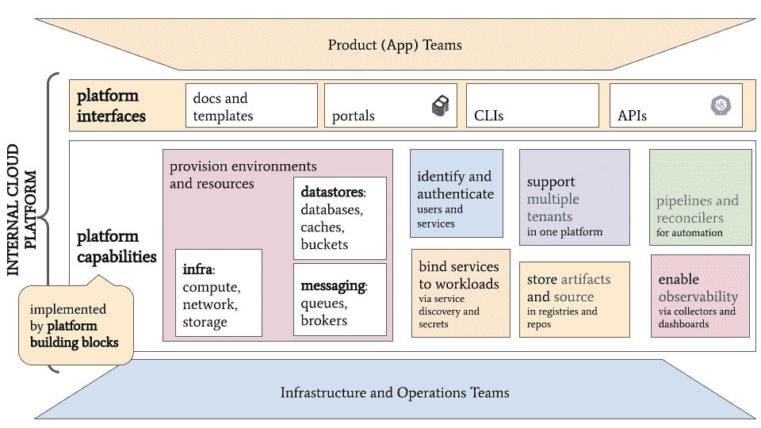
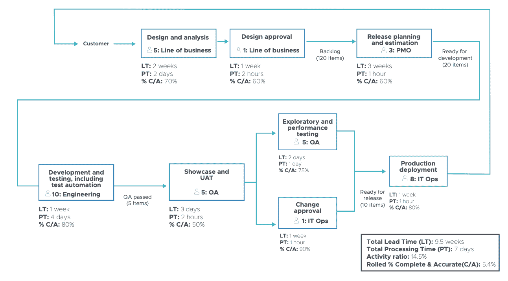

# 平台工程师:开发者是你的客户

> 原文：<https://thenewstack.io/platform-engineers-developers-are-your-customers/>

如果你是一个建立平台工程团队的组织，这个团队的新客户是应用程序开发人员。这似乎是显而易见的，但这与基础设施建设者通常思考工作的方式有很大的不同。从[提供服务](https://www.techtarget.com/searchitoperations/definition/IT-service-delivery-information-technology-service-delivery)到[将平台作为产品进行管理](https://tanzu.vmware.com/content/white-papers/why-you-should-treat-platform-as-a-product?utm_source=cote&utm_campaign=devrel&utm_content=TNSdevcustomers)的转变意义重大。

虽然平台已经存在了几十年，但将平台视为产品的概念是从 DevOps 社区、网飞的工具组、站点可靠性工程原则、Pivotal(现在是 VMware Tanzu)实践、“[团队拓扑](https://www.youtube.com/watch?v=IISozt7zc9I)、 [Thoughtworks](https://martinfowler.com/articles/talk-about-platforms.html) 以及许多许多其他组织发展而来的。

在研究了多年来构建和运行这些平台的平台工程团队后，我们发现，最成功采用这些平台的组织是那些转变为产品思维并将内部开发团队视为客户的组织。在我们讨论产品管理平台意味着什么之前，让我们先来看看什么是平台。

## 产品:平台

平台是框架、中间件、工具和实践的粘性层，开发者用它来构建和运行他们的应用程序。Thoughtworks 的 Evan Bottcher [在 2018 年](https://martinfowler.com/articles/talk-about-platforms.html)更精确地定义了粘性层:

*"* 数字平台是自助式 API、工具、服务、知识和支持的基础，它们被安排为引人注目的内部产品。自主交付团队可以利用平台以更快的速度交付产品特性，减少协作。

 *您可以将其视为基础架构层之上的一切，无论该基础架构是基础架构即服务(IaaS)、裸机、虚拟化还是 Kubernetes。在云原生商店中，Kubernetes 提供闪烁的光标，有时被称为“拨号音”，平台是您在其上堆积的所有东西，因此开发人员可以开始编码，您可以开始在生产中运行他们的应用程序。

在过去的一年里，[内部开发者门户](https://tanzu.vmware.com/content/analyst-reports/innovation-insight-for-internal-developer-portals?utm_source=cote&utm_campaign=devrel&utm_content=TNSdevcustomers) (IDPs)已经被添加到被认为是“平台”的组件中 IDP 是什么各不相同(Gartner 已经[很好地定义了它](https://tanzu.vmware.com/content/analyst-reports/innovation-insight-for-internal-developer-portals?utm_source=cote&utm_campaign=devrel&utm_content=TNSdevcustomers)，但是我们认为它是所有[老派应用生命周期管理的东西](https://youtu.be/izHE64nBFeY)，已经消失了很多年。

它是开发人员用来支持内部资源开发、发现其他可用团队和 API、跟踪他们自己的应用程序、文档的内部网，顾名思义，它是所有信息辐射器和组织拥有的单一窗口需求的门户框架。

目前，Spotify 的开源项目 Backstage 是一个非常有趣的建立 IDPs 的基础。Backstage 是标准化 IDP 外观的好方法，同时为定制提供了大量空间。

它的目的是帮助大公司的开发人员更好地相互合作，这是显而易见的。在 VMware Tanzu 应用平台中，我们已经有了很好的体验。

没有那么多的无供应商平台图(我很高兴向您展示 VMware 平台图！)，但是这个来自定义“平台”的 [CNCF 工作组的非常好](https://blog.joshgav.com/posts/kubecon-platforms-review):

因此，对平台有一个简单的概念。

## 客户:开发人员

在过去的 10 年里，我们学到了许多平台工程经验。平台成功最重要的一课是了解谁是你的客户。就平台而言，这些客户就是开发者。

第一步是了解你的客户需要什么:他们的目标是什么，他们如何工作，[他们有什么问题](https://tanzu.vmware.com/content/analyst-reports/forrester-vmware-executive-checklist-for-devex?utm_source=cote&utm_campaign=devrel&utm_content=TNSdevcustomers)以及什么对他们最有效。也就是说，你要开始为他们的开发者体验建立一个想法和品味。此外，您需要了解什么对组织和其他利益相关者(通常是安全、治理和 FinOps 人员)有价值。

这里的“你”是产品经理，在一些平台团队中也叫“产品负责人”。幸运的是，产品管理是一个非常成熟的、[有据可查的](https://tanzu.vmware.com/content/white-papers/vmware-tanzu-labs-product-manager-playbook?utm_source=cote&utm_campaign=devrel&utm_content=TNSdevcustomers)角色，有我们可以适应的流程。Syntasso 的 Paula Kennedy 是平台即产品方法的早期支持者之一，[总结了平台产品经理的工作](https://youtu.be/jJSo3kdflpA?t=1020):

产品经理可以帮助定义产品策略。他们可以帮助制定产品路线图。他们可以管理正在交付的积压功能，并通过数据驱动的决策和验证假设来帮助确定这些功能的优先级。

产品经理决定平台中要包含哪些特性和服务，以及何时实现它们。为了做到这一点，产品经理在生产过程中与开发人员和组织中的其他人交谈、研究并了解他们的需求。

产品经理一直在平衡几件事情，其中包括:

1.  对开发者来说，有哪些有价值的问题需要解决？
2.  用平台中的特性解决这些问题的最好方法是什么？
3.  应该如何实现特性来满足整个组织的需求，而不仅仅是单个开发人员的需求？
4.  识别风险及其缓解措施

所有这些不仅是凭直觉完成的，而且是遵循经验证的设计方法进行的数据驱动的研究和测试。

## 去开发者在的地方

如果他们还没有使用像 Cloud Foundry 这样的平台，我们与之交谈的大多数基础设施团队都专注于构建 Kubernetes 作为他们平台的基础。这些团队通常遵循相同的方法，也就是所谓的服务交付方法。

注重服务交付的团队收集性能和容量需求、未来几年将在集群上运行多少工作负载的想法、安全和生产需求等等。然后，他们建造了“kool korporate Kubernetes kloud ”,差不多完成了。他们已经提供了服务，现在只需确保其可用性。

现在开发者可以来获得他们想要的所有 Kubernetes 或者他们的配额允许的数量。这种方法更像是一种*项目*的思维方式，而不是一种*产品*的思维方式，所以它给了我们一个思考如何管理平台的好方法。

这种以项目为中心的方法的问题是，开发人员需要的不仅仅是 Kubernetes 闪烁的光标；他们需要持续的帮助来弄清楚他们在 Kubernetes 之上需要什么工具。更有可能的是，您无法提前预测该堆栈对于您组织的独特需求而言会是什么样子。你需要[发现和发展它，测试理论](https://tanzu.vmware.com/developer/guides/guide-to-discovery-and-framing/?utm_source=cote&utm_campaign=devrel&utm_content=TNSdevcustomers) …也就是说，产品管理它。

要做到这一点，你应该从开发人员开始，了解他们每天都在做什么。有两件常见的事情要开始:规划生产路径和改进开发人员入职。

生产之路基于[价值流图](https://tanzu.vmware.com/developer/practices/value-stream-map/?utm_source=cote&utm_campaign=devrel&utm_content=TNSdevcustomers)，它绘制了从创意到设计、编码、部署以及到达使用软件交付价值的人的所有活动。这里有一个假设的例子:

一定要用实际用户来验证这个旅程图！理解这个价值流图将使平台团队持续了解他们的客户，即使不是每个活动都是平台团队的责任。

有了这条路径，您就可以开始寻找要解决的问题。这些问题中的许多将是消除浪费，通常是通过删除不必要的步骤，改善不同团队之间的协作(通常称为“左移”)以及自动化过程。

另一个常见的起点是开发人员入职流程。在今年的一项调查中，大约 50%的大型组织的经理说他们对开发人员的入职时间不满意。因此，举例来说，你可以瞄准一个开发者从头开始使用你的平台需要多长时间。

另一个版本可以是测量一个新开发人员贡献有意义的代码，通过[黄金路径](https://engineering.atspotify.com/2020/08/how-we-use-golden-paths-to-solve-fragmentation-in-our-software-ecosystem/)需要多长时间。我建议问问你的开发人员，通过定期的[调查来发现和跟踪开发人员辛苦工作的减少会有什么帮助。](https://tanzu.vmware.com/content/white-papers/developer-toil-the-hidden-tech-debt?utm_source=cote&utm_campaign=devrel&utm_content=TNSdevcustomers)

当你从开发者开始，你可以更好地管理平台中的产品。这不仅是挑选最适合的功能，也是优先考虑你如何度过你的时间。

> 开发人员通常想要最新最棒的东西——任何看起来既酷又有用的东西。但是，即使是 100 名左右的开发人员，更不用说 25000 名开发人员之间的差异太大，也会损害整个组织。

例如，如果您从底层开始，仅使用 Kubernetes，您可能会构建出超出需要的东西，您可能会错过添加与您的 Java 开发人员(或任何类型的开发人员)一起工作的服务网格，并且您肯定无法学习和适应您使用的工具和内部开发人员门户方法。

以下是平台团队解决的一些常见问题和功能示例:

*   标准化构建管道并自动生成[物料清单](https://tanzu.vmware.com/software-bill-of-materials?utm_source=cote&utm_campaign=devrel&utm_content=TNSdevcustomers)以实现合规性和安全性
*   自动化加速开发人员环境
*   建立和改进内部协作工具，如内部开发人员门户
*   寻找方法来打包和配置新的应用程序以在平台上运行，或者减少修改应用程序以在平台上运行所需的时间
*   对入职门户进行修改，以添加更多自助服务功能
*   附加支持服务(或“中间件”)，如 MySQL、RabbitMQ 或 Spring 云服务
*   针对安全性、日志记录、指标和负载平衡等跨领域问题的标准工具包
*   与其他企业系统的集成，尤其是您的内部系统
*   平台的多个变体具有不同的服务级别目标(SLO)和生产特征、行业法规和云主权支持

这些团队做的最困难的事情之一是平衡开发人员的愿望和组织范围的标准。开发人员通常想要最新最棒的东西——无论是编程语言，还是部署方法(还记得 Docker 是什么奇怪的东西吗？还是虚拟化？)，新的工具和框架…任何看起来既酷又有用的东西。但是，即使是 100 名左右的开发人员，更不用说 25，000 名开发人员之间的差异太大，也会损害整个组织——局部优化等等。

> 有价值的是你的平台的所有定制，这些定制使开发者更有效率。

这是我们希望产品管理能够处理的问题。当你像对待客户一样对待开发人员时，你更渴望给他们想要的东西，并投入额外的工作以使其可持续发展。

相比之下，如果您只是交付一组预先确定的服务，虽然您可能并不打算这样做，但更容易陷入“只使用认可的企业架构”的境地我认为 Java 应用服务器简化为 Spring、JBoss 和 Rails 的周期，开发人员转移到 Docker，以及 WS-*和企业服务总线之类的东西失宠，表明了集中式平台未能将开发人员视为客户的问题。

## 除了闪烁的光标

事情是这样的，你最终会得到一个类似于上图中[的平台。但这不会是你平台最有价值的部分。你的平台如何适应你的组织的实践、需求甚至文化(在 DevOps 的意义上)将会使平台工程团队变得有价值。](https://blog.joshgav.com/posts/kubecon-platforms-review)

当您从开发人员开始时，您会发现平台工程团队可以解决的最有影响力的问题。它不会是成本管理、安全甚至是多云全球控制平面魔术。所有这些都是必需的，但实际上，它们是商品、行业标准功能，或者很快就会成为商品、行业标准功能。

有价值的是你的平台的所有定制，这些定制使开发者更有效率。以及建造它们的顺序。产品经理所做的很大一部分是对所有事情进行优先排序，并确保专注于在最短的时间内增加最多的价值。

从平台即产品的角度考虑问题，并实施产品管理是组织中良好平台工程的关键，尤其是大型组织。第一步:最好找个产品经理。

<svg xmlns:xlink="http://www.w3.org/1999/xlink" viewBox="0 0 68 31" version="1.1"><title>Group</title> <desc>Created with Sketch.</desc></svg>*