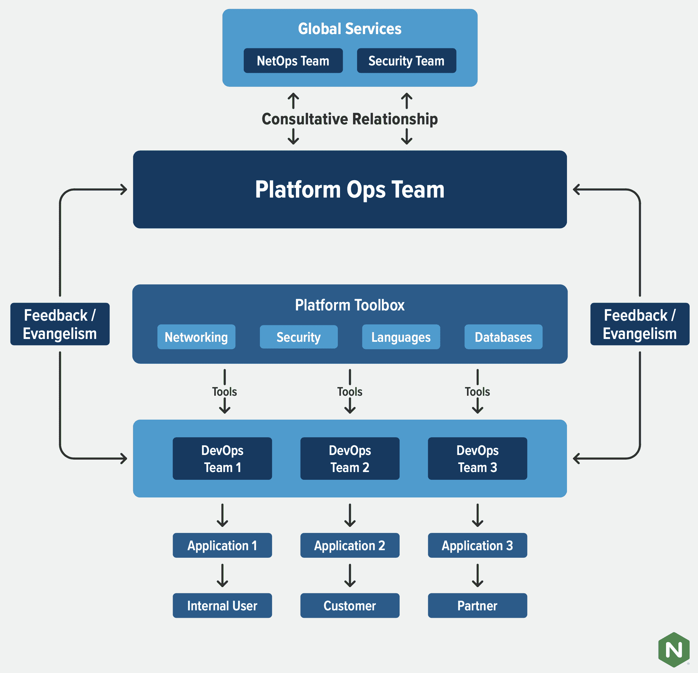

# 平台运营:运营团队的下一个前沿

> 原文：<https://thenewstack.io/platform-ops-the-next-frontier-for-operations-teams/>

[kart hik Krishnaswamy](https://www.linkedin.com/in/kkrishnaswamy/)

[kart hik 是 F5 旗下 NGINX 的产品营销主管。他拥有芝加哥大学布斯商学院的 MBA 学位和伊利诺伊理工学院的计算机科学学位。他来自印度南部的钦奈，现在住在加州圣何塞。](https://www.linkedin.com/in/kkrishnaswamy/)

我们越来越多的客户对“平台运营”的出现感到好奇，它描述了构建、管理和优化应用基础设施的团队。有些人想知道平台运营与开发运维、站点可靠性工程(SRE)、安全运营和网络运营有何不同。这是一个有效的问题，需要进行细致入微的讨论。平台运营无疑是运营领域最新的、最不为人所知的领域。它吸收了其他 ops 角色的一些功能，同时还浮在上面并指导它们。

当一个企业有多个开发运维团队时，平台运维就变得必不可少，每个团队指导自己的应用，并为流量管理、可见性、遥测、安全性和弹性选择自己的工具。在这方面，平台运营是 DevOps 的必要扩展功能；随着 DevOps 的能力和职责转移到开发人员和服务所有者，这变得更加重要。

更通俗地说，当一家公司从两个披萨团队变成 10 或 20 个披萨团队时，平台运营就变得必不可少。有了一个比萨饼，就很容易理解什么是平台，什么不是。随着许多团队做许多事情，有人必须确保所有的比萨饼团队得到他们的订单，但他们也不允许从 27 个不同的比萨饼店订购。

## 什么是平台？

在我们描述平台运营团队做什么之前，我们需要停下来明确“平台”的含义这个定义必然是不固定的，但在大多数公司都有共性。一个平台包含了不同工程团队所接触的一系列技术。平台可以指物理或虚拟基础架构和网络。公司的平台还包括遥测、应用交付、容器部署和使用 Kubernetes、内容交付网络(cdn)和 CI/CD 工具等工具进行编排。从最广泛的意义上来说，平台是公司构建、部署和交付其应用程序的环境和技术集合。

平台团队精心设计和管理技术组合，以最大限度地提高工程和网络团队的效率，并建立最佳实践，以便组织能够更轻松、更安全地进行扩展。“但这听起来像是一个旧式的整合 IT 组织！”有人可能会说。平台运营团队寻求的不是限制选择，而是推动共识，确保每个人都获得他们需要的工具和能力。这并不是说工程师有无限的选择——这导致了混乱。但是 platform ops 走的是一条精心制作和传播的选择菜单的微妙路线，它可以满足 95%的需求，同时对选择的反馈保持开放。

## 透过要做的工作来看平台运营

公司实现平台运营的最佳方式是什么？了解一个部门是做什么的一个好方法是阅读一份写得很好的部门领导职位的工作描述。这是“要做的工作”心态的最纯粹形式。因此，我认为传达平台运营是什么和做什么的一个很好的方式是浏览这样一个工作描述并将其分解。

在这种情况下，工作描述来自一家超增长的早期创业公司，该公司在许多团队中雇佣了数十名工程师。该公司还在构建一个混合多云平台，在此平台上开发和部署其产品。该职位是公司平台工程组织的副总监，他将是“…平台工程团队计划和执行的关键驱动者，致力于管理和提高团队的效力、质量和效率。”现在，让我们看看工作描述中定义平台运营的一些关键段落，并提供一份关于如何建立平台运营实践的用户手册。

**协作:***“…该角色将在整个工程组织中协作，以创建最佳实践，并帮助为我们的系统和服务架构构建整体生态系统。”*

注意描述的语气。平台运营是关于协作和共同工作的。这与传统的 IT 角色截然相反，后者开发企业范围的策略并严格执行这些策略。语气也表明一个平台团队是策展人，是共识构建者，是教练。制定最佳实践的最有效方式是实践和展示，而不仅仅是讲述。这就引出了下一点。

**动手:** *“除了领导一个工程团队之外，你还需要具备足够的技术技能，花一些时间进行实际开发工作。”*

平台运营主管和团队成员必须能够编码、配置和部署应用，以及工程师做的所有其他事情。他们提供建议和合作，但他们也可以潜入战壕完成工作。顺便说一下，这也是他们如何了解使用他们为开发团队构建的平台的真实感受。

**创新和客户服务:“** *在所有其他因素中，我们正在寻找聪明、有动力、希望成为创新和客户服务文化一部分的候选人。”*

创新既意味着不断尝试新事物，也意味着不断迭代现有流程和产品以进行改进。因此，很明显，这个角色不仅仅是协作和监管，也是创新技术、服务和产品的变革推动者和测试者。提到客户服务表明，平台团队本质上是一种服务台——尽管它专注于为开发人员和工程师提供他们做好工作所需的东西。

**宣传:** *“在整个工程组织中宣传平台，以推动社区拥有的平台模型的持续采用。”*

推动开发人员或工程师采用任何新技术或产品的一个关键部分是宣传。为了取得成功，平台运营团队必须像内部开发人员关系中心一样运作，教授和解释平台是什么，为什么它是一个好的架构，以及如何使用它。

**建立合规性和标准:*****“****建立技术标准和指导方针，确保系统的完整性和对公司 IT 标准、政策和流程的合规性。”*

请记住，平台运营是 IT 和开发运维之间的桥梁，是两个角色的混搭。仅仅因为平台运营团队与开发人员的需求高度一致，并不意味着它可以在合规性和标准上妥协。平台运营团队必须被 IT 团队视为优秀的团队成员，而不是一群开发人员牛仔。这意味着愿意控制工具蔓延，并做出一些艰难的选择，以符合 IT 政策、审计和法规遵从性的需求。

**跨团队边界工作:****在所有组织层面建立强大的工作关系，跨越职能团队和组织边界。”**

 *平台运营团队不仅对面向 IT 的职能部门很重要。技术越来越成为每个企业的生命线，这使得公司的技术平台成为战略性的商业资产。平台运营团队提供了传递这种活力的血管系统。像营销、财务、HR 这样的非技术团队也依赖于平台，所以平台运营团队需要向他们咨询并与之建立密切的关系，就像对技术团队一样。平台运营也需要与之合作；在云时代，越来越多的软件通过 HTTP 作为服务交付，平台是让企业中的每个人都得到他们想要和需要的机制。

## 结论:平台运营来了，做好准备

我们最具前瞻性的客户已经进入了建立平台运营团队的探索阶段。我们预计这将是 2021 年下半年的热门话题，因为为“左移”现实建立护栏和指导方针的需求变得更加迫切。即使你不打算建立一个平台运营团队，只要你有两三个以上的开发运维团队，你的组织就会从采用平台运营思维和最佳实践中受益。幸运的是，已经是平台运营领导者的公司很乐意为您提供指导。看看他们的工作列表，以获得如何塑造你的方法的指导。

<svg xmlns:xlink="http://www.w3.org/1999/xlink" viewBox="0 0 68 31" version="1.1"><title>Group</title> <desc>Created with Sketch.</desc></svg>*