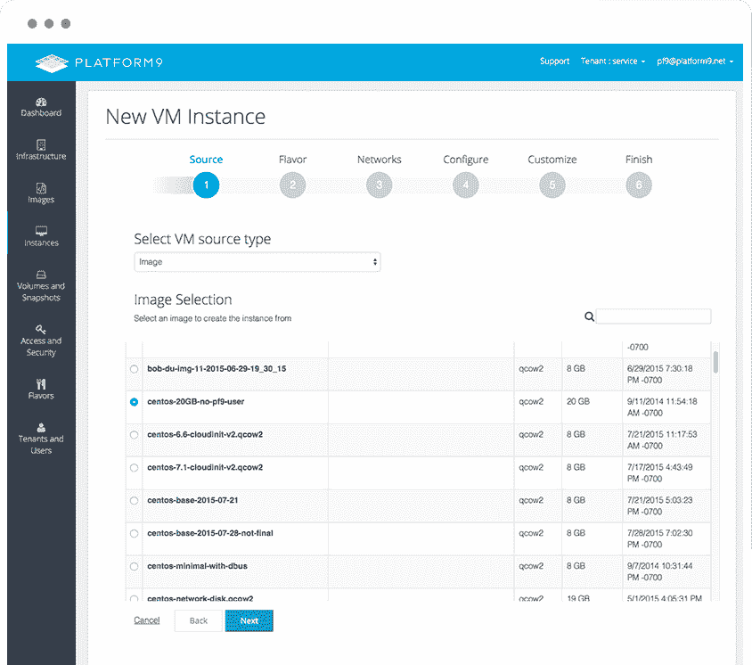

# Platform9 为繁忙的企业管理 OpenStack

> 原文：<https://thenewstack.io/platform9-manages-openstack-busy-enterprise/>

加利福尼亚州森尼维尔-据 Platform9 联合创始人兼产品负责人 Madhura Maskasky 称，科技高管对 OpenStack 推动私有云和混合云运营的能力越来越感兴趣。但对于这些潜在的企业客户来说，这不仅仅是让 OpenStack 启动和运行，而是确保它保持修补、升级和整体管理。

[Platform9 Systems](https://platform9.com) 已经加入了[将 OpenStack 服务](https://platform9.com/blog/platform9-now-openstack-liberty-release/)升级到 [OpenStack Liberty](https://www.openstack.org/software/liberty/) 的热潮，这是 OpenStack 的最新完整版本，加入了 Red Hat、Rackspace、HPE 和托管私有云领域的其他公司。随着这一版本的发布，Platform9 声称对客户来说升级是完全自动化的，平均只需要 22 分钟。

最新的 Platform9 Managed OpenStack 软件包还包括与 [Okta](https://www.okta.com/?_bt=110622576689&_bk=okta&_bm=e&gclid=CjwKEAjw9Zu5BRCS_OuVibujhQ0SJAD7t4KrrQwiSyoz1Lo3QDhw_s-lYhJTeVRrsGEsTCk0IJKH4BoCEdrw_wcB) 身份管理软件的单点登录集成，以及其他集成，如即将在未来几个月推出的 Active Director 和 LDAP。

## 运行正常的

Platform9 提供的不仅仅是 OpenStack 发行版。该公司提供完全托管的服务，在用户的基础设施上运行。

Platform9 [由早期的 VMware 工程师 Sirish Raghuram、Maskasky、Roopak Parikh 和 Bich Le 于 2013 年创建。该公司的特色是在客户现有的基础设施上提供服务，使用他们现有的工具和流程，允许他们使用其管理软件作为代理，为你想要的云功能“打电话回家”，正如首席架构师乐所说。](https://platform9.com/leadership/)

> “我们认为 Kubernetes 作为一个框架有很多价值。无论它是否是部署 OpenStack 本身的理想平台，都需要进一步的验证和测试。这当然是一个有趣的概念”——Bich Le

该公司已经筹集了 1450 万美元。它在一个繁忙的领域竞争[托管的私有 OpenStack 云](https://www.openstack.org/marketplace/hosted-private-clouds/)。与此同时，市场正在推动该公司超越其最初的根基。

Wikibon 分析师认为，2015 年私有云实施的市场规模为 70 亿美元，而公共云市场为 250 亿美元。仅亚马逊网络服务[去年就创造了 79 亿美元的收入](http://recode.net/2016/04/06/amazon-aws-cloud-service-10-billion-business/)。首席信息官在 JP 摩根的一项调查中报告称，他们 16.2%的[工作负载现在运行在公共云](http://blogs.barrons.com/techtraderdaily/2016/04/14/amazon-seeing-momentous-change-of-guard-as-public-cloud-booms-says-jp-morgan/) *中，他们预计这一比例将在五年内上升至 41.3%。*

正如营销自动化提供商 PubMatic 的数据中心和云运营高级总监 Udy Gold 上周在奥斯汀的 OpenStack 峰会上对观众所说的那样，公共云并不适合所有人。他谈到，当公共云开支失控时，他会躲避公司的首席财务官。该公司是公共云的大用户，直到其每月

PubMatic 现在维护一个混合基础设施。Maskasky 说，虽然 Platform9 处理其私有云，但 PubMatic 自己维护一些公共云服务。

在该公司今年早些时候在奥斯丁举行的[技术领域日](https://platform9.com/blog/platform9-at-tech-field-day-2016/)上，Raghuram 谈到了其他客户用例，来自协作供应商 [Box](https://www.box.com/) ，视频分析公司 [IdenTV](https://www.identv.com/) ，以及发布汽车交易商、ForRent.com 和 YachtWorld.com 等网站的 [Dominion Enterprises](http://www.dominionenterprises.com/) 。他谈到云安全提供商 [AlertLogic](https://www.alertlogic.com/) 如何使用 HashiCorp 工具 [Packer](https://www.packer.io/docs/post-processors/vsphere.html) 来维护与 vSphere 的混合开发环境。

该发行版还支持用于混合 DevOps 工作流、多个私有云以及多个地理上分散的数据中心的基础设施工具，如 Scalr、vagger、Terraform、Fog、Libcloud、iCloud 和 Boto。

## 库伯内特人的崛起

同时，乐解释了该公司的“多语言愿景”及其与 Kubernetes 的合作。

Maskasky 说:“最终用户寻求的是与合作伙伴合作，以获得适合他们的 OpenStack 部署，并进一步获得适合他们的容器平台。”

“我们希望客户告诉我们，‘这是我的整个基础架构。我希望其中的 20%被虚拟化，30%使用 Docker 容器进行容器化。然后，我们将部署适当的开源服务，它可以是 OpenStack 或 Kubernetes 或 Mesos，以帮助他们实现最终目标。"

在 OpenStack 峰会上，CoreOS 发布了 [Stackanetes](https://thenewstack.io/openstack-gets-self-healing-coreoss-new-kubernetes-based-stackanetes/) 开源项目，允许你使用 Kubernetes 在容器中部署和管理 OpenStack。用马斯克斯基的话说，这是一次“相当有力的示威”

“我们认为 Kubernetes 作为一个框架有很多价值。无论它是否是部署 OpenStack 本身的理想平台，都需要进一步的验证和测试。这当然是一个有趣的概念，”她说。

专题图片: [Kylie_Jaxxon](https://www.flickr.com/photos/76614164@N02/) 的《平台》，以 **[CC BY-SA 2.0](https://creativecommons.org/licenses/by/2.0/)** 授权。

<svg xmlns:xlink="http://www.w3.org/1999/xlink" viewBox="0 0 68 31" version="1.1"><title>Group</title> <desc>Created with Sketch.</desc></svg>