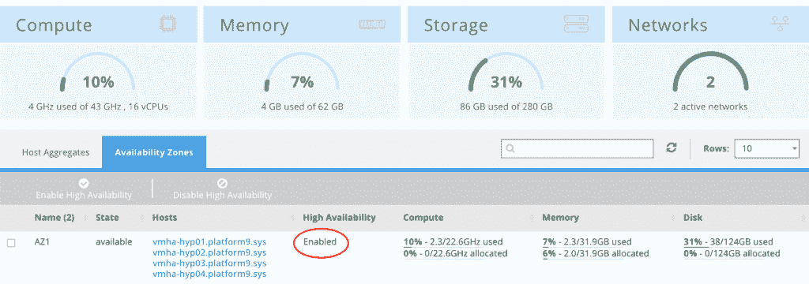

# Platform9 提高了 OpenStack 的“高可用性”标准

> 原文：<https://thenewstack.io/platform9-raises-high-availability-bar-openstack/>

当云服务提供商承诺每年的正常运行时间为“五个九”(即 99.999%)时，这意味着客户在 12 个月内的停机时间不应超过五分半钟。

这是服务提供商目前向客户提供的在 VMware 基础架构上托管虚拟机的服务。在过去的几年中，OpenStack 的贡献者已经意识到，如果他们在服务质量的任何考虑中被认真对待，他们需要能够提供这“五个九”上个月，服务提供商 [Platform9](https://platform9.com/?gclid=CNuK_ZmSns8CFQpZhgodgbcI9w) 宣布，它有足够的信心使用 KVM 虚拟机管理程序驱动的基础架构为其 OpenStack 客户提供所谓的高可用性(HA)服务。

在[最近的一篇公司博客文章](https://platform9.com/blog/virtual-machine-high-availability-platform9-openstack/)中，Platform9 产品副总裁 [Madhura Maskasky](https://twitter.com/madhuramaskasky) 解释了其交付 HA 的策略:将服务分散到多个可用性区域(AZs)。

Maskasky 写道:“传统应用程序假定基础设施总是可用的。“应用程序架构不能容忍硬件故障。。。借助 Platform9 管理的 OpenStack，此类应用也可以得到保护。如果应用虚拟机崩溃或底层虚拟机管理程序节点关闭，这些虚拟机可以重新定位到新的主机上。”

## 高度可用

过去，我们听说过“高可用性”或“高可用性”(小写)一词适用于 Platform9。其中一些措辞与去年 12 月被 NetApp 收购的全闪存存储阵列公司 SolidFire 有关。自 2015 年 8 月以来，Platform9 一直在为客户提供一种将其基于 OpenStack Cinder 的块存储与 SolidFire 阵列集成的方法。

这新一轮的 HA 暗示了一些更具体的东西。虽然 OpenStack 分销商 [Mirantis](https://www.mirantis.com/) 自 2012 年以来一直在提供[其所谓的“高可用性 open Stack”](https://www.openstack.org/summit/portland-2013/session-videos/presentation/standup-ha-openstack-with-open-puppet-manifests-in-under-20-minutes-for-goat)，但 Maskasky 告诉新 Stack，Platform9 客户确实应该从最新一轮中期待更多。

“在 KVM 虚拟机管理程序上运行并由 OpenStack 管理的虚拟机现在可以以高可用性运行，”她给我们写道。“‘高可用性 OpenStack’是指 OpenStack 控制器服务的可用性，而不是指由 open stack 管理的虚拟机。”

正如 Platform9 所描述的那样，HA 指的是 OpenStack 通过其托管的虚拟机提供的服务，而不是 OpenStack 平台底层组件的可用性。正是这种区别让我们想要——或者需要——重新审视高可用性和高可用性被描绘的方式。

这是 Red Hat 高级技术产品经理 Arthur Berezin 于 2014 年 4 月发表的博文[将高可用性 OpenStack 控制器与高可用性等同起来。在这篇文章中，Berezin 解释了如何使用名为 Pacemaker 的 Red Hat 组件来建立集群并在这些集群之间部署 HAProxy 负载平衡器，从而产生满足高可用性需求的高可用性控制器。](https://twitter.com/arthurberezin)

在 OpenStack Israel 2015 的一次演讲中，Berezin 将 Pacemaker 解释为一个集群资源管理器，作为操作系统的一部分提供，它将自己包装在服务周围，并控制它们当前的操作状态。Pacemaker 与虚拟 IP 地址和 HAProxy 负载平衡器一起，可以确保网络中某个位置的某个服务副本响应 API 请求。

但是在 Madhura Maskasky 的 Platform9 博客文章中，她提高了标准，暗示真正的 HA 不是由开发人员或管理员定义的，而是由客户定义的。当客户认为某项服务高度可用时，该服务可能是应用程序，而不是控制器节点。因此，她认为 HA 意味着托管的虚拟机冗余。

## 哦，对了，存储也很重要

“为了在故障节点上恢复虚拟机，需要共享存储，”Maskasky 在她的公司博客帖子中写道。“高可用性群集中的所有节点应使用具有相同虚拟机存储路径的相同共享存储，以正确恢复故障节点上的虚拟机。在 OpenStack 中的 AZ 上启用 HA 后，Platform9 会在该 AZ 中的所有 KVM 节点上部署分布式集群服务。集群服务使用 gossip 协议来跟踪集群中的所有节点。

实际上，目前有少数几种不同的八卦协议在使用。第一个取得重大进展的是 SWIM [PDF]，它应该是“可扩展的弱一致性感染型进程组成员协议”的首字母缩写。

SWIM 是在康奈尔大学开发的，资金由美国宇航局喷气推进实验室管理。SWIM 的全部目的是用一种算法取代典型的半可靠心跳协议，该算法定期测量集群中服务器之间关于其各种进程的成员资格的聊天消息或八卦的变化。

如果你熟悉在“现实世界”中，政治民意测验专家根据选区选民的登记模式来检测选区可靠性中可能存在的漏洞，那么你就不会对 SWIM 的基本原理感到陌生。在这里，服务器集群中的进程注册成为成员。注册过程生成消息流，这些消息流规定了正常操作的模式。当模式的变化超出持续更新的容差水平时，故障检测器组件开始确定真正故障的相对概率。

“感染”部分基于一个描述成员信号如何在整个集群中传播的隐喻。如果“怀疑失败”消息被多播到群集中的多个其他 IP 主机，那么多播消息将很有可能不会被预期的接收者接收到，而不是怀疑实际上是正确的。这是因为 IP 多播被有意设计成一种“尽最大努力”的方法，以广泛的地址为目标。“感染”依赖于一个成员节点与另一个节点聊天的倾向。使用八卦协议，怀疑被捎带到成员节点的常规成员聊天消息上。

后来，HashiCorp 在 SWIM protocol 的基础上开发了自己的产品化版本 Serf T1(注意，不是 surf，也不是首字母缩写)。根据 HashiCorp 的文档，Serf 利用了一个专用的八卦层，而不是捎带式的，这使得更高的通信速率与更慢、更容易管理的故障轮询速率相结合。

## 高可用性

在高可用性服务的演示中，Platform9 的 Cody Hill 展示了客户如何从客户的角度为云原生和传统的虚拟机托管应用开启高可用性。Hill 展示了 AZ 如何代表数据中心内部或之间的故障区域，以及客户如何为每个区域指定特定的主机地址。跨这些区域扩展应用程序，并在配置中指定 AZ 地址，使应用程序能够跨区域扩展，以实现真正的高可用性。

然后，Platform9 可以根据收到的警报自动制定跨 AZs 的可扩展性策略。Hill 的云原生演示模拟了 OpenStack 主机上计算节点的故障，其中数据库查询的结果每五秒更新一次。即使在节点故障的情况下，应用程序的用户也能继续看到持续更新的时钟，这得益于适当协调的故障转移。

在演示的非扩展虚拟机部分，Hill 在一个 AZ 中启动了一个虚拟机。虚拟机的一个实例被关闭，很快，一个新的实例使用新的 IP 地址启动。这一次，随着新虚拟机的启动，出现了明显的停机时间 Hill 首先将其描述为“一点点”录音被压缩了，所以根据 Hill 的表，新实例接收新地址的时间大约消耗了三分钟。该地址上的服务可用性需要另外半分钟左右。

这低于停机时间“五个九”规则规定的五分半钟。但这意味着，在今年剩余的时间里，同一台服务器无法承受另一次故障事件。

Maskasky 的博客文章指出一个名为 [Masakari](https://launchpad.net/masakari) 的 OpenStack 组件负责自动拯救虚拟机。在去年 10 月的 OpenStack 峰会上，NTT 公司的工程师后白河天皇·室井将 Masakari 介绍给了东京的工程师。该项目目前正在[通过 GitHub](https://github.com/ntt-sic/masakari) 开源。

“虚拟机的高可用性正在以社区为中心的方式开发，并将完全开源，”Maskasky 在新堆栈的一份说明中说。“Platform9 本身将这些功能打包为其托管 OpenStack SaaS 解决方案中的开箱即用功能。”

<svg xmlns:xlink="http://www.w3.org/1999/xlink" viewBox="0 0 68 31" version="1.1"><title>Group</title> <desc>Created with Sketch.</desc></svg>