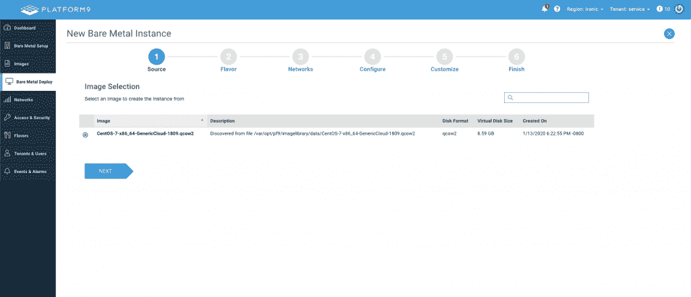

# Platform9 通过 Kubernetes 将裸机变成云

> 原文：<https://thenewstack.io/platform9-turns-bare-metal-into-clouds-with-kubernetes/>

[Platform9](https://platform9.com/) ，一家 SaaS 的私有云和边缘云托管 Kubernetes 和 OpenStack 提供商，本月在[推出了](https://platform9.com/blog/announcing-the-industrys-first-cloud-ready-saas-managed-bare-metal-orchestration-platform/) [Platform9 托管裸机](https://platform9.com/bare-metal/)的，这是一项完全托管的基于云的服务，允许其客户将其服务器转变为私有云。

Platform9 产品营销负责人 [Kamesh Pemmaraju](https://www.linkedin.com/in/kpemmaraju/) 解释说，对于许多大型组织来说，供应裸机服务器仍然是一个乏味的过程，但 Platform9 的托管裸机服务扭转了这一局面。

“在大型企业中，他们有一个服务器管理团队，这些人要么一个服务器一个服务器地手动完成所有工作，要么将一大堆脚本放在一起。您必须更新您的 BIOS、更新您的固件、部署操作系统，然后部署您需要的任何堆栈，现在您必须在数百台服务器上完成这些工作。这非常非常麻烦，而且很容易出错，因为都是手动操作，”Pemmaraju 说。“我们消除了所有这些痛苦，并使其完全自动化—单击、远程、即时资源调配。您只需指向一台有 IP 地址的服务器，几分钟之内，您就可以让该服务器启动并运行您需要的一切，当然，还可以进行扩展。”

Platform9 Managed Bare Metal 部分使用 [OpenStack 讽刺性的](https://github.com/openstack/ironic)裸机配置开源项目构建，为用户提供了一个熟悉的用户界面，用户可以在其中部署、管理裸机云并对其进行故障排除，使用平台上其他地方采用的基于角色的访问控制(RBAC)。同时，UI 并不是在裸机云上执行操作的唯一方式。相反，用户可以访问支持 UI 的相同 API，从而能够将裸机配置直接放入现有的持续集成和持续交付(CI/CD)管道中。

Pemmaraju 解释说，API 访问与自助式 UI 相结合，为开发人员提供了裸机方面的灵活性，而这是其他方式无法提供的。

“裸机一直是整个堆栈中最慢的组件。仅仅是资源调配、启动和运行、动态更改就需要几周时间，对吗？人们不想碰它。一旦安装完毕，他们就让它保持原样，这让事情变得非常不自然。“人们希望能够非常快速地改变他们服务器的角色。他们希望能够在各种类型的硬件上测试他们的软件，如惠普或戴尔服务器、不同的网卡等等。你如何快速做到这一点？如果你有 API 级别的访问权限，那么你就可以自动化整个事情。您可以在几分钟内启动一台新服务器，并用新的排列测试您的新软件。”

除了通过 UI 或 API 快速配置裸机，Platform9 还提供了将 Kubernetes 一次性部署到这些裸机云的能力，提供了一个跨边缘、私有云和裸机的统一环境。

“越来越多的人希望直接在裸机上运行 Kubernetes，原因显而易见:他们想要高性能，他们不想要虚拟机管理程序税，他们希望能够扩展并利用 Kubernetes 提供的一切。但是目前，他们受到管理底层裸机能力的限制。有许多供应商提供裸机 Kubernetes，但他们希望客户自己处理裸机，”Pemmaraju 说。“这是我们正在解决的前进问题。我认为我们会在裸机上看到越来越多的 Kubernetes，这是我们已经在做的事情。”

<svg xmlns:xlink="http://www.w3.org/1999/xlink" viewBox="0 0 68 31" version="1.1"><title>Group</title> <desc>Created with Sketch.</desc></svg>