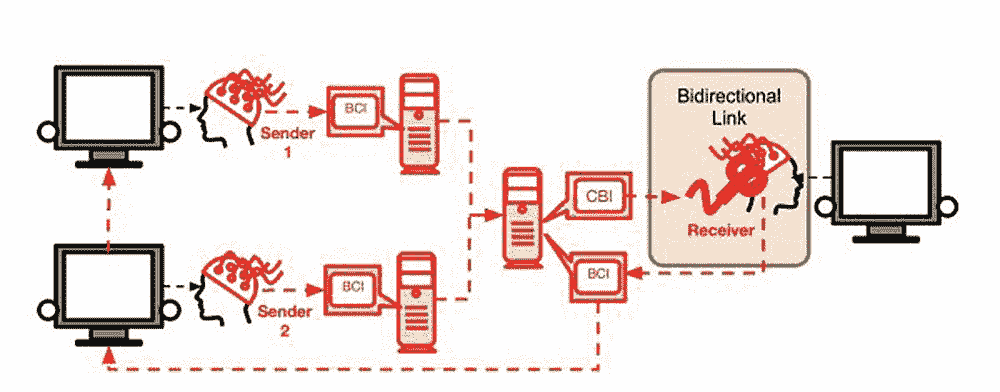
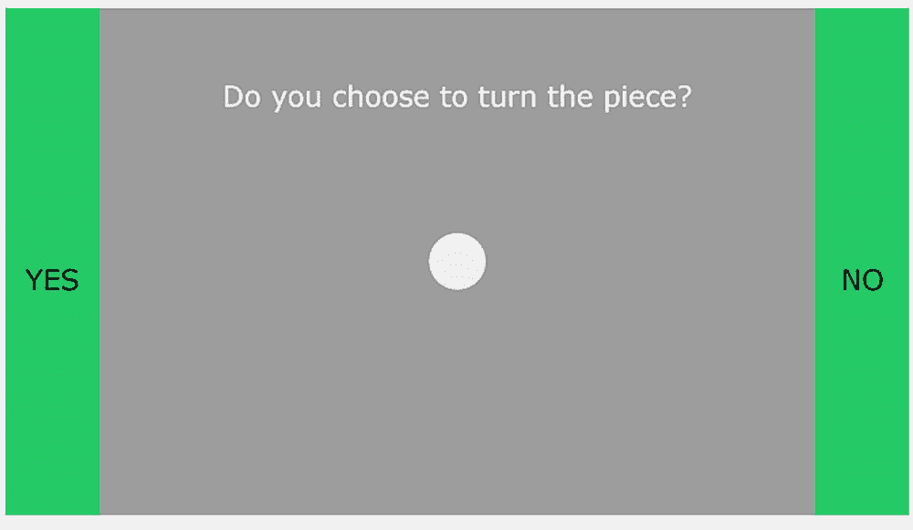
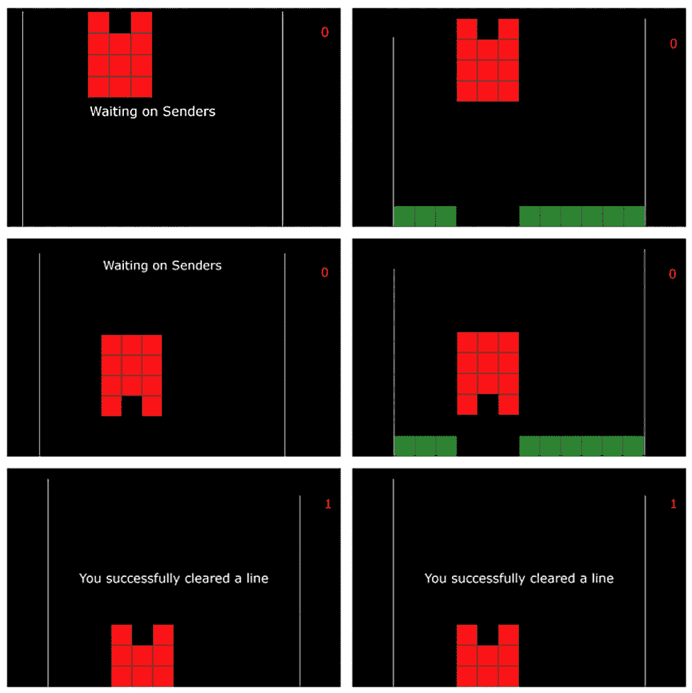

# 用脑对脑的“社交网络”以心灵感应的方式玩俄罗斯方块

> 原文：<https://thenewstack.io/play-tetris-telepathically-with-a-brain-to-brain-social-network/>

我们最近才开始习惯于[脑机接口](https://en.wikipedia.org/wiki/Brain%E2%80%93computer_interface) (BCIs)的想法，它直接在大脑和外部设备之间建立通信链接。到目前为止，我们已经看到了各种非侵入性脑机接口的例子，它允许人们用他们的思想[控制机械臂](https://thenewstack.io/control-robotic-arm-mind-using-machine-learning/)，或者帮助[机器人纠正自己](https://thenewstack.io/self-correcting-robot-thats-telepathically-controlled-human-brain/)。

但是，让一个人与另一个人直接交流，就像心灵感应一样的脑-脑接口怎么样呢？先前的研究表明，BBIs 可以在一个动物和另一个动物之间，一个动物和一个人之间，以及一个人和另一个人之间建立。现在，华盛顿大学的一组科学家已经直接连接了不止两个人，而是三个人，他们称之为世界上第一个脑对脑的“社交网络”

## “大脑网络”

在他们的[论文](https://arxiv.org/pdf/1809.08632.pdf)中，标题为 *BrainNet:一个用于大脑间直接协作的多人脑对脑接口*，该团队描述了该研究的参与者如何使用这个所谓的“脑网”来协作解决任务。更具体地说，这项研究涉及一个三人小组——两个信息“发送者”和一个“接收者”——他们分别被安置在不同的房间里。每个人都被连接到一个脑电图(EEG)机器上，该机器可以追踪大脑活动时的电脉冲。此外，“接收器”与经颅磁刺激(TMS)机器相连，该机器产生磁场来刺激大脑中的某些神经细胞。

然后，三名参与者被要求玩一个简化版的类似俄罗斯方块的游戏，其中两个发送者能够看到整个屏幕，但接收者只能看到它们下降时的几何图形，而不能看到它们最终在屏幕底部的位置。这个想法是，发送者必须充当接收者的眼睛，然后与“接收者”合作，以便让碎片旋转并正确匹配。

为了做到这一点，实验使用所谓的[稳态视觉诱发电位](https://en.wikipedia.org/wiki/Steady_state_visually_evoked_potential) (SSVEPs)来帮助参与者相互交流。为了产生这些 SSVEP 信号，发送者将他们的目光集中在屏幕两侧的两个闪烁的 LED 灯之一上。在一侧，灯以较高的频率闪烁，以表示“是，旋转棋子”的决定，而在另一侧，另一个灯以较低的频率闪烁，以表示“不，不旋转”的决定。

通过引导他们的眼睛盯着这些重复的闪光，发送者的脑电波以相同的频率传输，产生一个 SSVEP 信号，然后由 EEG 编码，通过互联网传输到接收者的 TMS。然后，接收到的信号促使 TMS 产生电反应，使接收器看到闪光。较高强度的闪光意味着他们需要旋转木块，而较低强度的闪光意味着接收者需要不去碰木块。

为了增加一点额外的挑战，有时一个发送者得到错误的信息，然后这些信息被转发给接收者，这意味着接收者有时必须评估哪个发送者发送了正确的信息。根据研究人员的说法，尽管这些故意的干预措施“人为地将噪音注入”接收者的决策过程，但测试组能够在大约 81.25%的时间里成功完成类似俄罗斯方块的游戏。

研究小组解释说:“仅使用大脑网络传递的信息，接收者就能够学会区分其他主体传递给他们大脑的信息的可靠性，并选择更可信的发送者。”“这使得 BrainNet 介导的信息交换类似于现实生活中的社交交流，让我们离‘大脑社交网络’更近了一步。”"

不用说，这种技术有很多可能性，尤其是如果它被放大的话。该团队设想，在未来，“基于云的脑-脑接口服务器”可以允许通过互联网在世界各地直接传输数据。当然，这样一个全球性的大脑网络会提出一些必要的问题，如隐私、安全和其他相关的神经权利，但不用说，这是一个非常令人兴奋的前景，也可以让人们更深入地了解个人意识如何超越人类头骨的生物界限，以便集体工作。

图片: [rawpixel](https://www.rawpixel.com/) ，华盛顿大学。

<svg xmlns:xlink="http://www.w3.org/1999/xlink" viewBox="0 0 68 31" version="1.1"><title>Group</title> <desc>Created with Sketch.</desc></svg>