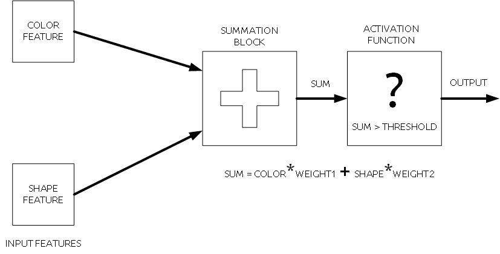
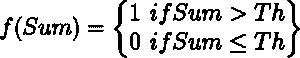
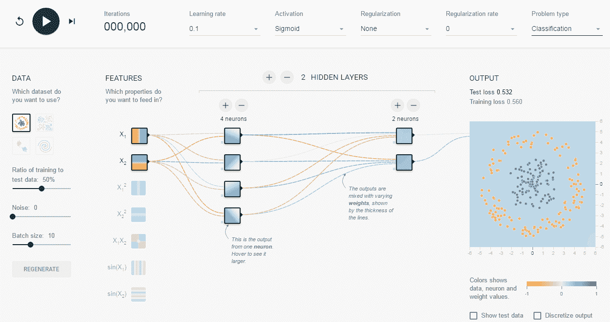

# 在你的浏览器上建立并运行一个人工神经网络

> 原文：<https://thenewstack.io/playtime-neural-network/>

在之前的一篇文章中，我们构建了一个图像分类器，可以检测图像中的花朵。建立过程包括安装 Docker、下载数据集、连接 TensorFlow 图像、重新训练人工神经网络等几个步骤。

但是，如果您想超越上述所有步骤，并在 web 浏览器中可视化结果，而不用担心破坏代码，该怎么办呢？这听起来很棒，会很棒的。因此，在本帖中，我们将展示人工神经网络(ANN)如何从提供的输入数据中学习，以及当提供不同类型的输入时，其输出如何变化，同时了解在学习过程中起关键作用的不同参数。下图显示了人工神经网络的基本工作原理。

然后我们将在一个浏览器内人工神经网络模拟器中测试这些概念，这个模拟器是由谷歌的一些人创建的。

## 度量衡

人工神经网络的基本工作原理

首先，ANN 采用输入特征的组合，每个特征都有自己的权重。权重分配可以被认为是将*优先级*分配给一个特征。在求和块中，所有输入特征首先与其权重相乘，然后求和。

在此之后，执行*阈值检查*，验证*总和*是否超过*阈值。*如果总和超过阈值，则 ANN 激活*，其状态变为 ON*，并产生相应的输出，否则保持*去激活*，其状态保持 *OFF* 。**

 *例如，考虑构建一个对图像中的红球进行分类的算法。我们将选择的最可能的输入要素集是红色和圆形。现在，与颜色相比，我们更重视形状特征。为此，我们将为这两个特征分配权重*参数*，但是与颜色特征相比，形状特征的权重将具有更高的权重。

这一步完成了输入特性和求和模块。现在是选择*激活函数*的步骤，它将执行阈值检查。有几种类型的可用函数，如[s 形函数](http://mathworld.wolfram.com/SigmoidFunction.html)和[阶跃函数](http://mathworld.wolfram.com/StepFunction.html)，或者您可以创建自己的函数。您可以尝试更改不同类型的函数，并查看相应的输出。对于这个例子，我们想要一个 True 或 False (0 或 1)的输出。因此，*阶跃函数*似乎是一个不错的选择，其输出响应可由下式给出:

激活功能

因此，如果*和*大于选择的阈值，则状态为开，这意味着图像中存在红球，否则为否。可能发生的情况是，所选择的阈值对于分类器来说不是完美地工作，或者简单的线性激活函数可能不能处理输入特征的类型。

有时操作可能试图*过度拟合*输入特征数据，因此可能无法正常工作并给出突然的预测响应。为了解决这个问题，通常在函数 **f(Sum)** 中添加一个*正则化*项，这有助于提高算法的性能。

为了更好地理解我们在这篇文章中看到的术语，并进一步探索，请查看由谷歌的丹尼尔·斯米尔科夫和山·卡特创建的在线实验工具，它允许你在网络浏览器中直接修改人工神经网络:

不用担心破解代码的人工神经网络

在该工具中，块代表神经元，神经元层之间的连接厚度显示其权重(重要性)。正如你所看到的，人工神经网络包含 2 个隐藏层，但更多的层可以通过点击顶部的加号和减号按钮来添加。

同样，神经元的数量可以通过点击类似的按钮来控制。在左侧，有不同类型的数据集，人工神经网络可以在这些数据集上进行训练和测试，通过选择*功能，可以将一些独特的属性添加到数据集。*可从下拉菜单中选择激活功能及其学习率。

学习率决定了在*时间内神经网络学习的*进程*。*同样，也可以控制正则化率，防止我们稍早谈到的过拟合问题。另一个术语与数据分类密切相关，但实际上与数据分类有很大不同，称为*回归。*当给定某种类型的输入时，回归用于预测给定函数的输出值，但不标记它。然而，在分类中，目标是预测输出，但也为输出提供标签(分类)。在该工具中，所有参数都可以通过编辑条目或悬停在该块上然后编辑值来进行调整。

根据数据集的类型，和/或通过用激活函数添加噪声，可以在屏幕的右侧同时查看图形形式的训练损失、测试损失和学习进度形式的输出响应。我希望通过使用这个工具，你可以学习和看到很多[机器学习](/category/machine-learning/)的基本概念在行动，如果你想将人工智能用于你的优势，这是非常重要的。

快乐学习，敬请期待接下来的探索！

<svg xmlns:xlink="http://www.w3.org/1999/xlink" viewBox="0 0 68 31" version="1.1"><title>Group</title> <desc>Created with Sketch.</desc></svg>*