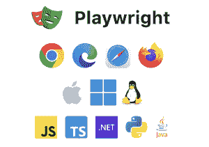
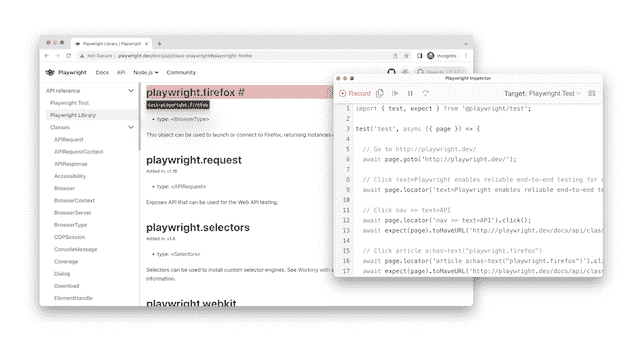
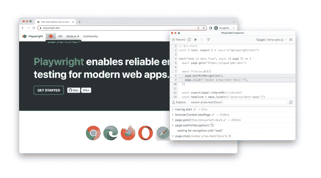
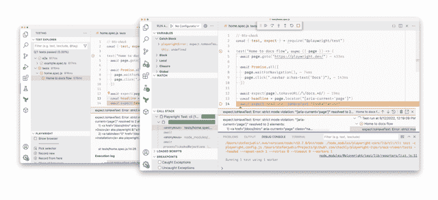
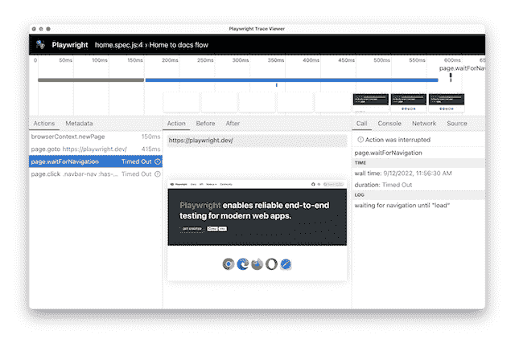

# 一个节省时间的端到端测试框架

> 原文：<https://thenewstack.io/playwright-a-time-saving-end-to-end-testing-framework/>

你对你的网站现在正常运行有多大信心？

我相当确定我的项目已经完成，但是我总是面对这种对生产问题的隐藏的恐惧，只是我还不知道。

因为东西会坏掉。不被注意。一直都是。

当然，高的自动化测试覆盖率是有帮助的，但是这说起来容易做起来难，因为创建一个运行良好的测试套件是具有挑战性的。

应该写什么测试？单元测试？端到端测试？我应该测试 API 还是使用它们的应用程序？还是两者都有？然后，我应该在何时何地运行所有这些测试？

我没有所有的答案，因为与软件工程类似，测试中没有灵丹妙药。这总是一个权衡的问题。

但是让我告诉你我是如何在为 web 构建了十年之后解决测试问题的，并且今天分享我选择的工具。

## 剧作家——现代端到端测试解决方案

虽然在我职业生涯的大部分时间里，我是一个痴迷的“100%单元测试覆盖率”倡导者，但今天，我倾向于端到端的用户体验测试。当一千个经过单元测试的组件组合在一起失败时，它们将无济于事。另一方面，端到端的测试保证了所有的部分都能正确地协同工作。

然而，我的端到端测试经历是一条非常坎坷的道路。在早期，我使用 Selenium、PhantomJS 和 CasperJS，并且不断地无法创建稳定的测试套件，最终只能以不可靠的系统报告无用的误报而告终。

木偶师、Cypress 和其他现代工具是朝着正确方向迈出的一大步，但是有一个工具开发人员社区没有充分讨论。

让我告诉你为什么微软的开源剧作家[](https://playwright.dev/)是这个领域中被低估的玩家！

### 跨浏览器、跨语言和跨平台

首先，剧作家是“跨越一切”



控制所有现代浏览器渲染引擎:Chromium (Chrome/Edge)、WebKit (Safari)、Gecko (Firefox)。

还有，剧作家是跨平台的。在 Windows、macOS、Linux、您的 CI 或本地运行它。

最后，剧作家也可以跨编程语言工作。用你最喜欢的语言写你的测试:TypeScript，JavaScript，Python。支持. NET 或 Java。

这三点已经是很扎实的基础了，但是在选择测试方案的时候至少还有两点需要考虑:速度和开发者体验。

让我们深入了解这些！

### 为节省时间而构建的测试框架

如果你相信自动化测试，你会不断创造新的测试。每增加一个测试都会使你的测试套件变慢，因为需要运行更多的代码。缓慢的测试套件会成为干扰交付过程的负担。当它变得太慢时，您的开发人员只会在“需要的时候”运行它们。我也经历过这种情况，相信我，这是你失败的时刻。

留意你的测试执行时间，否则你不会成功。

但是剧作家如何在速度上有所作为呢？

**使用 DevTools 协议控制浏览器**

剧作家利用 Chrome DevTools 协议直接与浏览器通信。该协议允许比其替代方案更快和更少的古怪执行。我们在这里只讨论几分之一秒，但是这些加起来！

**自动等待、可操作性和网络优先主张**

端到端测试通常包括许多`waitFor`语句。点按一个按钮，然后等待某个东西出现。提交表单，并等待新页面加载。当您端到端测试您的产品时，总有一些事情需要等待。

令人耳目一新的是，等待被融入了剧作家本身。点击元素或填充输入 [等 UI 动作自动等待](https://playwright.dev/docs/actionability) 。

假设您想要单击一个在 UI 操作后显示的按钮；您现在可以执行 UI 操作，等待按钮出现，然后单击它。

在剧作家，你可以“只是”点击按钮，跳过等待的步骤。框架等待元素可操作，这意味着:它在 DOM 中，可见，没有动画，启用，并且没有被其他元素遮挡。

```
```javascript

// click this button when it is actionable

await page.click('[data-test=cta]')

```

```

这种自动等待机制极大地简化了 UI 测试，因此您可以专注于您的行为测试，而不是编写代码来等待。但这还不是全部！

剧作家背后的团队也将自动等待融入到他们的断言库中。Web 优先断言看起来像是一些方便的方法，但是还有更多。

让我们看一个例子。

```
```javascript

// wait for the .status element to have the text “Submitted”

await expect(page.locator('.success)).toHaveText('You made it!');

```

```

上面的断言查询一个 DOM 元素，并检查它是否包含文本“Submitted”。但是这个断言并不是一张支票。“expect”重新运行检查，直到满足条件或超时。

虽然这看起来是一个不重要的细节，但它导致了更干净的代码，因为您不必担心元素何时达到特定状态。忘记所有这些手动的“等待”语句，让剧作家自己解决剩下的问题吧！

自动等待是避免随机超时浪费时间和创建最精简测试的好方法。但是，如果这还不够，并且您的测试套件仍然突破了不可接受的执行时间，该怎么办呢？

平行化，平行化，平行化

剧作家允许你 [并行化你的测试](https://playwright.dev/docs/test-parallel) ，并在编排好的操作系统进程(工作者进程)中运行它们。配置您要启动多少个工人，定义应该并行运行什么，然后就到此为止。这真的没什么大不了的，但是并行化将大大加快您的测试速度。

快速测试是故事的第一部分，但是开发人员的体验呢？

### 运行、记录和调试

虽然剧作家主要是一个命令行工具，但它附带了方便的“辅助应用程序”来缓解复杂的端到端测试主题。

**记录并调试你的脚本**

编写新的测试需要时间，这正是代码生成有所帮助的时候。运行一个 CLI 命令，开始记录下一个端到端测试的基础。

```
```sh

<span class="s3">npx playwright codegen playwright.dev</span>

```

```

该命令将打开一个浏览器窗口和剧作家检查器。点击链接或填写表格等浏览器操作将被记录在生成的脚本中。当你完成你的记录，拿起脚本，调整选择器，添加断言，然后把新的脚本移到你的代码库中。



但是检查器不仅仅在你创建新脚本的时候有用。有些情况下，您必须调试现有的脚本，以找出您的测试不工作的原因。调试模式提供了一种单步调试浏览器脚本的简单方法。剧作家会突出选定的元素，这样更容易发现哪里出错了。



但也许你更像是一个 IDE 的人；剧作家也把你包括在内了。

**强大的 VS 代码扩展**

为了不运行额外的应用程序，您可以安装[剧作家 VS 代码](https://marketplace.visualstudio.com/items?itemName=ms-playwright.playwright)扩展，并从 VS 代码中调试、记录和运行您的测试代码。



这就是创建和本地调试，但是当脚本在您的机器上工作但在其他环境中失败时，您该怎么办？

**回溯追踪**

为了在远程环境中调试失败的脚本，剧作家支持跟踪。生成的 zip 存档可以通过另一个 CLI 命令或 [剧作家的在线跟踪检查器](https://trace.playwright.dev/) 进行检查。你会发现一个时间表，所有的说明，以及失败测试的截图就在你面前。



得到测试失败的通知，下载跟踪并找出发生了什么。没有什么比过去的时光旅行更好的了！

用所有这些工具开发测试会是一种极好的开发体验。下一步是什么？

## 您应该在何时何地运行您的测试？

随着现代测试工具的出现，最后一个问题仍然存在。你应该什么时候运行你的测试来确保你的整个堆栈都在运行？

开发团队理想地遵循 DevOps 原则，涵盖特性开发、交付和测试。您的自动化测试套件应该至少在每次部署的 CI/CD 管道中运行，以避免退化。新生产部署的测试应该是获得一些信心的最低限度。但是怎么才能达到 100%的自信呢？

### 开发人员来测试，但留下来进行监控

我了解到部署驱动的测试执行并没有给我所有项目足够的信心。我们来看两个例子。

考虑一个没有任何运行时计算的静态 [Jamstack 站点](https://thenewstack.io/the-sweetness-of-jamstack-javascript-apis-and-markup/)。从设计上来说，这种技术体系很少出错。在部署时进行测试可能就足够了。

但是另一方面，请考虑一个具有定期数据库更新、用户生成的数据和多个相关第三方提供者的系统。这些项目中出错的可能性极高。部署驱动的测试不能解决这个问题。

监控 API 以满足正常运行时间 SLA 是常见的做法。为什么我们不用同样的方法测试我们的 ui 呢？你多久使用一次保证 99.999% API 正常运行时间的服务，却在他们的 web 产品中发现小故障？这些事情我见得太多了。

所以这是这篇文章的热点:ui 应该像 API 一样被小心的监控，以使它们能够提供最好的产品。产品应该进行端到端的测试。一直都是！

还有像 Checkly 这样的 [工具，它们扩展了剧作家的功能，使你能够测试你的部署并监控你的整个技术堆栈。使用剧作家测试您的站点端到端，本地，部署和时间表。提高标准，确保任何时候一切正常。](https://checklyhq.com/)

## 测试重要的东西，运送一流的产品！

唯一重要的是产品的工作没有惊喜。问题必须在影响生产之前被发现，像我这样的开发人员应该消除对生产问题的持续恐惧。

测试领域有很多活动。剧作家和所有其他新的测试解决方案是迈向更好软件的重要一步。所以，如果你还没有对你的产品进行端到端的测试，也许今天就是开始的时候了！相信我，端到端测试已经走过了很长的路，这是 100%自信的方式。终于！

<svg xmlns:xlink="http://www.w3.org/1999/xlink" viewBox="0 0 68 31" version="1.1"><title>Group</title> <desc>Created with Sketch.</desc></svg>