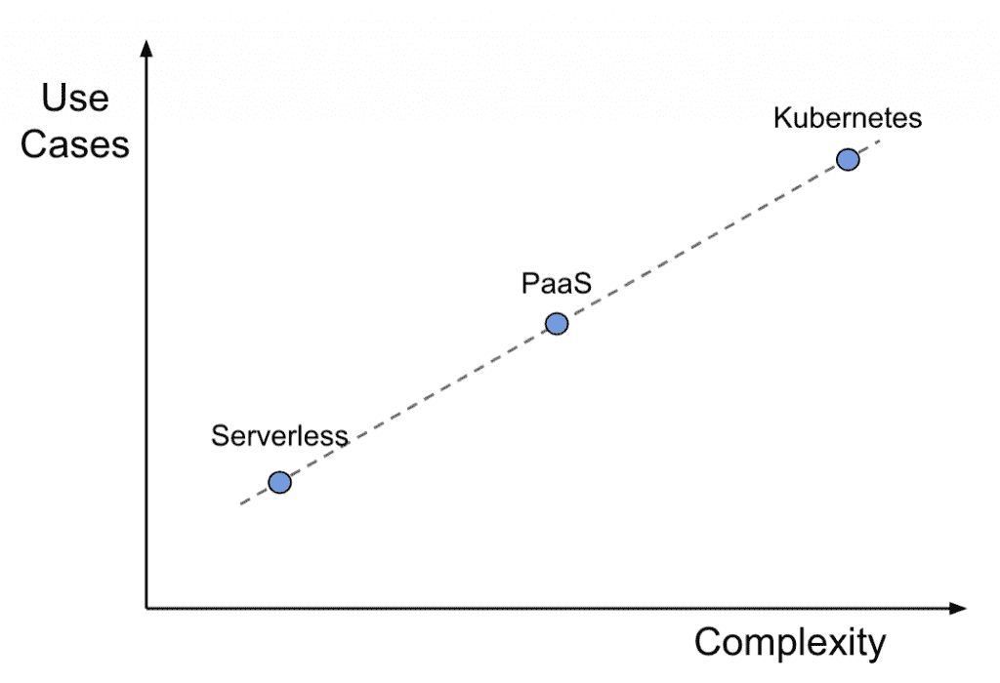
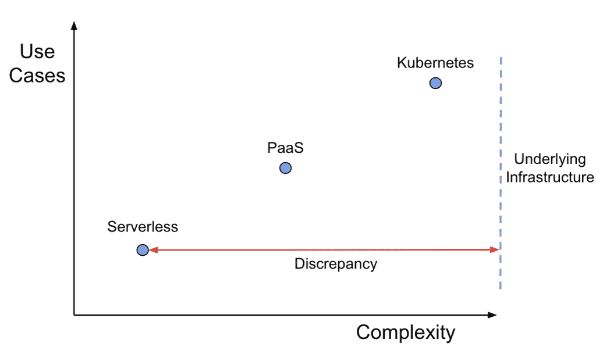

# 请无服务器，有意见

> 原文：<https://thenewstack.io/please-serverless-have-an-opinion/>

 [山姆·法里德

山姆·法里德是硅谷的一名软件工程师，他曾参与过世界范围的基础设施建设，比如谷歌的无服务器平台和 YouTube 的反欺诈系统。Sam 喜欢自动完成任务，手工完成可能会更快，在大学期间担任过一段时间的电台 DJ 后，他仍然语速过快。](https://www.linkedin.com/in/sam-farid-0b87219a/) 

下面是一个典型的中断，虽然很糟糕:

网络中断几秒钟。每个客户端应用程序都进入离线模式，对客户请求进行排队，当一切恢复在线时，所有请求会立即涌入。即使您已经使用一个[无服务器](https://thenewstack.io/category/serverless/)服务设置了您的应用程序代码来处理来自客户端的突发流量，这个流量峰值也比平常要大。“无服务器”自动伸缩通过加倍实例来响应，但是数据库没有配置为处理这么多打开的连接。这开始了一个级联失败:数据库开始抛出错误，这导致每个失败的请求被重试，这导致更多的自动伸缩，这…

剩下的时间用来调整实例大小、重新配置数据库，并疯狂地为客户机添加指数补偿特性，以避免下次给自己下药。幸运的话，交通将在非工作时间减慢到足以让一切恢复正常。

我支持无可指责的尸检，但在这种情况下，我倾向于问自己这是我的错还是我们堆栈的结果。在我职业生涯的早期，我会责怪自己——我应该更熟悉代码，反应更快，准备好剧本，事情就不会变成这样。

在内部从事云平台工作后，我开始相信，一定比例的停机是您选择的基础架构提供商的自然功能。

> 无服务器提供功能即服务，具有无限的可扩展性，但您需要确保它所涉及的一切都能够处理其规模。

在这次停机中，数据库抛出了错误，因为它无法处理规模。但我认为真正的原因是无服务器背后的设计理念:它提供功能即服务，具有无限的可扩展性，但要确保它所涉及的一切都能够处理它的规模，这取决于你。

本质上，无服务器给了你足够的自由去搞砸事情，但是没有足够的灵活性去防止这些错误。它不只是运行。

从替代无服务器的角度来看，这些设计选择尤其令人沮丧。当一个团队选择无服务器作为他们的应用程序代码时，他们就对他们的服务和技术策略的优先级做出了强有力的声明——他们希望专注于业务逻辑，并将其余的交给他们的云提供商。

这种选择更多托管基础设施的选择可以用新项目的其他常见选择来表示:Kubernetes，以及一些 PaaS 风格，如 Heroku 或[Amazon Web Services](https://aws.amazon.com/?utm_content=inline-mention)Elastic Beanstalk。

微妙但危险的问题是，这些选项中的每一个都以相似的复杂性实现。无服务器是一个抽象概念，无论它看起来多么简单，底层基础设施的任何地方都可能出现问题。无服务器在设置时要求最少，但当出现问题时，要求最多。

Kubernetes 知道它是什么，它不在乎[你是否认为它很复杂](https://www.infoworld.com/article/3614850/no-one-wants-to-manage-kubernetes-anymore.html)。您选择 Kubernetes 是因为它的灵活性，如果您需要任何帮助来管理它，供应商可以加入进来。

无服务器是另一个极端，它的权衡只有在孤立的情况下才有价值。如果无服务器对其周围的生态系统采取立场，它可以防止这次停机。如果它包装有一个弹性的、全球可访问的存储层会怎么样？如果它的负载平衡器在错误开始后对传入的请求进行速率限制，会怎么样呢？如果它可以重新配置每个实例打开的数据库连接数会怎么样？

哪个不重要，应该只是有而不是没有。无服务器离处理所有生产开发工作如此之近，如果它走完了最后一英里呢？

<svg xmlns:xlink="http://www.w3.org/1999/xlink" viewBox="0 0 68 31" version="1.1"><title>Group</title> <desc>Created with Sketch.</desc></svg>