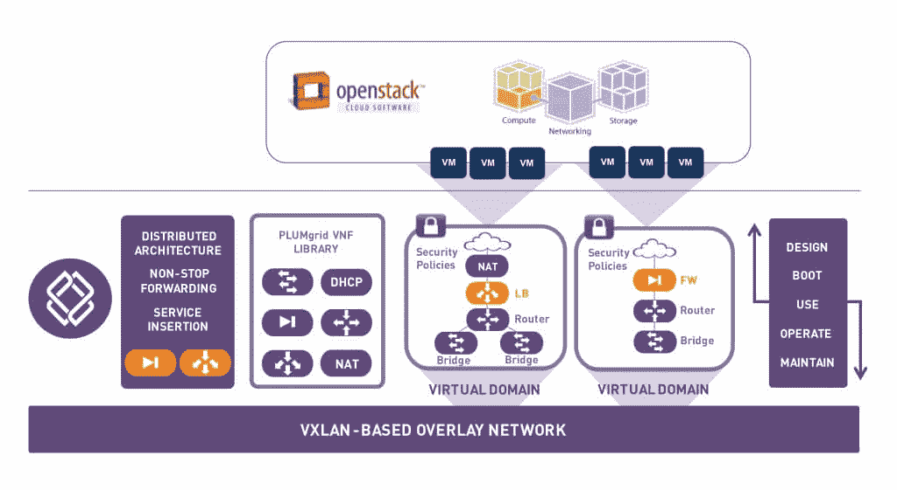

# PLUMGrid 更新其 OpenStack 网络软件，支持 Docker，Kuryr

> 原文：<https://thenewstack.io/plumgrid-brings-docker-support-sdn-offering-ons-5-0/>

[PLUMgrid](http://www.plumgrid.com/) 更新了用于 OpenStack 部署的虚拟网络基础设施软件——开放网络套件(ONS ),以包括 Docker 支持。

ONS 允许客户创建私有虚拟域，为每个租户提供流量隔离、安全组和策略实施的微分段。新发布的 5.0 版本支持 OpenStack 版本、Kilo 和 Liberty，它的目标是企业客户和服务提供商。

ONS 的最新版本为 OpenStack 用户带来了许多新功能，但最显著的功能是对 Docker 容器的支持，在 5.0 中可用，也可以作为 4.x 版本的反向移植。

“增加对 Docker 容器的支持可提供 SDN[软件定义网络]服务，这对于保护多租户网络至关重要。PLUMgrid 创始人兼首席技术官 Pere Monclus 在一份声明中表示:“在这种复杂的环境下，拥有 CloudApex 这样的工具来简化 OpenStack 云中的物理和虚拟资源，对于数据中心运营来说至关重要。

根据 PLUMgrid 的说法，随着容器部署的不断增加，对连接之外的高级虚拟网络服务的需求也越来越多。该公司正在通过为 Docker containers 提供 SDN [插件](https://github.com/plumgrid/libnetwork-plugin)来满足这一需求，从而为 Docker 云提供丰富的网络功能、安全多租户、多主机网络、高可用性和分布式横向扩展性能。

ONS 为 OpenStack cloud 带来了许多新功能。

“部署 OpenStack 的客户基本上都在使用没有 ONS 5.0 中提供的许多功能的 [Trunk](https://www.openstack.org/summit/portland-2013/session-videos/presentation/deploying-openstack-trunk-into-a-production-environment) 。我们还为 OpenStack 提供微分段；我们为多租户提供微分段。它提供了完全的流量隔离和安全执行，”PLUMgrid 产品管理和营销副总裁温迪·卡特解释说。

“客户可以定义每个微分段虚拟域的虚拟类型，”Cartee 说。“他们可以基于租户部署这种虚拟类型。对于希望在有多个租户的地方建立数据中心的客户来说，这是一个巨大的优势。例如，租户可以是工作负载、应用程序，也可以是企业内的不同部门。它非常灵活，允许客户以他们希望的任何方式定义租赁。”

在这个版本中，ONS 还增加了对 Kuryr 项目的支持，这是一个 OpenStack 计划，为 Neutron API 提供容器网络抽象。ONS 和 Project Kuryr 共同支持 OpenStack 云构建者在虚拟域中部署容器、虚拟机和裸机架构。

“我们提供一种称为服务插入架构(SIA)的技术，允许我们的客户从第三方获得虚拟网络功能，并能够将其插入到我们的 SDN 架构中，”Cartee 说。“因此，如果客户拥有基于软件的 SIA 防火墙，他们可以将该防火墙直接插入到我们的 SDN 软件中，并能够利用该防火墙来保护他们的流量，根据需要保护微分段域。”

这是一个巨大的优势，因为它为客户提供了很大的灵活性，因为他们可以使用任何第三方 DNS 或 VNF，并能够在像 ONS 5.0 这样的通用 SDN 架构中利用这一点。

Cartee 表示，OpenStack 用户面临的最大挑战之一是无法监控他们在 OpenStack 上的 SDN 状态，包括虚拟和物理资源。一旦部署了网络，架构师团队通常会将云交给他们的运营人员。因此，工作人员需要一种简单快捷的方法来监控网络的健康状况。

为此，ONS 5.0 推出了智能向导，可检查系统和连接状态，以确保工作负载和应用程序能够畅通无阻地访问资源。一些向导包括安全策略连接向导、系统资源向导和配置数据库向导。

PLUMgrid 还为部署 overlay SDN 提供了许多运营工具和分析。“自从 ONS 问世以来，我们一直在通过提供许多内置于 ONS 和 GUI 中的工具来解决这个问题。现在，它显示了虚拟资源以及数据中心中的特定资源，便于直观地了解虚拟资源和物理资源之间的关系。它使运营商能够非常容易地监控和排除其数据中心资源的健康状况，”Cartee 说。

在这个版本中，该公司还引入了 SmartLogs，这是一个基于 Riemann 的开源插件，可以将机器数据提取为可操作的日志消息，以便操作员轻松关联、故障排除和解决云范围内的问题。

还没完呢！ONS 5.0 还带来了 CloudApex，这是一个实时 SDN 可视化和监控平台，具有基于亲和力的 GUI、云范围的搜索和实时热图。CloudApex 通过单一控制台提供直观的仪表板视图，简化了对企业虚拟和物理资源的监控。

“Cloud Apex 包含一个热图，可以实时动态地向他们显示虚拟机的运行状况。状态显示为红色、黄色和绿色，因此他们可以快速看到开放堆栈云中的潜在热点，并能够主动解决这些问题，”Cartee 说。

ONS 不受硬件限制，支持任何 L2 和 L3 数据中心结构，允许企业按需添加微分段以实现多租户。基于客户需求，PLUMgrid 还增加了对思科 Nexus 9000 系列的网关支持；它已经支持 Arista 网络和 Cumulus 网络的网关。

由于 IPv4 地址即将用完，ONS 正在启用对并发 IPv4 和 IPv6 地址的支持。客户可以在租户云内部和之间配置 IPv6，以便在 IPv4 并发运行时实现灵活寻址。这使客户能够满足合规性要求，扩展到新的区域，支持新的应用，并为物联网等新市场铺平道路。

PLUMgrid ONS 通过 PLUMgrid 点火计划在全球范围内提供免费试驾。

Docker 是新堆栈的赞助商。

通过 Pixabay 的特征图像。

<svg xmlns:xlink="http://www.w3.org/1999/xlink" viewBox="0 0 68 31" version="1.1"><title>Group</title> <desc>Created with Sketch.</desc></svg>