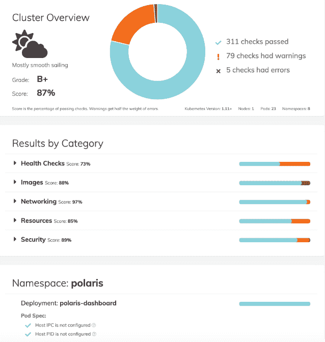
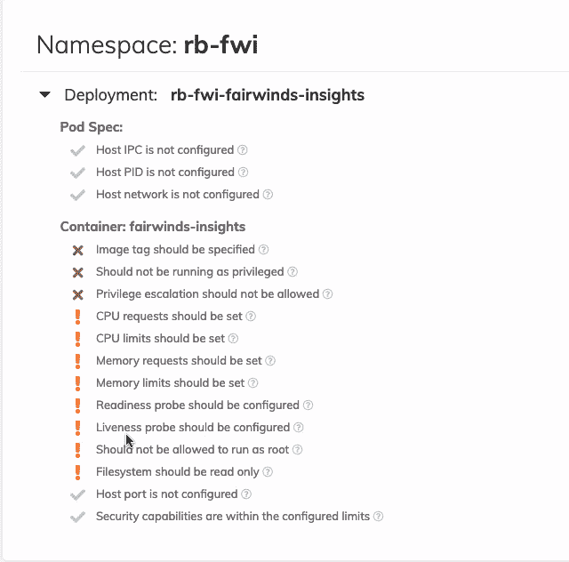

# 北极星为 Kubernetes 的最佳实践指明了方向

> 原文：<https://thenewstack.io/polaris-points-the-way-to-kubernetes-best-practices/>

Fairwinds 的一个新的开源项目旨在拯救开发者。它名为 [Polaris](https://github.com/FairwindsOps/polaris) ，进行大约 20 次检查，以确保 Kubernetes 的部署符合最佳实践。

这些事情很容易被开发团队忽略，但是会导致可靠性和安全性问题。

“许多 DevOps 团队花时间记录最佳实践，并教育开发人员遵循最佳实践。这是一个耗时的过程。我们一直在这样做，并建立了一些强制机制，以便公司可以识别他们部署的风险，并防止这些部署进入生产，[公司开源总监罗伯特·布伦南](https://www.linkedin.com/in/robert-a-brennan/)说。(不要和[的董事长鲍勃·布伦南](https://www.linkedin.com/in/bobbrennan236/)混淆。)

它的最佳实践基于其作为 Kubernetes 提供商的多年经验以及在 Kubernetes 社区中共享的经验。

Polaris 提供了两种运行检查的方式:通过仪表板或作为验证 webhook。

该控制面板提供了集群运行状况的得分，以及每个工作负载的详细报告，按类别、命名空间和部署列出了结果。每个检查链接到关于该主题的文档和更多资源。它还提供了改进建议。

您可以深入查看每个检查类别。例如，在 images 下，开发人员可能会将指定图像的字段留空，Kubernetes 将总是获取最新版本。Fairwinds 战略副总裁 Joe Pelletier 说:[这是一个让代码在生产中运行的好方法，如果你有一点试验性的代码在某个地方运行，这是你没有计划的。该检查确保每个部署都使用特定的图像标记。](https://twitter.com/joepelletier?lang=en)

您还可以设置资源请求和限制。“如果你不设置这些东西，Kubernetes 就很难像魔法一样扩展你的部署，当 pit 运行不正常时计算它并自动重启它们。Pelletier 说:“开发人员需要计算应该使用多少内存和 CPU，如果他们不这样做，Polaris 就会发出警报。

您还可以深入到非常具体的部署，例如特定团队负责的特定应用程序。

可选的 webhook 可以运行相同的验证，并将拒绝任何触发验证错误的部署。在一个演示中，Pelletier 试图提升特权，这是一个潜在的安全漏洞，被系统拒绝。

“如果你说你永远不希望一个容器运行特权，你可以把它设置为一个策略，你的开发者将无法绕过它，”他说。

“我们认为这是一个实验性的功能(公司称之为测试版),因为它阻碍了你与集群的交互。我们警告人们不要将此用于生产集群。

“我们不希望对您的集群能做什么和不能做什么有太多的规定。你可能有一个中断，你可能需要快速推动一些打破你的北极星配置。所以在投入生产之前，我们想对它进行更多的测试。我们希望在允许用户做他们需要做的事情来完成他们的工作和允许他们做一些会搬起石头砸自己的脚的事情之间找到一个平衡，”他说。

根据用户反馈，该公司为 Circle CI 和 Jenkins 等工具内置了持续集成/持续交付支持。

“通常，我们希望人们部署到生产环境的方式是不要让他们的最终开发人员与 Kubernetes API 交互。Pelletier 说:“只有一个 DevOps 工程师，一个真正了解 Kubernetes 的人，才会使用 kubectl 与 API 本身进行交互。

“我们希望普通开发人员通过 git 存储库检查他们的配置，让 CI/CD 流程运行，然后如果测试全部通过，就将该配置交付生产。…人们希望能够针对本地文件运行，并在弹出错误或分数低于特定阈值时让此命令失败。”

北极星与审计工具如 Sonobuoy 和 kubesec 竞争。该公司表示，不同之处在于，Polaris 分析部署层，重点是开发人员负责的配置，而大多数审计工具侧重于整体集群配置和设计，这通常会影响开发人员和基础设施工程师。

Polaris 也是完全可配置的——您可以决定应用哪些检查以及您希望每个检查的严重程度。违规应该仅仅是警告还是阻止部署？您可以设置可用资源的限制。

Polaris 可以在 GitHub 上找到，或者点击[网站](https://www.fairwinds.com/polaris)上的“验证你的集群”。

## **新方向**

该公司原名 ReactiveOps，在三位波士顿技术高管——前 Veracode 董事长兼首席执行官鲍勃·布伦南、前黑鸭软件首席技术官比尔·莱丁汉姆和 Volition Capital 创始合伙人罗布·凯特森——去年接管该公司后，该公司已更名为 Fairwinds。莱丁汉姆现在是首席执行官。

该公司正在努力将 it 从一家服务公司转变为一家解决方案提供商，以帮助客户迁移到云原生技术。

它的其他开源工具包括:

*   计算者，安装和管理多个舵图表版本。
*   [RBAC 管理器](https://github.com/FairwindsOps/rbac-manager)，旨在简化 Kubernetes 中的授权。
*   [rok8s 脚本](https://medium.com/uptime-99/using-rok8s-scripts-to-automate-your-deployment-workflow-1977acd4be63)，用于管理 Kubernetes 中应用部署生命周期的脚本。

专题图片: [N1tr0glyc3r1n](https://www.flickr.com/photos/157604335@N07/) 的“IMG_2557.jpg”。根据 CC BY-SA 2.0 获得许可。

<svg xmlns:xlink="http://www.w3.org/1999/xlink" viewBox="0 0 68 31" version="1.1"><title>Group</title> <desc>Created with Sketch.</desc></svg>