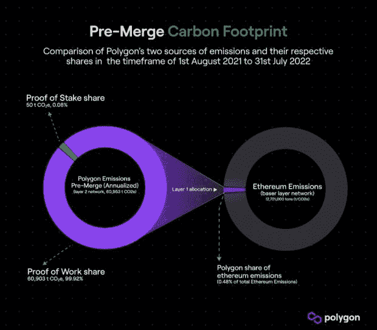
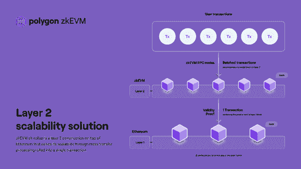

# 合并后多边形和第二层区块链的未来

> 原文：<https://thenewstack.io/polygon-future-following-the-ethereum-merge/>

在太平洋时间 9 月 14 日午夜之前，以太坊备受期待的从工作共识证明到利益证明的合并完成了。不是矿工解决数学问题作为一种方法来保护以太坊网络，验证者下注大量的以太坊令牌将确保网络保持安全。合并在一夜之间成功完成。

从技术角度来看，最大的胜利是以太坊大大降低了能源消耗，对环境没有任何有意义的影响。根据[自己的估计](https://ethereum.org/en/energy-consumption/#fn-1)，以太坊使用工作验证模式每年消耗 112 万亿瓦时的能源。预计合并后，这一数字将降至每年 0.01 TWh。能源足迹和由此产生的碳排放是对区块链技术最大的批评之一，也是分散应用(dApp)开发人员选择 Polygon 和 Arbitrum 等第二层(L2)区块链，而不是直接在以太坊区块链上构建的影响因素。

既然能源问题已经解决，为什么 dApp 的开发者会在后合并时代选择 L2 区块链呢？

## 减少碳排放

Polygon 的可持续发展预合并方法包括抵消 Polygon 与以太坊互动时产生的碳排放。Polygon 的可持续发展主管 [Stefan Renton](https://www.linkedin.com/in/stefan-renton-7b5132221/) 在接受新 Stack 采访时表示:“来自 Crypto Carbon Ratings Institute(CCRI)的一份报告发现，所有 Polygon 附近的排放(大约 60，903 吨 CO2)中有 99.92%来自以太坊工作验证基础层的活动。Polygon 自身的碳排放量(不包括以太坊活动)相对较小，仅为 50.13 吨二氧化碳。这相当于乘坐商务舱从慕尼黑到旧金山往返八次，或者是美国普通家庭年耗电量的十倍。”

合并后，Polygon 的目标是减少碳排放。在讨论这一目标时，Renton 说，“虽然合并将解决以太坊的绝大多数环境相关问题，但这远远不是 Polygon 可持续发展努力的结束。Polygon 完全致力于在 2022 年成为一个碳负平台。由于合并，加上我们自己的抵消措施，这在短期内是非常容易实现的。”

你可以在 Polygon 于 2022 年 4 月发布的[绿色宣言](https://blog.polygon.technology/our-green-manifesto/)中了解更多关于 Polygon 对可持续发展的承诺。

## 以太坊交易费用保持不变

合并不会改变与以太坊交易相关的可变交易成本，也就是人们常说的汽油费。伦顿说，“以太坊基金会指出，合并不是网络容量的扩大，因此[不会导致更低的天然气费用](https://ethereum.org/en/upgrades/merge/#misconceptions)。”第 2 层解决方案传统上具有低费用结构，这是吸引力的一部分。Polygon 和其他第二层区块链将继续比以太坊的交易模式节省大量成本。

## 第 2 层对于缩放仍然有效

合并后，以太坊网络上的交易处理速度大致保持不变。以太坊基金会强调了使用第二层区块链进行扩展的[案例，指出以太坊现有的容量限制。对于 Polygon 在此次扩展中的作用，Renton 表示:“作为领先的第 2 层以太坊扩展平台，Polygon 现在和将来都将继续提供比以太坊 L1 主网更便宜、更快速的交易。Polygon 的 zkEVM 推出后，这些优势将得到进一步加强，这是第一款基于零知识证明、完全兼容的以太坊虚拟机。”](https://ethereum.org/en/layer-2/)

Polygon 的 zkEVM 的早期测试表明，zkEVM 将以太坊当前的吞吐量提高几个数量级，同时将网络费用降低 90%以上。Polygon 博客下面的可视化显示了这可能是什么样子。

## 不需要应用程序更新

我问 Renton 的一个关键问题是，合并后开发者需要对他们的应用做什么样的改变。我还问开发者是否自动继承减少的碳排放。他说，“基于 Polygon 的 dApps 将不需要任何基础设施的改变，并将继续受益于 Polygon 的碳抵消和低排放。与此同时，由于合并将大大减少以太坊方面的碳排放，所有在 Polygon 上运行的 dApps 也将自动受益于此。”

## Polygon 继续增长

在合并之前，Polygon 显示出了强劲的采用迹象，今年许多知名公司都采用了它的区块链技术。星巴克宣布计划在本周推出由 Polygon 支持的区块链忠诚度计划。迪士尼在 7 月为其[加速器项目](https://thewaltdisneycompany.com/2022-disney-accelerator-participants-announced/)选择了 Polygon。

八月份， [Polygon 博客](https://blog.polygon.technology/polygon-is-now-home-to-over-37000-dapps/)上发布的 Alchemy 数据称，自成立以来，已有超过 37，000 个 dApps 在区块链上线。截至 7 月底，这些 dApps 中有 11，800 个是活跃的，比 2022 年 3 月的 8，000 个活跃项目有所增加。该报告的另一个关键统计数据显示，74%的项目完全建立在 Polygon 上，剩下的 26%跨越 Polygon 和 Ethereum。

dApp 开发者在合并后将如何进行应用部署还有待观察，但更低的交易费用和更高的交易吞吐量无疑是未来考虑第 2 层解决方案的一个令人信服的理由。

<svg xmlns:xlink="http://www.w3.org/1999/xlink" viewBox="0 0 68 31" version="1.1"><title>Group</title> <desc>Created with Sketch.</desc></svg>