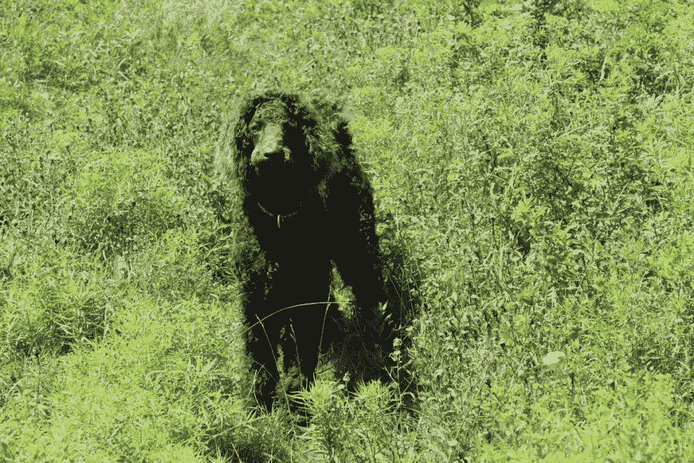

# 狮子狗，哈巴狗，还是香肠狗？使用 Python 和 Flask 部署狗识别张量流模型

> 原文：<https://thenewstack.io/poodle-pug-weiner-dog-deploying-dog-identification-tensorflow-model-using-python-flask/>

在本帖中，我们将创建一个演示，看看使用 Python 的 Flask 库开发一个基于[机器学习](/category/machine-learning/)的服务有多简单。

在很多情况下，您可能无法使用云服务来托管您的模型，而需要使用自己的推理服务。在许多大型企业中，内部解决方案是强制性的。购买第三方解决方案的审批过程也很漫长和复杂。所以开发自己的小服务可能是最好的解决方案。

我们将在这里开发的演示将是一个如何加载和托管您的模型的概念验证演示，但不会涉及有关安全性、身份验证或负载平衡的问题。

## 开发模型

皮特·加尔辛

作为 ActiveState 的开发者代言人，Pete 在网页和游戏软件开发方面拥有超过 15 年的经验，发布了 40 多种产品，从程序员到音频总监再到执行制作人。他在滑铁卢大学获得了本科学位，在渥太华的卡尔顿大学获得了传播学硕士学位。他热衷于参与社区，致力于增强开发人员对 ActiveState 产品的体验。

第一阶段是开发模型。您可能已经有了一个您一直在培训的模型，可以随时部署。有几种方法可以使用 [TensorFlow](https://www.tensorflow.org/) 准备好您的模型进行部署。例如，您可以使用 TensorFlow 的“冻结图形”功能将整个图形导出为协议缓冲区，以用于服务。

在我们的演示中，我们将开发一个超级强大的人工智能，它能够确定贵宾犬、哈巴狗和“维也纳狗”(又名腊肠狗)之间的区别。对于这项前沿技术，我们可以使用谷歌 [Inception](https://github.com/google/inception) 或 [MobileNet](https://github.com/Zehaos/MobileNet) 模型的再培训版本。

现在，就像著名的[硅谷“不是热狗”](https://www.engadget.com/2017/06/26/silicon-valley-not-hotdog-app-android/)应用程序一样，我们的*实际狗*识别算法肯定会对人类有很大用处。因此，一旦我们训练了我们的模型来识别这些关键的狗品种，我们将想要创建一个服务，使它对世界可用。

重新训练 Inception 或者 MobileNet 模型实际上非常简单。只需在一个带标签的子文件夹中提供一系列图像，就可以训练它对全新类别的对象进行分类。然后，它会采取这些图像，分类标签(即。文件夹名称)，并在中输出新训练的模型。pb 格式。

**提示:如果你正在寻找关于如何重新培训这些模型的优秀介绍和教程，你可以通过谷歌提供的这个代码实验室** **来工作。**

出于性能原因，我们选择 MobileNet 模型。它针对移动设备的使用进行了优化。这个模型为了速度牺牲了一些准确性，但是对于我们的用例来说非常好。

然后，我们可以修改 Google 的一个标签脚本，其中包含有用的实用函数，用于加载图形和将图像转换为张量，以便与 TensorFlow 一起使用。这个改编后的脚本将成为我们推理服务的基础。

## 构建服务

一旦我们重新训练了模型并将其导出到磁盘，我们就可以将模型托管为服务。我们将使用一个简单的函数从磁盘加载模型，该函数直接从文件中获取图形定义，并使用它来生成图形。TensorFlow 为我们完成了大部分工作:

```
def load_graph(<em>model_file</em>):
 graph  =  tf.Graph()
 graph_def  =  tf.GraphDef()

 with open(model_file,  "rb")  as  f:
    graph_def.ParseFromString(f.read())
 with graph.as_default():
    tf.import_graph_def(graph_def)

```

使用 Python [Flask](http://flask.pocoo.org/) 微框架，我们已经完成了配置服务器和处理请求的大部分繁重工作。在我们创建了一个 Flask 应用程序对象之后:

然后，我们可以轻松地为我们的分类服务创建路径。让我们为 classify()函数创建一个默认路由，它将允许我们将图像传递到端点以进行识别。

```
@app.route('/')

def classify():

```

使用 decorator 语法来定义路由，它将配置服务，以便每当有人点击我们的服务地址的根时，我们的 **classify()** 函数将被调用。我们说过，我们希望用户能够指定一个要识别的文件，所以我们将把它作为请求的参数存储:

```
file_name  =  request.args['file']

```

在实际的应用程序中，我们可能会从表单附件或 URL 填充它。对于我们的例子，我们将简单地让用户指定他们想要被识别的文件的路径。

然后，我们可以读取图像文件，并将其转换为张量，作为我们之前加载的图形的输入。基本脚本包含了许多有用的函数，包括**read _ tensor _ from _ image _ file()**，它将获取图像文件，并通过使用一个小的自定义张量流图将它转换为张量以用作输入。

用这个图像在我们的图表上运行推理也非常简单:

```
        results  =  sess.run(output_operation.outputs[0],
                      {input_operation.outputs[0]:  t})

```

在这一行中，变量‘t’代表由 read_tensor_from_image_file()函数创建的图像张量。TensorFlow 然后将获取该图像，并运行新的重新训练的模型来生成预测。

这些预测以一系列概率的形式出现，表明哪个种类(狮子狗、哈巴狗或威纳狗)最有可能。因为这只是一个预测服务，它将简单地返回数组的 JSON 表示。

在我们的脚本中，我们可以用
开始我们的服务

```
app.run(<em>debug</em>=True,  <em>port</em>=8000)

```

然后，如果我们想从命令行启动脚本，我们所要做的就是运行`python app.py`，它将初始化并开始在端口 8000 上运行。

## 使用服务

我们现在可以通过在 web 浏览器中访问该服务，或者在该端口上进行任何 REST 调用来使用该服务。对于一个简单的测试，我们可以使用`curl` :
访问它

```
curl localhost:8000?file=path/to/poodle.jpg

```

所以，如果我们把我的标准狮子狗 Orion 的图像给它，让我们看看它会说什么:



输出是:

```
[
   [
     "poodle",
     "pug",
     "dachshund"
   ],
   [
     0.9994891881942749,
     1.1696176443365403e-05,
     0.0004991634050384164
   ]
]

```

成功！我们的 TensorFlow 模型 99.9%确定这家伙是狮子狗！

## 后续步骤

显然，要将它变成现实世界的生产服务，需要进行大量的扩展。然而，它确实说明了将模型作为服务来托管是相对简单的，并且可以在不编写大量样板代码的情况下快速完成。

将此转变为生产就绪服务需要更多组件，下一次我们将了解如何为自动再培训、培训数据的版本控制等建立数据管道。

谷歌是新堆栈的赞助商。

通过 Pixabay 的特征图像。

<svg xmlns:xlink="http://www.w3.org/1999/xlink" viewBox="0 0 68 31" version="1.1"><title>Group</title> <desc>Created with Sketch.</desc></svg>