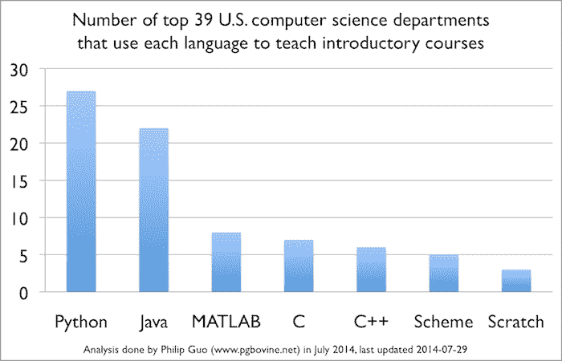

# Python 在 Java 世界中的流行

> 原文：<https://thenewstack.io/popularity-python-java-world/>

汤姆·雷德克里夫

Tom Radcliffe 在学术界和工业界拥有超过 20 年的软件开发和管理经验。他是一名专业工程师(PEO 和 APEGBC ),拥有金斯敦皇后大学的物理学博士学位。Tom 为 ActiveState 带来了对量化、数据驱动流程的热情。他深深地致力于贝叶斯概率理论的思想，并认为将最好的软件工具放在最有创造力和最有能力的人手中会使世界变得更好，这种想法具有很高的贝叶斯合理性。

我喜欢 Python，但我不得不承认，Java 仍然是许多人心目中的第一名。Java 开发人员正在大数据、云服务、软件定义网络(SDN)等领域引领潮流。即使在移动领域，Java 也非常受欢迎，这要归功于 Android。但是未来是可以争取的。

最近的 TIOBE 社区指数把 Java 放在了第一的位置，并且还在增长。对 Java 开发人员社区、公司管理以及其他其宣告死亡的迹象的担忧被大大夸大了。

Python 也不逊色。在同一指数中，它从一年前的第八名升至第五名。如果我是一名开发人员，在 Java 和 Python 之间做出选择，我应该依赖这些类型的使用数字吗？

Python 的强大之处在于它可能变成什么样。Philip Guo 在 ACM communication s 上写了一篇文章，表明“[排名前 10 的计算机科学系中有 8 个(80%)和排名前 39 的 27 个(69%)在介绍性的 CS0 或 CS1 课程中教授 Python](http://cacm.acm.org/blogs/blog-cacm/176450-python-is-now-the-most-popular-introductory-teaching-language-at-top-us-universities/fulltext)此外，国际商业时报最近指出 [Python 已经超过法语](http://www.ibtimes.co.uk/coding-uk-classroom-python-overtakes-french-most-popular-language-primary-schools-1517491)成为小学里教授最多的“语言”。

为什么教 Python 而不是过去十年占主导地位的教学语言 Java？这对未来有什么影响？

大多数人认为 Python 只是比较容易入门的课程。年轻的程序员进入职场，毕业后学习 Java。尽管 Python 是“初恋”,但使用统计似乎表明这可能是事实。但是还有更多的吗？

请记住，在过去的十年里，高中的 AP 课程和大学的 CS 入门课程都是基于 Java，而不是 Python。转向 Python 是最近的事情。事实是，我们还不知道这将如何影响劳动力。

## 标签的力量

虽然强制使用制表符通常会让 Python 新手感到厌烦，但这有助于使 Python 成为广泛使用的最易读的编程语言之一。我认为这是最具可读性的。这意味着在代码上协作和执行代码评审变得更加容易。

正确:制表符和缩进是一个微妙的区别。我也承认 Python 有一些特性，比如动态类型的变量，在某些情况下很难阅读。

然而，Python 的整体语法使其更适合热爱 GitHub 的世界，在这个世界中，代码应该由一群人来阅读，而不仅仅是编写代码的程序员。

虽然 Python 不像 Java 那样流行，但它被广泛使用。这对那些在大学 CS 入门课上学习 Python 并坚持学习的程序员来说很重要。使用 Python 的公司包括 YouTube、Google、Pinterest、Reddit、Quora、美国银行、Diebold、洛克希德·马丁、NASA、波音、美国陆军等等。

以下是 Python 的一些统计数据，显示了社区的力量:

*   **GitHub** :超过 3300 万个代码结果和 675355 个存储库结果(在该网站的编程语言中排名第四)，849141 个问题。
*   **栈溢出**:Python 的 481655 个标签；Python 2.7 的 38，475 个标签；Python 3.x 的 24833 个标签；和许多更具体的 Python 标记。
*   PyPI:Python 包索引，一个由 Python 库组成的存储库，拥有 67，530 个包和每周 340 万次下载，相当于每年至少 1.75 亿次下载。
*   **PyPI 排名，空前:**前 10 名下载量超过 4.49 亿次。
*   **PyPI 排名，本周:**下载量前 10 几乎是 8000 万次下载。

## Python 支付

根据 PayScale，拥有 Python 技能的人的平均工资是 103422 美元。在 LinkedIn 上，Python 专业人士论坛有 35，734 名成员。没有迹象表明 Python 的薪水比 Java 高。我想说的一点是，薪水足够让我过上体面的生活。它不仅仅是一种用于教育的语言。Python 出现在许多行业，包括 IT、DevOps、系统管理、软件开发(web)、科学计算、游戏、金融服务、法律、医疗保健等等。

## 统计是用 Python 做的

数据科学家和数据分析师被誉为过去几年的热门职位。大多数数据科学家用的是 R 或 Python，而不是 Java。随着这一角色变得越来越重要，大数据继续其上升趋势，它对 Python 的帮助将超过 Java。Python 是否会统治 R 还有待讨论，我很乐意在将来讨论这个问题。

纵观当前的大数据、Android 和 SDN 发展趋势，问题在于趋势已经确立。你现在看到的是今天的快照。

> 尽管我们不知道什么样的开发语言会变得强大，但我们知道大量的人将会掌握 Python 编程技能。

Python 社区受益于具有 Python 技能的大量人员和用于高效同行评审的简单代码可读性的组合——可以轻松地将想法转化为功能性应用程序，从而超越 Java 作为快速原型开发工具——这只是几个优点。

我敢打赌，未来的发展趋势将由 Python 开发者来决定。

<svg xmlns:xlink="http://www.w3.org/1999/xlink" viewBox="0 0 68 31" version="1.1"><title>Group</title> <desc>Created with Sketch.</desc></svg>