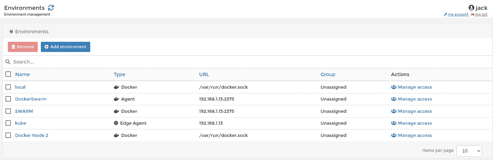
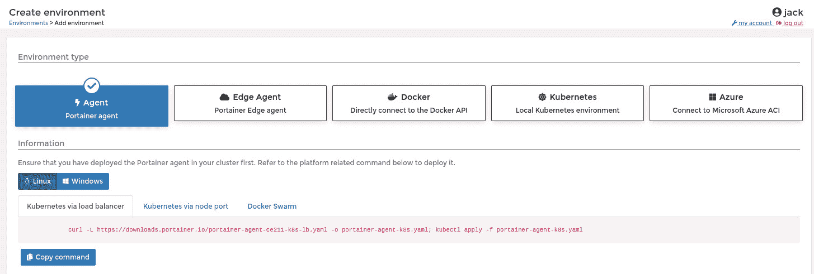
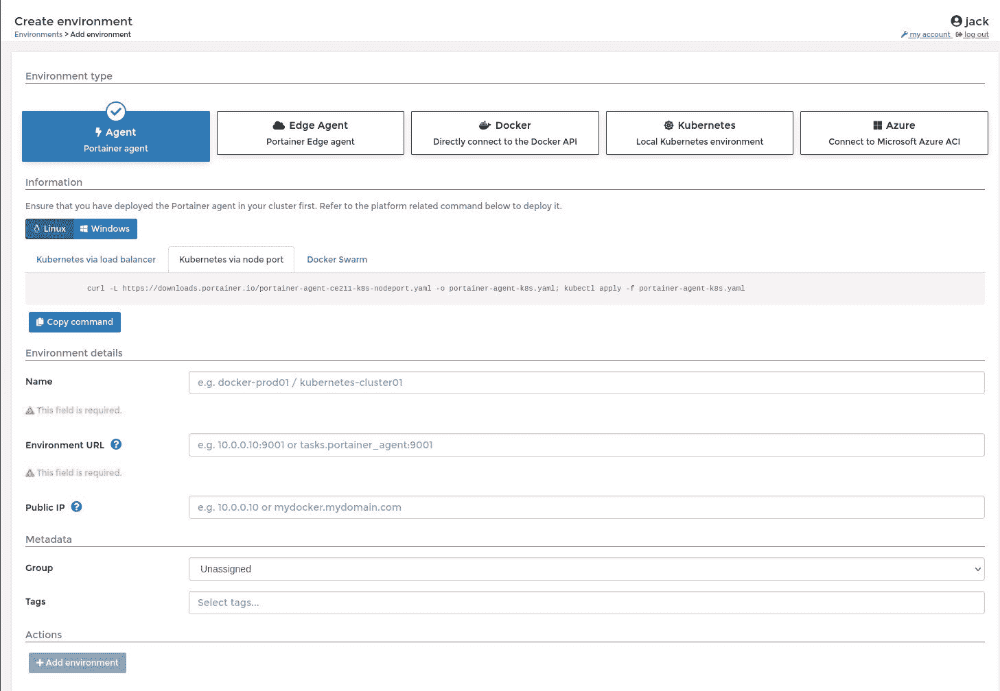
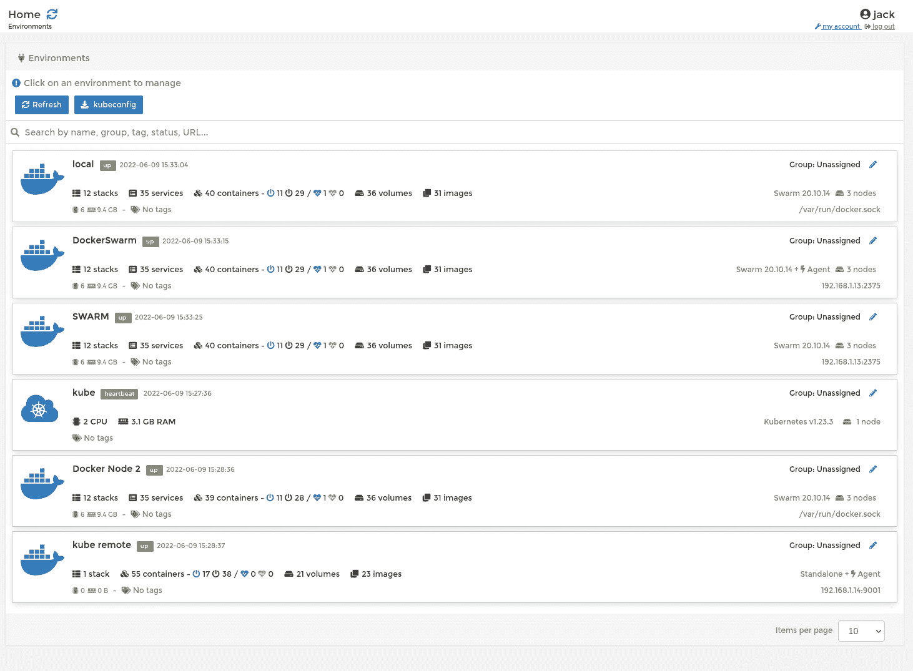

# Portainer:如何添加 Kubernetes 环境

> 原文：<https://thenewstack.io/portainer-how-to-add-a-kubernetes-environment/>

我们再来谈谈 Portainer，好吗？

Portainer 容器管理系统的一个出色之处在于，它允许您添加多个环境，然后可以将这些环境分配给不同的团队。通过这种设置，您可能让一个团队访问本地环境进行开发，一个团队访问 Azure 环境进行部署，而另一个团队访问 Edge 代理。

您可以添加的另一种类型的环境是 Kubernetes。添加了这个环境后，您就可以管理您的 Kubernetes 了，这样就可以管理:

*   名称空间
*   舵
*   应用程序
*   配置映射和机密
*   串

当您在 Portainer Kubernetes 环境中创建应用程序时，您可以通过清单或使用 Portainer 表单 GUI 来完成(这类似于在 Docker 环境中添加完整的堆栈或容器部署)。

对于任何管理 Kubernetes 并一直在寻找一个可靠的基于 web 的 GUI 的人来说，将 Kubernetes 环境添加到 Portainer 是一个不错的选择。

我将向您介绍的方法允许您将 Portainer 连接到远程 Kubernetes 集群，该集群要么需要在同一个 LAN 上，要么可以通过可访问的 [FDQN](https://www.godaddy.com/garage/whats-a-fully-qualified-domain-name-fqdn-and-whats-it-good-for/) 进行访问。

让我告诉你这是怎么做的。我将假设您已经启动并运行的只是一个 Linux 服务器(我将从头到尾在 Ubuntu Server 22.04 上演示)。

## 如何安装 Docker

我们要做的第一件事是安装 Docker。登录你的 Ubuntu 服务器实例，安装必要的依赖项:

```
sudo apt-get install ca-certificates curl gnupg lsb-release wget apt-transport-https   -y

```

接下来，使用命令添加官方 Docker GPG 键:

```
curl  -fsSL https://download.docker.com/linux/ubuntu/gpg | sudo gpg --dearmor -o /usr/share/keyrings/docker-archive-keyring.gpg

```

我们现在可以添加 Docker 稳定库:

```
echo  "deb [arch=$(dpkg --print-architecture) signed-by=/usr/share/keyrings/docker-archive-keyring.gpg] https://download.docker.com/linux/ubuntu $(lsb_release -cs) stable"  |  sudo tee  /etc/apt/sources.list.d/docker.list  &gt;  /dev/null

```

最后，用下面两条命令安装 Docker 引擎:

```
sudo apt-get update
sudo apt-get install docker-ce docker-ce-cli containerd.io  -y

```

使用
启动并启用 Docker 服务

```
sudo systemctl enable  --now docker

```

接下来，您必须使用命令将您的用户添加到 docker 组:

```
sudo usermod  -aG docker  $USER

```

使用
让系统知道新组

## 如何安装 kubectl 和 Minikube

我们需要安装 kubectl 命令和 Minikube。首先，用:
安装 kubectl

```
curl  -LO  "https://dl.k8s.io/release/$(curl -L -s https://dl.k8s.io/release/stable.txt)/bin/linux/amd64/kubectl"

```

用:
安装 Kubectl

```
sudo install  -o  root  -g  root  -m  0755  kubectl  /usr/local/bin/kubectl

```

接下来，我们需要用
下载 Minikube 二进制文件

```
wget https://storage.googleapis.com/minikube/releases/latest/minikube-linux-amd64

```

使用
将二进制文件复制到/usr/local/bin

```
sudo cp minikube-linux-amd64  /usr/local/bin/minikube

```

使用
授予二进制可执行文件权限

```
sudo chmod  +x  /usr/local/bin/minikube

```

## 如何部署 Portainer

接下来，我们将部署 Portainer。首先，使用
创建一个卷(用于永久数据)

```
docker volume create portainer_data

```

用 Docker 部署 Portainer，使用命令:

```
docker run  -d  -p  8000:8000  -p  9443:9443  --name=portainer  --restart=always  -v  /var/run/docker.sock:/var/run/docker.sock  -v  portainer_data:/data portainer/portainer-ce

```

给容器一点时间旋转，然后将浏览器指向 http://SERVER:9443(其中 SERVER 是托管服务器的 IP 地址)。然后，您需要为 Portainer 创建一个帐户并登录。

## 如何添加 Kubernetes 环境

我们现在可以将 Kubernetes 环境添加到 Portainer 中。单击 Environments(在左侧栏中)，然后(在结果页面中)，单击 Add Environment ( **图 1** )。



图 1:我已经在 Portainer 中配置了几个环境。

在下一个窗口中(**图 2** ，点击代理选项卡。



图 Portainer 中的环境创建页面。

在出现的窗口(**图 3** )中，单击 Kubernetes via node port 以显示您必须在 Kubernetes 主机上运行的命令。那个命令是:

```
curl  -L  https://downloads.portainer.io/portainer-agent-ce211-k8s-nodeport.yaml -o portainer-agent-k8s.yaml; kubectl apply -f portainer-agent-k8s.yaml

```

命令完成后，返回 Portainer 并填写环境信息。您需要给新环境起一个名字(比如 kube、k8s、minikube 等。).接下来，键入 Kubernetes 服务器的地址，如:

```
https://192.168.1.13:9001

```



图 3:添加一个新的 Kubernetes 环境作为代理。

如果要将环境分配给一个组，请单击“组”下拉列表并选择您已经创建的任何组。选择您创建的任何标签，然后单击添加环境。单击 Add Environment，Portainer 将连接到您的 Kubernetes 集群。回到 Portainer 主窗口，您会看到新的 Kubernetes 环境被列出来(**图 4** )。



图 4:我们新的 Kubernetes 环境已经成功添加。

恭喜您，您已经将 Kubernetes 添加到 Portainer 组合中。享受额外的功能和灵活性。

<svg xmlns:xlink="http://www.w3.org/1999/xlink" viewBox="0 0 68 31" version="1.1"><title>Group</title> <desc>Created with Sketch.</desc></svg>