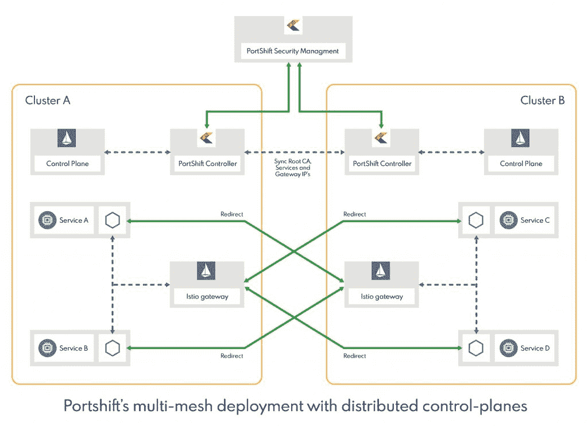

# Portshift 试图为 Istio 服务网格所缺乏的东西提供“更细粒度”的安全性

> 原文：<https://thenewstack.io/portshift-attempts-more-granular-security-for-what-istio-service-meshes-lack/>

Portworx 赞助了 New Stack 在圣地亚哥的 KubeCon + CloudNativeCon 的报道。

在转向 Kubernetes 部署时，组织通常会面临许多不可预见的挑战。即使团队使用服务网格来帮助管理 Kubernetes 平台基础设施和策略，DevOps 团队也可以意识到许多问题仍然存在——而且往往为时已晚。

在越来越流行的 [Istio](https://istio.io/) 服务网格上部署时，其中一个问题是它缺乏管理多个 Kubernetes 集群的通用性。这个缺点也隐藏着安全挑战，我们将在下面更详细地描述。

总部位于以色列的 [Portshift](https://www.portshift.io/) 表示，它可以帮助解决 Istio 在 Kubernetes 部署方面的缺点。在本周于圣地亚哥举行的 kube con+CloudNativeCon North America 2019 上，该公司将展示其基于身份的容器和微服务工作负载保护平台。Portshift 说，该系统为 Istio 提供了更完整的网状支持的安全性，这要归功于其容器工作负载身份和其他功能。Portshift 的首席执行官 Ran Ilany 告诉新堆栈，这种能力在 CI/CD 阶段为容器分配数字身份，并扩展到 Istio 服务网格以进行“认证通信”。

Ilany 说，这一想法是为了提高合规能力，使其成为“固有的和持续的”。

Portshift 说，对于身份验证，Istio 使用 [SPIFFE](https://spiffe.io/) (面向所有人的安全生产身份框架)身份，并且通常提供服务帐户信息(SAC)，但这还不够。Ilany 说，Istio 服务网格的安全监控需要“允许粒度策略执行”，并为每个 pod 实施证书。一旦添加了 Portshift，Istio 代理将被配置为使用更细粒度的证书和身份，作为 sac 停止的扩展。

在许多方面，Portshift 正试图为 Istio 服务网格提供一个经常缺失的安全性和合规性管理链接。Ilany 描述了服务网格一般是如何为 Kubernetes 部署的连接性、可用性和网络容量服务的。然而，Ilany 说，他们的主要缺点是无法“以 DevOps CI/CD 环境不断变化的速度解决安全性和法规遵从性问题”。

Ilany 说，大多数组织在 Istio 上运行 Kubernetes 时，通常会根据它们的地理来源，为不同的集群手动配置自己的合规性规则。“不幸的是，组织真正面临的挑战是，当前的解决方案是如何‘事后’实施的，或者是如何在运行时实施的。”这意味着这些组织需要手动了解确切的连接逻辑，“这在这些动态环境中是不可能的，”Ilany 说。使用 Portshift，可以在任何给定时刻获得此信息，并自动创建审批规则

Ilany 说，最终目标是允许 DevOps 创建一个简单的安全策略，“只需单击一下”，即可加密多个服务网格层上所有容器之间的通信。

Ilany 在一篇[博客文章](https://www.portshift.io/secure-multi-cluster-connectivity/)中写道，最终的配置由多集群上的网状部署组成，每个集群中有 Istio 的复制控制平面元素，包括混合器、飞行员和 Citadel。“我们添加了一种方法来共享所有集群的根证书颁发机构(根 CA)，我们选择为每个集群添加一个 Istio 入口，从而自动化集群之间的证书/身份和服务属性的联合，”Ilany 说。

Ilany 说，Portshift 的工作原理是用相邻集群更新每个 Istio 入口网关，并“在所有集群中使用外部服务的 DNS 配置”。

Ilany 说，Istio ServiceEntry 在每个集群中为外部服务实现自动化，同时为每个外部服务 IP/FQDN 和 ServiceEntry 创建一个虚拟服务。这将基于 IP 和端口身份的安全模型更改为更细粒度的容器身份，这些身份也在运行时进行身份验证

[KubeCon + CloudNativeCon 北美 2019](https://events19.linuxfoundation.org/events/kubecon-cloudnativecon-north-america-2019/) 是新堆栈的赞助商。

通过 Pixabay 的特征图像。

<svg xmlns:xlink="http://www.w3.org/1999/xlink" viewBox="0 0 68 31" version="1.1"><title>Group</title> <desc>Created with Sketch.</desc></svg>