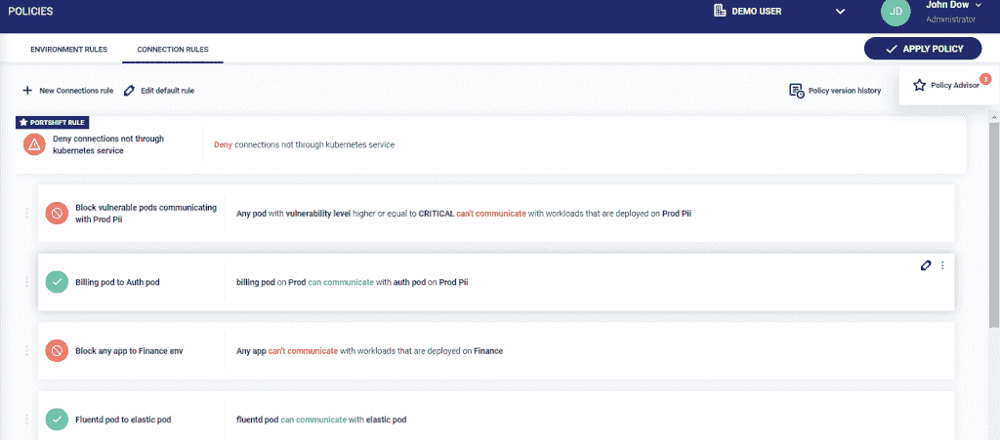

# Portshift 将漏洞管理提升到容器级别

> 原文：<https://thenewstack.io/portshift-manages-vulnerabilities-management-to-the-container-level/>

虽然将安全策略绑定到 IP 地址可能是一种对一些传统应用程序足够有效的做法，但以太、短暂、可移植和高度可扩展的容器化工作负载的性质可能意味着 IP 地址不再是可靠的标识符。此外，IP 地址通常与正在运行的工作负载相关联，而不是与它相关联的代码，因为它通过持续集成和持续交付(CI/CD)工作流。因此， [Portshift](https://www.portshift.io/) 为容器和微服务提供了一个基于身份的工作负载保护平台，可以在 CI/CD 阶段为容器分配数字身份，并且现在已经扩展了这一功能，以提供漏洞修复的运行时策略。

Portshift 与开源服务网格 [Istio](https://istio.io/) 一起提供基于身份的安全性，这在一定程度上提供了动态改变策略的能力。今年早些时候，[公司推出了其策略顾问功能](https://www.portshift.io/news/portshift-launches-advanced-policy-advisor/)，该功能可以自动为微服务之间的通信创建规则，并允许用户根据不同的需求随时更改规则。现在，Portshift 不仅能够动态地提供规则变化，而且还将其与风险缓解引擎相连接，该引擎“将 Kubernetes 网络政策与生产工作负载中发现的漏洞相连接，使其能够缓解易受攻击容器的潜在风险，直到用删除易受攻击组件的新版本进行替换，”根据公司声明。目前，Portshift 通过连接许多安全提供商来提供安全扫描，包括 [Clair](https://github.com/quay/clair) 、 [Aqua Security](https://www.aquasec.com/) 和 [Twistlock](https://www.twistlock.com/) 。

新功能允许 Portshift 逐个 pod 地处理安全问题，并提供以前没有的精细策略实施，这不仅仅是在发现漏洞时使整个应用程序离线。

“目前，大多数处理漏洞的解决方案都停留在 CI/CD 级别，这意味着要么 CI/CD 批准了，您就没事，要么它阻止了您，您就没有部署。这是在 CI/CD 中离线完成的二元决策。我们试图将它带到运行时级别，这意味着一旦你部署了，我们也可以强制执行，”Portshift 联合创始人 [Zohar Kaufman](https://www.linkedin.com/in/zohard1/?originalSubdomain=il) 在接受新堆栈采访时说。“我们将我们的政策与 pod 的其他特征联系起来，即 pod 的脆弱性。一旦我们获得了一个单元的扫描结果，我们就可以做出明智的决定，例如，该单元是否可以在生产中运行，以及我们是否让它运行，但将易受攻击的单元的通信限制在财务数据库等敏感资产上。”

当我们[上个月在 Kubecon + CloudNativeCon 与 Portshift](https://thenewstack.io/portshift-attempts-more-granular-security-for-what-istio-service-meshes-lack/)交流时，他们强调了这种提供更大粒度的能力是 Portshift 的关键特性之一。Kaufman 再次强调了这一点，他指出，在更基本的层面上，在这种粒度级别上使用工作负载身份还可以让用户确定哪些工作负载可以在哪里运行，从而防止只能在测试环境中运行的东西进入生产环境。显然，下一步就是采用这种精细的方法来处理单个单元中的漏洞。

Kubecon + CloudNativeCon，Palo Alto Networks，Portshift 是新堆栈*的赞助商。*

通过 Pixabay 的特征图像。

<svg xmlns:xlink="http://www.w3.org/1999/xlink" viewBox="0 0 68 31" version="1.1"><title>Group</title> <desc>Created with Sketch.</desc></svg>