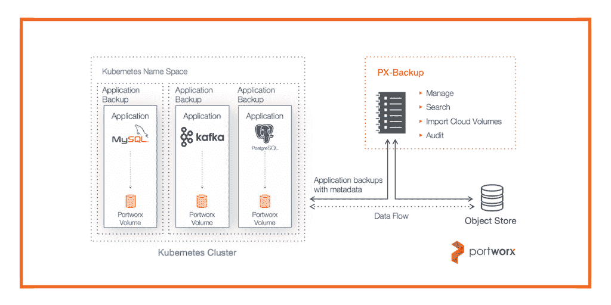

# Portworx 备份:Kubernetes 应用程序的可调备份

> 原文：<https://thenewstack.io/portworx-backup-tuneable-backups-for-kubernetes-applications/>

[Portworx](https://portworx.com/) 赞助本帖。

就备份和恢复而言，一种尺寸并不适合所有情况。

对于一个任务关键但不面向客户的应用程序(如 CI/CD 管道)来说，宕机是一回事，而对于一个电子商务网站来说，在黑色星期五宕机则是另一回事。并非所有备份都需要“可恢复”

根据 [451 Research](https://451research.com) 的分析，许多公司甚至需要“非关键”应用程序和数据(如 CI/CD 管道)能够在 24 小时内恢复，并在发生故障时将数据丢失降至最低。具体来说，47%的受访者预计恢复时间目标(RTO)在 24 小时以内，这意味着应用程序停机时间应少于 24 小时。同时，53%的公司期望恢复点目标(RPO)在 24 小时以内。换句话说，他们预计丢失不到 24 小时的数据。

然而，一个成熟的[同步灾难恢复解决方案](https://thenewstack.io/disaster-recovery-and-backup-in-todays-multicloud-world/)对于可能停机 6、8 或 10 小时的应用程序来说可能是大材小用。这种灾难恢复解决方案运行成本太高，对于非关键应用程序来说也没有必要。它也没有解决另一个常见的备份用例:确保出于合规性原因存储数据。

为了弥补这一差距，容器原生存储公司 [Portworx](http://www.portworx.com) 推出了 [PX-Backup](https://portworx.com/cloud-native-application-backups-using-px-backup/) ，允许公司只需点击几次鼠标即可备份——并在必要时重新启动——Kubernetes 应用程序的数据和配置。用户可以控制单个应用程序的备份频率，并且可以备份到任何 S3 兼容的对象存储。因为该产品以容器粒度、以应用程序为中心的方式工作，所以它可以备份多节点分布式数据库，如 Elasticsearch、Cassandra、Kafka 和 Cassandra。

Portworx 在今年早些时候发布了 PX-DR，这是一个针对关键任务应用程序的 Kubernetes 优化的灾难恢复解决方案。通过 PX-Backup，该公司希望满足全套公司的备份需求。备份与 Portworx 平台的其余部分分开提供，目前在技术预览中。

Portworx 产品营销副总裁迈克尔·费兰蒂(T4)说，PX-Backup 主要有两种使用情况。第一个是 CI/CD 管道—任何应用程序在停机后不需要在几分钟内恢复运行，但仍应在几小时内恢复运行。

第二个解决了完全不同的企业需求——出于法规遵从性原因的可见性。有了 PX-Backup，就有可能以一种易于搜索的方式备份 Kubernetes 上运行的应用程序收集的数据。例如，如果您需要证明客户的数据在删除请求后的某个时间段内被删除，您将能够在过去的某个日期登录到应用程序的完整副本，并在数据库中搜索该数据以确保客户数据已被删除。

“他们有义务进行备份，但他们可能永远不需要‘恢复’该应用程序，”Ferranti 说。然而，他们必须能够搜索数据，确保数据安全存储，并在需要时可以访问。

“灾难恢复用例是，如果这个东西曾经关闭，我绝对需要让我的应用程序恢复运行，”Ferranti 说。“备份解决了一个不同的市场。更多的是运营问题，以及法规遵从性使用案例，在这种情况下，您需要始终保留数据的三份拷贝，您需要保留三年，如果数据被删除，您需要知道是谁删除的。”

图片由来自 Pixabay 的 Gerd Altmann 提供。

<svg xmlns:xlink="http://www.w3.org/1999/xlink" viewBox="0 0 68 31" version="1.1"><title>Group</title> <desc>Created with Sketch.</desc></svg>