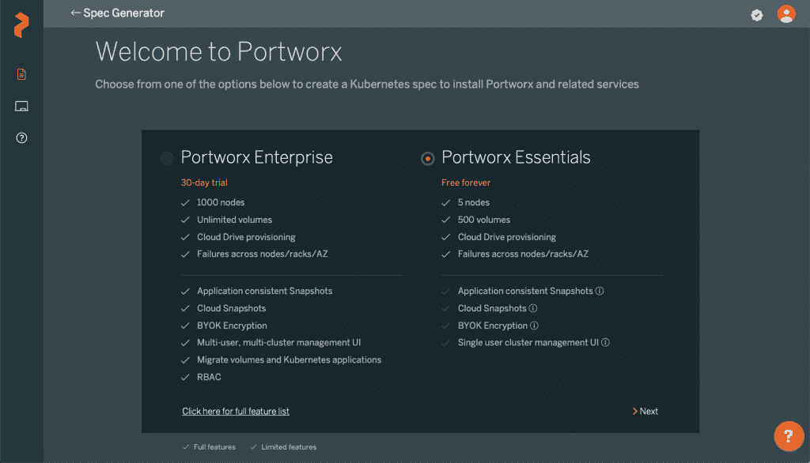
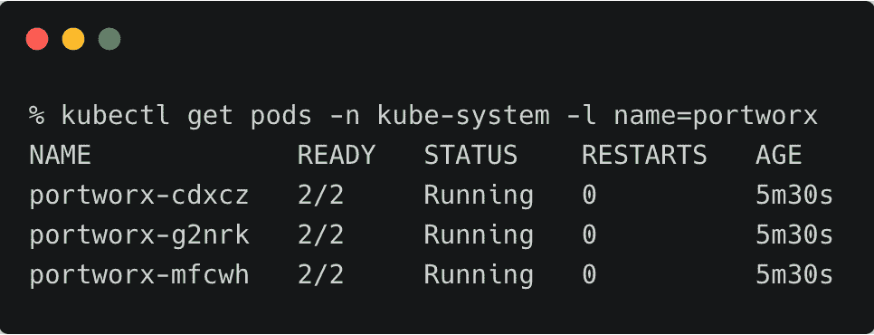
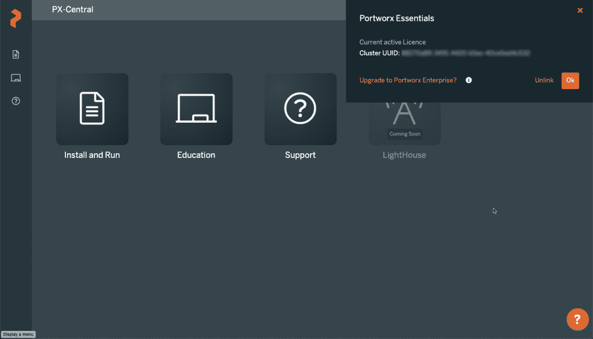
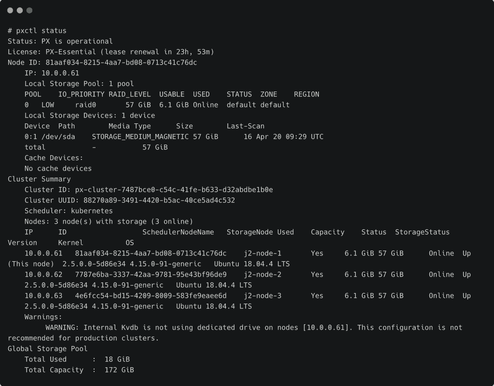

# portworx Essentials:Kubernetes 的免费云本地存储引擎

> 原文：<https://thenewstack.io/portworx-essentials-a-free-cloud-native-storage-engine-for-kubernetes/>

如果您与 Kubernetes 打交道，您会知道存储是集群基础架构的核心构建块之一。它与工作节点提供的计算构造块一样重要。由于集群的能力总是以工作节点的数量及其配置来衡量，因此存储并没有得到应有的重视。

想象一下:您配置了一个强大的裸机集群，并希望在其上运行高可用性和任务关键型工作负载。如果没有可靠的存储引擎，您的集群只适合运行不需要持久性的无状态和短暂的工作负载。但是任何企业应用程序都是无状态和有状态服务的组合。如果您无法在全新的 Kubernetes 集群上运行端到端的应用程序，您就无法证明在该集群上的投资是值得的。

当你安装开源的、向上流动的 Kubernetes 发行版时，它没有配备高性能的存储引擎。与公共云中的托管 Kubernetes 服务不同，这些服务带有映射到各自块存储服务的默认存储类，您的集群没有任何存储类。

> 持久卷对于存储就像节点对于计算一样。

就像您使用 **kubeadm** 来配置和将节点加入集群一样，您需要提供存储，并通过存储类和持久卷将其公开给应用程序。请记住这一点—持久卷对于存储的重要性相当于节点对于计算的重要性。在 Kubernetes 上运行任何有意义的应用程序都需要这两者。

您可能希望使用内置的原语来创建基于 **emptyDir** 和 **hostPath** 的持久卷(PV)。但是，它们不是为可靠性和可用性而设计的。他们还不支持[容器存储接口(CSI)](https://github.com/container-storage-interface/spec) ，该接口承诺了一些功能，例如为 PVs 提供卷快照，从而为卷带来备份和恢复功能。

另一种选择是使用 NFS 或 GlusterFS 作为 Kubernetes 集群的分布式文件系统。但是这些共享文件系统不是为云本地环境设计的。它们无法提供 IO 密集型有状态工作负载所需的性能。

大多数商用存储平台都无法进行评估。从免费版升级到有专业服务和支持的商业版并不容易。

领先的云原生存储初创公司之一 Portworx 推出了其存储平台的免费版本 [Portworx Essentials](https://portworx.com/announcing-portworx-essentials/) 。它附带了一个无附加条件的许可证，您可以在少于五个节点的任何集群上使用。

Portworx Essentials 可以轻松升级到 Portworx Enterprise，这是一个成熟的存储平台，具有 RBAC、备份/恢复、迁移和业务连续性等企业功能。

## 考虑 Portworx Essentials 的 5 个理由

### 1.这是 Kubernetes 的免费叠加存储平台

Portworx Essentials 是使用 Portworx 存储平台有限版本的永久免费许可证。您可以将其安装在运行于裸机集群、部署在公共云中的自托管集群或托管服务(如 GKE、AKS 和 EKS)中的 Kubernetes 环境中。

Portworx Essentials 每个节点最多支持 30 个容器，每个集群最多支持 500 个卷。

### 2.Portworx Essentials 是一个符合 CSI 标准的存储引擎

[容器存储接口(CSI)](https://github.com/container-storage-interface/spec) 规范是作为在 Kubernetes 上将任意块和文件存储系统暴露给容器化工作负载的标准而开发的。由于 Portworx Essentials 符合 CSI 标准，因此它支持动态预配置、用于执行备份和恢复的卷快照等功能。

CSI 合规性可确保存储引擎与用于数据管理和数据移动的 [Velero](https://velero.io/) 和 [Kasten](https://www.kasten.io/) 等工具配合良好。

### 3.利用应用程序一致性快照和云快照

Portworx 有一个名为 [3DSnap](https://portworx.com/px-14-release/) 的特性，使存储管理员能够将持久数据卷作为一个单元进行分组和快照。这对于维护复杂应用程序的应用程序一致性备份非常有用。对于每个 3DSnap，Portworx 支持使用正在拍摄快照的卷指定在应用程序窗格上运行的先行和后继规则。例如，在拍摄 Cassandra statefulset 的 3d 快照之前，可以运行一个规则来将数据刷新到磁盘，以避免不一致的备份。

Portworx Essentials 每个卷最多支持五个 3d 快照。

### 4.跨开发和生产环境的一致存储平台

组织可以从运行在开发和测试环境中的 Portworx Essentials 开始，减少工作节点，同时投资 Portworx Enterprise，在生产环境中运行更大的集群。这通过维护相同的存储类别、PVC 名称、卷快照和 3DSnap 配置，确保了群集之间的一致性。

### 5.轻松升级到 Portworx Enterprise

运行 Portworx Essentials 的用户可以轻松升级到 Portworx Enterprise，而不会中断集群和工作负载。

## Portworx Essentials 入门

注册并登录到 [Portworx Central](https://central.portworx.com/dashboard) 以启动规范生成器。步骤与本[指南](https://thenewstack.io/tutorial-install-and-configure-portworx-on-a-bare-metal-kubernetes-cluster/)中讨论的安装 Portworx 企业试用版完全相同。

首先在第一步选择 Portworx Essentials。

生成的规范有新的参数，如 *OEM* 和*用户*，它们将安装与 Portworx Essentials 关联起来。

与企业版不同，您不能选择使用外部 ***etcd*** 集群。相反，KVDB 服务嵌入在安装中。

安装完成后，您会发现 **daemonset** 正在所有节点上运行。pod 中的第二个容器反映了作为边车部署的 CSI 驱动程序。

该集群现在已注册到 PX-Central，它将您的用户名与集群 id 相关联。

运行 **pxctl 状态**显示存储集群的详细信息。

请注意，许可证显示我们正在运行 PX-Essentials。

在有空气间隙的环境中运行 PX-Essentials 是可能的。每当群集访问互联网时，Portworx Essentials 将自动续订未来 24 小时的许可证。

如果您正在运行需要可靠存储平台的较小的 Kubernetes 集群，请尝试一下 Portworx Essentials。这是市场上最好的云原生数据平台之一。

Portworx 是新堆栈的赞助商。

特色图片由 2427999 来自 Pixabay。

<svg xmlns:xlink="http://www.w3.org/1999/xlink" viewBox="0 0 68 31" version="1.1"><title>Group</title> <desc>Created with Sketch.</desc></svg>