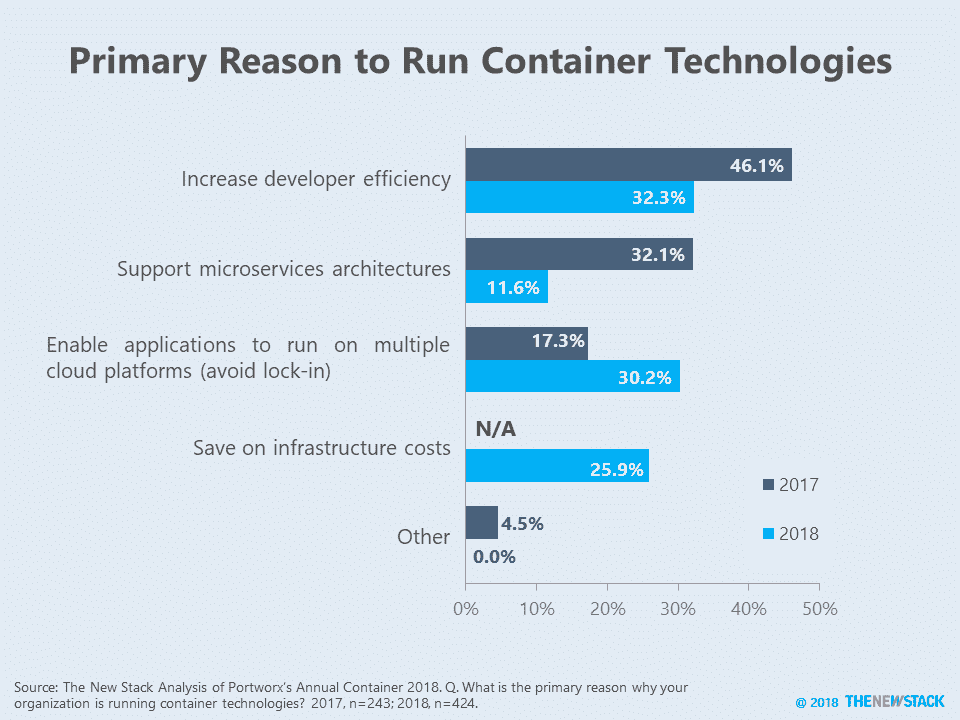
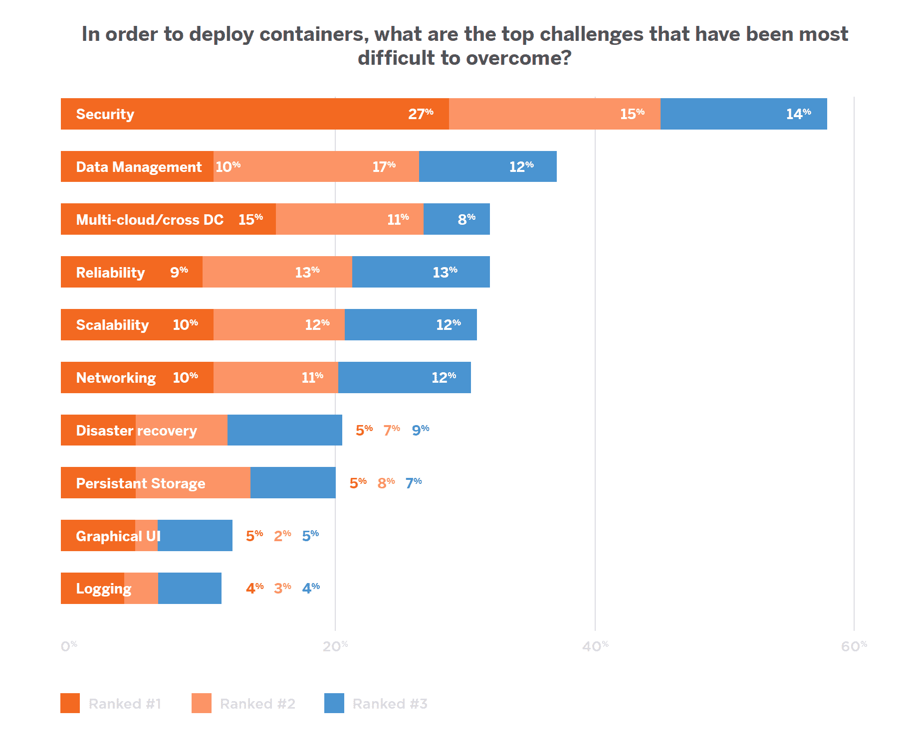
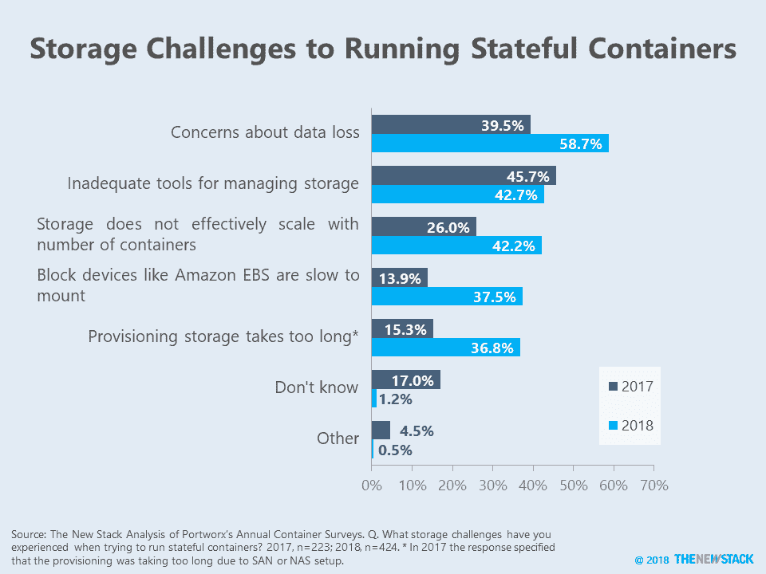

# Portworx: Multicloud 现在是集装箱的主要驱动力

> 原文：<https://thenewstack.io/portworx-multicloud-now-a-chief-driver-for-containers/>

跨多个云运行应用程序正迅速成为容器使用的主要驱动力，取代了以前吹捧的优势，如开发人员效率和对微服务的支持。

在最新一期的[年度集装箱采用调查](https://portworx.com/portworx-container-adoption-survey-report/)中， [Portworx](https://portworx.com/) 调查了 424 名集装箱用户，高于 2017 年版本的 250 名。基于这些更成熟的容器部署，安全性、数据管理和多云现在是最大的挑战，而持久存储变得不那么令人担忧。

正如我们多年来反复看到的那样，人们声称避免供应商锁定推动了云计算选择，但实际上并没有使用多个提供商。事实上，只有 26%的人说多云是他们的组织运行容器的原因，实际上他们在不止一个云上使用容器。相比之下，40%提到开发者效率的人在多个云上运行容器。只有 12%的受访者表示，对微服务架构的支持推动了容器部署，比 2017 年的 32%大幅下降。作为 2018 年的新选择，超过四分之一的人表示，集装箱主要用于节省基础设施成本。

与容器相比，无服务器继续大放异彩，因为开发人员希望在不需要维护服务器实例的情况下获得更高的效率，以及云基础设施支出的预期减少。尽管如此，这组容器采用者倾向于相信“无服务器将使容器过时”，因为 41%的人同意这种说法，只有 29%的人不同意。然而，根据[最近的新堆栈调查](https://thenewstack.io/ebooks/serverless/guide-to-serverless-technologies/?)，许多受访者可能不知道云之间的可移植性是无服务器最大的不足。如果这些麻烦继续下去，钟摆将摆回到容器上，但前提是当前的容器用户不再说多云是他们的最大挑战之一。

超过一半的容器用户表示，在部署容器时，安全性是最难克服的挑战之一。这与去年形成了鲜明的对比，根据措辞略有不同的问题，去年持久性存储是最大的挑战。数据管理的高层次挑战已经取代了低层次的持久存储问题。

Portworx 首席技术官 Gou Rao 认为，存储和保护数据是已经开始解决的“桌面赌注”,这使得开发人员可以专注于备份/恢复、迁移和复制数据管理等问题。根据基于连接器的容器存储, [EMC 的 RexRay](https://rexray.readthedocs.io/en/latest/) 或 [NetApp 的 Trident](https://github.com/NetApp/trident) 在调度程序集成方面存在问题，因为它们在其底层存储系统之上构建数据管理功能。

安全性是部署容器时面临的最大挑战。自上一次调查以来，对安全性的担忧可能有所增加，因为受访者现在在容器上部署的应用程序比例显著增加。

这指向了关于存储的一个更大的问题。对持久性存储概念性关注已经消失，但实际的挑战却增加了。当被问及他们在运行有状态容器时遇到了什么挑战时，除了工具不足之外，其他方面都比 2017 年有所上升。高认为，许多人认为持久存储是一个已经解决的问题，因为社区在标准化持久存储接口方面做得非常好，首先是 Docker 卷驱动程序，最近是[容器存储接口](https://github.com/container-storage-interface/spec)。他告诉我们，尽管人们可以用容器运行有状态服务，但他们还在纠结“如何”这样做。

更多上下文，请看本周 Numbers:Kubernetes 的容器首选项。

Portworx 是新堆栈的赞助商。

通过 Pixabay 的特征图像。

<svg xmlns:xlink="http://www.w3.org/1999/xlink" viewBox="0 0 68 31" version="1.1"><title>Group</title> <desc>Created with Sketch.</desc></svg>