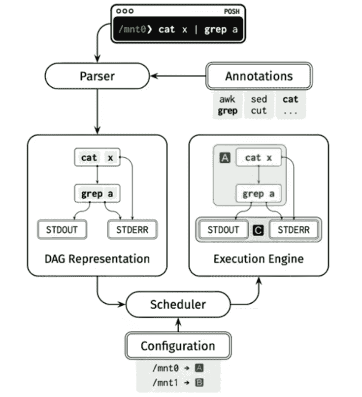
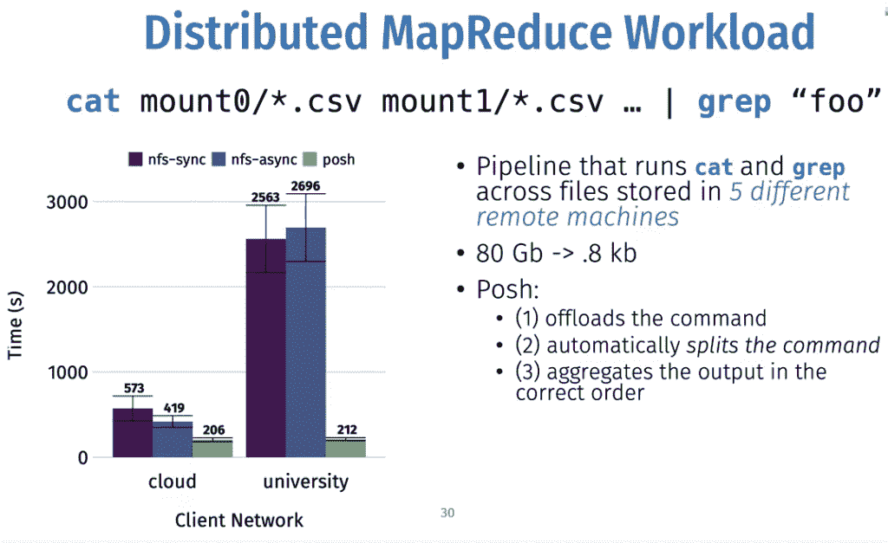

# POSH:一个支持更快分布式文本处理的数据感知外壳

> 原文：<https://thenewstack.io/posh-a-data-aware-shell-for-faster-distributed-text-processing/>

Unix 命令行提供了一套丰富的数据处理工具，如`cat`、`grep`和`awk`，用于文本搜索和过滤大文件。但是，通过园区网络或云对远程数据执行这些命令可能会导致研究停止，因为数据科学家需要等待结果返回到命令行或本地文件。

“Shell 应该考虑数据局部性，”斯坦福大学的博士生 Deepti Raghavan 解释道，她是数据感知型[进程卸载 Shell](https://github.com/deeptir18/posh) (POSH)的创造者之一，她在上个月举行的 [USENIX SRECon20 Americas](https://www.usenix.org/conference/srecon20americas) 会议上介绍了该 Shell。

目前，POSH 是一个原型，但该项目围绕分工的最佳方式提出了一些有趣的想法，以便尽快完成工作，同时使最终用户更容易执行这些任务。测试发现，基于 POSH 的方法可以在不修改数据或标准命令行的情况下，跨远程文件系统提供 1.5 到 15 倍的数据加速。

POSH 包括一个 shell 和一个相关的分布式运行时，通过将计算量大的工作转移到数据所在的位置，如 NFS 文件存储服务器上，可以将远程数据的处理速度提高几个数量级。命令是在用户的 shell 上本地发出的，但实际上是在服务器上与数据一起执行的，这可以大大加快处理速度。然后，只有输出被发送回本地机器上的命令行。

传统方法可能会耗费时间，因为它们涉及到将数据移动到客户端，对于大型数据集来说，这可能会非常慢。已经有一些方法，比如 POSH 的方法，将处理转移到数据上。MapReduce 和 Spark 就是两个例子。但是，对于数据研究人员来说，它们使用起来可能很麻烦，需要代码与它们的 API 进行交互。“使用这些系统的开销可能会超过它的价值，”她说。

Raghavan 说，这个想法是“在不改变开发人员工作流程的情况下，在更靠近存储的地方运行这个命令”。

POSH 提供了一个与规范 Bash shell 相同的 shell，但是它将命令需要的一些工作转移到数据存储上或附近的代理服务器上。位于这些远程存储服务器上的代理服务器可以处理数据。“这防止了大量不必要的数据移动，”Raghavan 说。

为了确定工作负载的哪些部分可以远程执行，POSH 使用一组关于各个 shell 命令的注释和元数据来确定在 shell 管道中的哪个位置将工作移交给远程代理服务器。一般来说，用户不必担心注释，尽管需要为所有相关的 Unix 命令创建注释。

此元数据记录了每个命令的文件依赖关系，以及每个命令的所有选项和参数。在涉及多个工具的命令中，it 需要了解命令之间有多少数据流动，以及命令是否可以跨不同的服务器并行化。运行时还包括一个调度算法，用于跨多个服务器调度工作负载，以获得最佳的执行时间。

当用户键入命令时，POSH 将生成一个有向无环图(DAG)来表示整个命令工作流，然后它可以执行该工作流:

POSH 最适用于 I/O 密集型工作负载，其中数据存储在远程存储中，如 NFS。在一项测试中，研究人员在五个配备代理的不同服务器上对 80GB 的数据使用了 cat 和 grep 组合命令。返回的结果只有很小的 8KB。测试在云环境和传统的大学网络中进行。在那里，该团队发现，与大学设置相比，速度提高了 10 倍，而在云设置中，速度提高了 2.5 倍:

在另一个案例中，团队观察了代码库中三个 git 命令(`add`、`commit`、`status`)的速度。在这种情况下，`add`命令返回结果的速度是传统方法的 10-15 倍。在使用`add`命令的情况下，git 返回每个检查过的文件的状态，在传统的设置中，这会导致 shell 和远程文件服务器之间的来回切换。

Raghavan 说:“通过避免多次往返，POSH 节省了延迟。

点击此处阅读[论文](https://deeptir.me/papers/posh-atc20.pdf)并点击此处观看视频:

[https://www.youtube.com/embed/-i7jFBqRSqk?start=14&feature=oembed](https://www.youtube.com/embed/-i7jFBqRSqk?start=14&feature=oembed)

视频

图片来自 Shutterbug75 de Pixabay。

<svg xmlns:xlink="http://www.w3.org/1999/xlink" viewBox="0 0 68 31" version="1.1"><title>Group</title> <desc>Created with Sketch.</desc></svg>