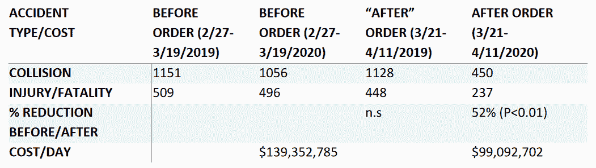

# 一个更美好的世界即将到来的积极迹象

> 原文：<https://thenewstack.io/positive-signs-of-a-better-world-to-come/>

在全球新冠肺炎疫情曲线变平的好消息中，人们开始问接下来会发生什么？在一个不确定的时代，我们现在想知道是否有任何方法可以达到一个更好的世界——如果有，它会是什么样子。

因此，抓住那些关于现在正在发生的积极事情的故事是很重要的，以及它们如何可能提供一个更美好的世界即将到来的信号。从远程办公到远程医疗，通过数字化升级和环境改善，有来自企业家的创新，也有来自我们自身的改变。

夹杂在所有希望的微光中，也许还有对未来事物的早期瞥见。

## 离开街道

利用加州公路巡逻队的实时数据，加州大学戴维斯分校的道路生态中心确定，一些高速公路的交通量下降了 55%。但是之后他们看了看车祸是否也在下降。

他们是，而且在很大程度上…

在 22 天内，该中心计算出仅在加州就比去年同期少了 658 起车祸。加利福尼亚州导致受伤或死亡的车祸数量也下降了 50%，从每天约 400 起降至每天仅 200 起。

研究人员写道:“撞车事故的减少相当于每月减少约 15，000 起碰撞事故，每月减少 6，000 起伤害/致命事故，这直接或间接归因于就地安置避难所的命令。”他们甚至继续用美元和美分来量化影响——大约每天 4000 万美元，或在这 22 天里为公众节省了 10 亿美元。

他们基于财产损失、治疗伤害(包括紧急反应)、保险索赔、工作时间损失的成本，“以及一条生命的等价成本…”

现在街道空了，可以用于其他用途。其中一些现在正被动物拜访。据美联社报道，在芝加哥市中心的密歇根大道上，以及旧金山的金门大桥旁，都有郊狼出没。

该通讯社还报道说，亚利桑那州的一个购物中心有“野猪般的野猪”在外面游荡，而“甚至纽约市的鸟似乎更饥饿、更大胆。”

在袋鼠之乡，南澳大利亚警方开玩笑说“一名身穿灰色毛皮大衣的嫌疑人今天早上在阿德莱德商业区的中心跳来跳去……”

## 神奇的时刻

动物占据了曾经为人类保留的空间，这是地球周围持续封锁的神奇和意想不到的结果之一。哥伦比亚广播公司报道说，当我们人类躲在家里的时候，“动物们正慢慢地爬回它们以前的栖息地，从中占便宜”。环境科学家说动物(和人类)开始享受低水平的空气和噪音污染。 [NBC 新闻](https://www.nbcnews.com/now/video/animals-roam-areas-left-empty-as-humans-remain-on-lockdown-82180677732)报道称，一群 100 只通常容易受惊的山羊在威尔士的一个废弃城镇游荡，而野生大象也被发现在印度空旷的街道上游荡。

“想到在我们自己的起居室之外，地球上的生命还在继续，这有点让人放心，”NBC 新闻记者莎拉·哈曼总结道。“只是可能有一段时间我们会少一点。”

或者，正如美联社所说，“一个计划外的大实验正在改变地球。”

https://Twitter . com/Danielle works/status/1253206670492262400

哥伦比亚广播公司报道，世界上最濒危的海龟甚至在泰国的海滩上产下了 20 年来最大的一个卵。T4 海龟保护协会的执行董事大卫·戈弗雷告诉美联社记者，从佛罗里达州到印度，再到哥斯达黎加，世界各地都有更好的海龟产卵。同时,《洛杉矶时报》报道称，对格里菲斯公园的年度调查发现，猎鹰、猫头鹰和鹰活跃的巢穴数量是一年前的两倍。

[https://www.youtube.com/embed/Yi_q5j1k2Jk?feature=oembed](https://www.youtube.com/embed/Yi_q5j1k2Jk?feature=oembed)

视频

## 弹性时间

如果我们再也没有回到同样的通勤水平会怎样？如果汽车排放再也没有回到以前的水平会怎样？

硅谷风险投资公司 Bond Capital 4 月 17 日的一份报告称，当湾区的科技公司 3 月 2 日开始让员工回家时，“一项重大实验开始了，这可能会改变很多办公室工作的方式。”

邦德非正式地调查了他们投资的公司——企业“通常使用尖端技术在云中运行”，其中大多数是在线企业，通常有 40-50%的员工专注于工程和产品开发。早期结果？"在边际上，生产率不变或更高."它的调查对象还报告说，视频电话可以是高效的和多产的，而在总部之外工作的人现在实际上感觉到更多的参与。此外，“让外人参与快速视频讨论更容易。”

如果这看起来像是对新兴趋势异乎寻常的关注，那是有原因的。Axios.com[全文转载了这份报告](https://www.axios.com/mary-meeker-coronavirus-trends-report-0690fc96-294f-47e6-9c57-573f829a6d7c.html)，指出邦德的合伙人之一是玛丽·米克尔，她以标志性的年度互联网趋势报告而闻名，这份报告“有一些结构上的相似之处”

它发现的最重要的趋势可能是，员工真的很享受通勤的休息时间，以及更灵活的时间表和与家人一起吃饭。大多数接受调查的公司表示，他们现在将计划更多地分配劳动力。一些人也在考虑它对企业招聘可能产生的积极影响——一位创始人预测，灵活的初创公司会接受这个想法。

“我们发现，在许多方面，都有很多令人喜欢的地方。”

## 其他升级

但有提升空间的不只是创业者。邦德的报告还表达了一种希望，我们将看到“政府技术/流程早该进行的升级和彻底改革。”他们还预测，我们将最终看到向数字健康记录的长期发展的高潮。“医疗保健刚刚开始接受互操作性和 API 的现代数据架构，”他们写道。“尽管在电子健康记录方面进行了数十年的投资，但仍有数百个黑暗的、互不关联的医疗数据池。”

邦德的报告还预测，包括远程医疗在内的已经开始的趋势如果不是加速的话，也会继续下去。除了在疫情期间的明显优势，远程医疗“更快，通常提供更好的质量，而且几乎总是更便宜……”

[Teladoc Health 的首席执行官 Jason Gorevic 告诉美国消费者新闻与商业频道](https://www.cnbc.com/2020/03/23/teladoc-health-ceo-on-verge-of-a-new-era-for-virtual-health-care.html)“需求已经永远转移到虚拟护理上了。

邦德的报告最终认为，全球范围内的创新者“将战胜病毒”。科技新闻网站上已经出现了几个例子。Raspberry Pi 控制的 3D 打印机已经被用于[打印面罩](https://www.techrepublic.com/article/raspberry-pi-why-sales-have-rocketed-in-the-middle-of-the-coronavirus-outbreak/)，而其他人正在使用他们的打印机[为医疗设备生成零件](https://www.zdnet.com/article/coronavirus-and-3d-printing-how-makers-are-stepping-up-to-supply-vital-medical-kit/)。为了帮助新冠肺炎的创新者，O'Reilly Media 提供电子书“ [*原型到产品*](https://www.oreilly.com/online-learning/navigate-change/nb.html) ”的免费下载，作者是一位正在开发开源呼吸机的修补匠。

邦德认为，我们当前的疫情“为科技行业及其企业家创造了一个闪耀的时刻。”

## 鼓舞人心的遗产

当然，他们不是唯一支持美国人民的人，CNN 分享了一个特别鼓舞人心的故事。在宾夕法尼亚州东部，40 多名工人[在他们的工厂](https://www.stltoday.com/news/national/factory-team-spent-28-days-at-pa-plant-making-coronavirus-protective-material-now-theyre-finally/article_3547580d-2b76-566c-9ead-142640ccf8b5.html)住了 28 天——每班工作 12 小时——以便继续生产聚丙烯，这是下游工厂生产医用口罩所需的原材料。

这一切都证明了麻省理工学院科技社会学教授雪莉·特克(Sherry Turkle)发现的一个更积极的趋势(她也是麻省理工学院技术与自我倡议的创始主任)。她指出，从马友友的免费大提琴演奏会到企业家提供时间聆听推销，网络上出现了一种新的奉献意愿。“这与消失在电子游戏中或润色自己的虚拟形象是不同的。这是用人类的慷慨和同情心打开了一个媒介。这是审视内心，问自己:‘我能真正提供什么？我有自己的生活，自己的历史。人们需要什么？

“如果向前发展，我们将人类最大的本能应用到我们的设备上，这将成为新冠肺炎的一份强大遗产。”

* * *

# WebReduce

专题图片:克里斯·菲茨帕特里克，特立尼达奥黛丽·杰弗斯公路(维基百科知识共享)

<svg xmlns:xlink="http://www.w3.org/1999/xlink" viewBox="0 0 68 31" version="1.1"><title>Group</title> <desc>Created with Sketch.</desc></svg>