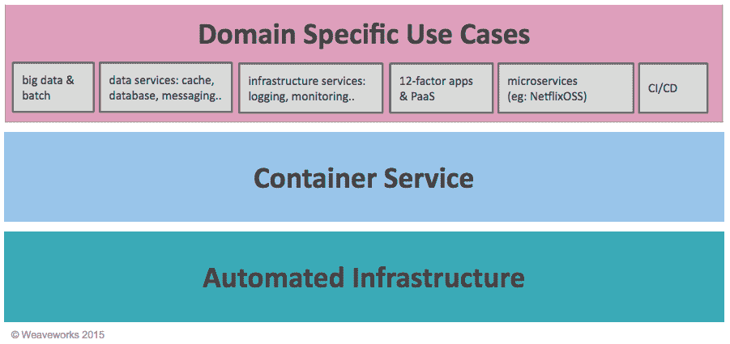
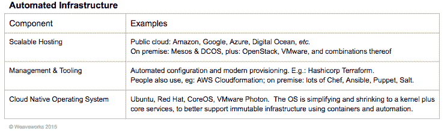
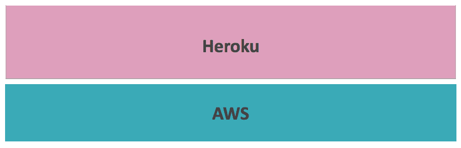
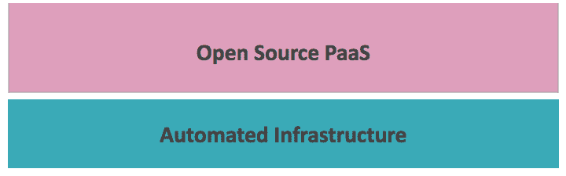
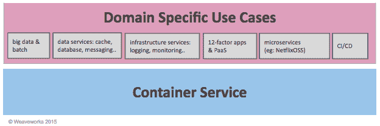
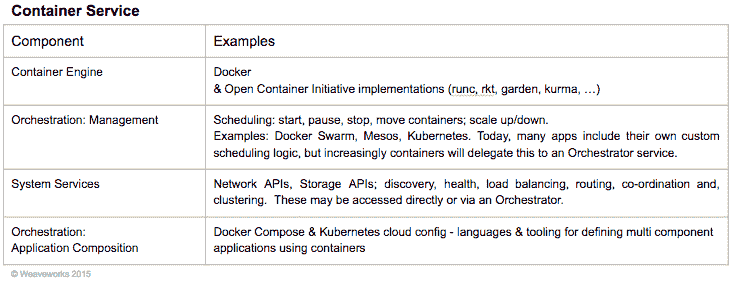
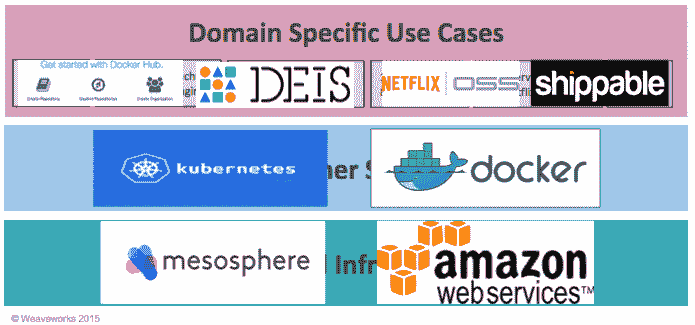

# 后亚马逊时代的挑战和新的堆栈模式

> 原文：<https://thenewstack.io/post-amazon-challenge-new-stack-model/>

我们看到了云原生软件的寒武纪大爆发:容器、编排和开发者平台。《新书库》( TNS)记录了一个发生在我们身边的惊人行业的故事。但是缺少了一些东西:一个清晰连贯的画面，描述所有这些活动的部分是如何组合在一起的——一个新的堆栈……因此，我将谦卑地尝试提供一个。

## 为什么我们需要新的堆栈？

我们需要一个新的堆栈，以便了解选择哪种技术及其原因。

在 2015 年，每个人都需要开发新的应用来保持竞争力。但是好像有一千种工具可以选择，昨天都出现了。这就好像我们被扔回到 20 世纪 90 年代初，在网站被完全理解之前，只是我们现在试图建立大量的定制软件应用程序和 API。因此，我们看到了关于“虚拟机与容器”、“固执己见与不固执己见”以及“结构化与非结构化”的令人分心的争论，这些争论假定了一个通用模型，但却没有提供。

我们需要一个模型来解释这一切:一个新的堆栈。这分为两部分:

1.  新的堆栈模型为您提供了一个了解当前和过去的产品试图做什么的环境。反过来，这有助于您为您的应用选择正确的工具，并做出构建还是购买的决定。
2.  新的堆栈提供了一个清晰的分层来清晰地梳理功能，上层真正抽象了下层的细节。

这很重要，因为以正确的方式创建软件应用程序的能力正成为收入的关键。为了获得最佳的经济效益，选择合适的筹码变得很有必要。这种堆栈应该比临时解决方案提供更好的“灵活性”，并解决一个关键的新堆栈问题，我们将在接下来进行描述。

## 新的堆栈问题

在过去的五年里，这个行业一直在寻找两个关键问题的答案。这些问题相当于新的堆栈问题:

1.  **我如何控制成本？**我的企业能否创建享受云经济优势的应用程序，而不必在每次部署时都使用亚马逊的云？
2.  **我怎样走得更快？**我的企业能否创建越来越多的云原生应用，同时降低管理它们的总成本？

要真正解决新的堆栈问题，必须能够运行相同范围的用例(应用、服务等)。)你可以在亚马逊上运行，但可以在任何地方，以一种系统的方式运行，这样管理是一致的，因此更便宜。

我们认为现在有了明确的答案。开发者和企业应该采用我们下面描述的云原生栈。这是考虑开发人员如何构建云原生应用的正确方式，包括微服务、数据服务等。

## 新堆栈的层

下面是一个简单的三层云原生栈——2015 版。这个故事的核心是在堆栈中创建新的标准容器管理层。我们称之为集装箱服务。直到 2013 年，这一层还隐藏在更大的产品中，如 PaaS。我们认为 PaaS 是重要的，但它是作为许多可以在容器上运行的产品之一出现的，容器成为了设计中心。我们将在文章的其余部分进行更详细的讨论。

### 这里是关键要点

*   **每层都是独立的。**基于他们的业务目标，大多数人更愿意在每一层选择同类最佳的产品。理解这个堆栈应该有所帮助。
*   **较高层可以抽象出较低层的细节。**例如，如果你正确地使用了容器服务，那么下面的层(自动化基础设施)应该对所有人都是不可见的，除了负责照看它的团队。该团队可能是内部运营团队或云提供商。
*   **每一层都代表一个架构承诺**，应该与任何商业考虑一起理解。

## 编织的作用

我们需要把我们的思维从“谁会赢？”到“我如何在堆栈中导航？”未来，app 会比以前有更多移动的部分:容器、平台、[微服务](http://weave.works/guides/microservices-weave-index.html)、[数据服务](https://blog.giantswarm.io/deploy-elastic-high-availability-sql-cluster-crate-weave/)等。Weave 开始让容器网络变得简单，现在仅仅是 Weave 网一天就有几千次下载。但我们的产品现在走得更远，利用对网络的洞察来提供监控和管理。给定任何应用程序(和任何网络)， [Weave Scope](http://weave.works/scope/) 自动构建您的应用程序地图，以便您可以理解它并诊断堆栈或应用程序中出现问题的位置。 [Weave Run](http://weave.works/run/) 增加了服务发现、负载平衡等功能，例如，如果 Scope 检测到您的系统不正常，它会将流量重定向到补丁节点。

在 Weaveworks，我们的目标是让所有人都轻松方便，而不是强迫你选择一个平台。我们是指所有人。我们提供易于使用的开发人员友好的工具，适合任何希望专注于容器化应用的人。

像 Docker 一样，所有的 Weave 都有一个关键的优势，那就是它非常容易在任何自动化基础设施上部署和运行，使用任何应用程序，无需更改应用程序或定制操作系统内核。

## 一开始是云

现在，让我们来讲述一下我们如何实现云原生的故事，并在过程中更详细地解释这些层。

在这个故事中，开发者被云技术所赋能。让开发人员能够又快又好地工作，已经成为企业赢得客户芳心的关键。这是一种新的便利经济学。便利改变了人们的行为，这就是推动市场的因素。它始于亚马逊，被初创企业发现，然后扩展到现有业务。这就是云原生应用的故事。

回想一下 2006 年。通过 EC2 和 S3，亚马逊推出了自助式计算和存储。假设你是一个开发者。突然间，第一次，你可以创建和部署一个真正的软件应用程序，而不需要和任何人交谈。您不必从运营团队获得硬件。你不必和你的老板讨论产能计划。你只需要编码、部署和运行。

所以你可以变得敏捷。你可以尝试一些想法——支持赢家，关闭输家。因为您可以在无需请求许可的情况下完成所有这些操作，所以您可以自己预测业务需求，并实时更改您的应用程序。因此，一个持续部署和集成、微服务和自动化的新世界开始了。

## 自动化基础设施

早在 2006 年，使用云基础设施意味着“使用 EC2”但自 2011 年以来，它意味着“使用一套集成的工具和云服务。”您需要一个完整的敏捷基础架构，支持三个主要领域的自动化:

### 关键要点

*   **这才是你真正需要的。**完全有可能仅使用自动化基础设施来部署和运行大规模应用。自 2006 年以来，人们一直在公共云上这样做，“私有”基础架构选项只会越来越好。
*   有两种方法可以做到这一点。厂商会卖给你这一层的集成版本。例如，通过中间层 DCOS，你可以得到中间层加上一些工具。或者，你也可以通过挑选你自己的棋子来获得好的结果。
*   **无论您做出什么决定，云原生应用都必须在敏捷基础设施**上运行，即自动化和自助服务。其他选择阻碍了开发人员使用云原生模式和实践，例如持续部署和弹性和正常运行时间架构。

## AWS 出现后发生了什么

2010 年至 2012 年间，新一代“云优先”的创业公司正通过快速行动颠覆整个行业。对于企业来说，便利的经济性是引人注目和显而易见的。我们进入独角兽时代:Airbnb、Square、Stripe、优步。这些领导者将云计算与移动和社交领域的创新相结合，重塑了整个客户体验。大多数情况下，他们[使用亚马逊网络服务](https://gigaom.com/2013/11/16/new-startup-economics-why-amazon-web-services-and-dropbox-need-each-other/)。甚至 T4 联邦政府也想加入 T5。

大约在这个时候，人们开始使用“原生云”来谈论广泛的技术、实践和部署模式，这些使开发人员能够最有效地快速交付新功能。大量新工具开始从网飞、赫罗库和其他人那里出现。这代表了一种认识，即组织云应用程序需要标准工具。

## 输入 PaaS

如果你是开发者，亚马逊给你自由。但是后来你发现自由可以意味着自己做所有的事情。这很难。而操作就更难了。也许自由并不是在所有事情上都是一个好主意。到 2010 年，一个新的解决方案出现了——Heroku PaaS。

在 Heroku PaaS 模式中，你可以获得在亚马逊上创建应用程序所需的“一切”，前提是你接受平台施加的约束。但我们不称这些为约束。相反，我们说 PaaS 是“固执己见的”。Heroku 的方法是专注于特定类型的网络应用，被称为“12 因素应用”

尽管非常受欢迎，最初的 Heroku 模型仍然是一个利基解决方案，即使在亚马逊上也是如此。这证明许多应用程序不符合 12 因素应用程序模型的约束。

## 现代 PaaS

最近，PaaS 模型得到了发展。在 Heroku 之后更进一步，比如 Cloud Foundry 和 OpenShift。后 Docker，甚至出现了更多的 PaaS 平台。

现代 PaaS 有三个主要属性:

1.  它不需要只在亚马逊上运行。
2.  它标准化了一个应用程序生命周期。
3.  它通常是开源的。

支持现代 PaaS 的论点是，客户希望有一个像 Heroku 一样的平台，但要能解决新的堆栈问题。这旨在帮助客户交付可在任何地方运行的“云原生”应用，而不会增加成本。资源可以通过这个平台提供给开发者。取决于开发者，他们可以自由选择他们需要多少资源。尽管如此，它还是得到了管理。任何人都可以打开水龙头，但这并不意味着他们可以获得社区的全部供水。

## PaaS 的利与弊

PaaS 模型的问题是双重的。首先，提供“完整平台”所有承诺价值的机器可能很笨重；第二，客户可能希望交付平台不支持的应用类型，例如数据服务。

PaaS 当然有帮助。PaaS 的价值来自于它支持一组关于用例的观点的能力，以及自动化支持该用例的工作的能力。但是，有多少开发商就有多少意见。在业务层面，在特定应用架构上实现标准化的速度收益与当您发现您的业务需要更多时受到限制的成本之间存在权衡。这通常首先表现在简单的层面上，比如集成您自己的监控工具。

我们认为这些潜在的缺点可以通过前面描述的云原生堆栈来解决。为了深入了解这一点，让我们检查用例的范围。

## 特定领域的用例

为了解决新的堆栈问题，我们希望运行与您在 EC2 上运行的用例同样广泛的用例，但是要在任何地方，以系统的方式运行。今天，我们看到大量不同的组件和框架构成了特定领域的用例。一些应用程序甚至会结合来自多个领域的组件。以下是一些例子:

*   12 因素 web 应用程序框架。
*   持续集成和部署服务。
*   微服务和支持工具，例如断路器、API 端点管理。
*   许多类型的 PaaS，既有大规模的“平台”，也有更简单、更精简的产品。
*   批处理框架。
*   大数据应用和流处理。
*   交易处理。
*   一些遗留迁移(雪花的封装)。
*   集成和云服务业务流程组合。
*   数据服务，如队列、noSQL 和 SQL 数据库；存储管理。
*   暂存和应用程序生命周期支持—与 CI、GitHub 等集成。
*   应用程序级管理、日志记录和监控。
*   计费、配额和使用计划。
*   安全性、加密、认证、身份、出处。

所有这些用例都可以在 Amazon 上以特定的方式实现。将它们移动到其他基础架构通常可以手动完成。其中一些用例可以作为 PaaS 中的“观点”得到支持，这实现了一定程度的一致性和可移植性。但是没有一个 PaaS 能够支持“所有观点”。相反，我们需要一个新的非固执己见的平台模型。人们对容器的兴奋源于这样一种信念，即它们是这一过程的基础。一致的平台将降低成本，并将应用从特定的基础设施中解放出来。

## 集装箱运输

这是正在出现的现实:应用程序是由运行在容器中的特定领域组件构建的，使用广泛接受的容器服务进行管理，并运行在开发人员基本上不可见的自动化基础设施上。固执己见的 PaaS 和其他框架增加了特定领域的价值和敏捷性。所有这些都运行在标准容器服务之上，标准容器服务“按需”提供容器，即容器的云/运行时。

## 求解新堆栈

集装箱服务的出现是因为需要:

1.  **可移植性:**跨平台的运行时层，可以在任何自动化基础设施上运行。
2.  管理:该层包括支持和 API，用于以系统化的方式管理容器、组件和应用程序，因此更便宜。

可移植性和管理增加了业务价值，所以让我们仔细地一步步来。

容器服务的第一个角色是成为任何云的高效公共虚拟层，这对开发人员来说是高效和实用的。它“就在那里”，开发人员在需要时可以利用它。运营团队负责管理。开发人员也管理它，就像任何资源一样。

这一层运行容器，它连接了容器化应用程序需要的核心执行服务，比如网络。这类似于支持虚拟机的 Amazon 或 OpenStack。容器和虚拟机是相似的:您在其中运行应用程序。但也有区别:容器可以在任何地方运行，VM 仅限于特定的云；容器的资源效率更高，从而提高了容量和速度。

容器服务的第二个作用是提供一种执行和管理容器化应用的方法。这些应用具有广泛的架构:从传统的 N 层应用到分布式应用、大数据和流。您可以支持的特定于领域的组件越多，您的容器服务层就越有用。作为开发人员，您应该询问供应商他们可以支持和管理什么范围的组件。

为了支持所有的架构，您需要这些能力:

成本效率是由于整个系统——每项服务——都像集装箱本身一样易于携带。通过使用容器服务，应用程序可以共享一组操作者 API，从而简化更改并降低成本。

## 从容器服务到云原生

容器服务提供了一个可以在任何地方运行的完整环境。因此，亚马逊提供的“看不见的、无限的”基础设施可以不受限制地交付。

现在，您拥有了一个全新的应用执行层，支持“任何地方的任何应用架构”所以，总的来说，这是实现便利经济的一个巨大进步。因此，它完成了我们的云原生堆栈。我们相信，这种架构将越来越成为现代企业的规范，因为它将帮助客户根据需要对不同的产品进行分层，例如 [Mesosphere DCOS 和 Kubernetes](https://mesosphere.com/blog/2015/09/25/kubernetes-and-the-dcos/) ，或者[亚马逊 ECS、Weave 和 Docker](http://weave.works/guides/service-discovery-with-weave-aws-ecs.html) 。【T8

人们已经在使用云原生技术运行大规模生产应用程序。随着世界转向容器和微服务，出现了一场平台之战(参见 GOTO London 的幻灯片)。其产品是垂直集成的平台供应商(又名“[结构化 PaaS](http://wikibon.com/cloud-native-application-platforms-structured-and-unstructured/) ”)可能会声称比专注于某一层的平台供应商更好，反之亦然。在每一层，供应商都会竞争。它们都是潜在的“云原生应用平台”——这是一个成熟的领域。如果你想了解更多细节，我们推荐 Wikibon 的[Brian gracey](http://wikibon.com/technical-dive-into-cloud-native-application-platforms/)，Redmonk 的 [Stephen O'Grady](https://redmonk.com/sogrady/2015/07/24/cloud-native-implications/) ，以及前谷歌的 [Joe Beda](http://www.eightypercent.net/post/layers-in-the-stack.html) 。

## 预言

未来呢？让我们以预测来结束。

将会有更多的开发者。在未来，每个企业都将雇佣重要的开发团队。因此，我们需要更好的应用部署和管理模式。CI/CD 支持将比以往更加强大。

开发人员将选择最容易理解和使用的工具。因此，云原生堆栈的三层将实现标准化。这有利于专业集装箱服务项目，如 [Docker](https://blog.docker.com/2015/09/docker-hub-2-0/) 和 [Kubernetes](http://googlecloudplatform.blogspot.co.uk/search/label/Kubernetes) ，以及来自 [CoreOS](https://tectonic.com/) 、 [Rancher](http://rancher.com/rancher-and-apache-mesos-docker-in-production/) 和 [Hashicorp](http://www.infoq.com/news/2015/09/hashiconf-nomad-otto) 的相关产品。 [Docker Compose](https://docs.docker.com/compose/) 将是这里的通用语。

对于 [Weaveworks](http://weave.works/) ，具体来说，监控和管理将需要变得可移植到所有自动化基础设施，并适应新的堆栈，这意味着在网络级别上与任何容器服务互操作——包括亚马逊 ECS 以及 [Kubernetes](http://weave.works/guides/platform/kubernetes/os/coreos/cloud/vagrant/) 等。

这不是一个赢家通吃的市场。客户在不同的规模和预算下运营。一些基金会正在形成，以标准化和发展开源基础，包括新的云计算原生计算基金会，它专注于容器服务层。

我们将看到更多专注于云原生堆栈顶层的增值产品。明显增长的领域包括[移动](https://thenewstack.io/amazon-web-services-isnt-winning-problems-poses/)，以及[使用](http://www.slideshare.net/adrianco/gluecon-2013-netflix-tutorial-introduction)[便携 Java](https://programmaticponderings.wordpress.com/2015/09/17/using-weave-to-network-a-dockerized-java-spring-we-application/) 的微服务。随着容器服务成为标准,“精益”PaaS 的数量将会增长。我们已经看到 [Deis](http://deis.io/deis-1-9-kubernetes-and-mesos-previews/) 、 [Flynn](https://flynn.io/) 、Tutum、Apollo、Cloud66、Convox、 [Empire](https://medium.com/@RemindEng/introducing-empire-a-self-hosted-paas-built-on-docker-amazon-ecs-7f8beb7f6ae4) 、Giant Swarm 和 [Magnetic](http://magnetic.io/) 建立在 Docker 和 Kubernetes 之上。

财富 100 强企业可能更喜欢垂直整合的“[结构化 PaaS](http://wikibon.com/technical-dive-into-cloud-native-application-platforms/) ”，如 [Apcera Continuum](https://www.apcera.com/continuum/) 或 [Pivotal Cloud Foundry](http://pivotal.io/platform) 。CF 嵌入了自己的容器服务， [Diego](http://www.slideshare.net/Pivotal/cloud-foundry-summit-2015-diego-update) 。但是[红帽 OpenShift](https://www.openshift.com/) 用的是 Kubernetes。

亚马逊将保持[做得非常好](http://uk.businessinsider.com/aws-earns-1-billion-a-year-on-6-billion-in-profit-2015-4?r=US&IR=T)。自动化基础设施的所有供应商，如 [VMware](http://wikibon.com/is-vmware-building-a-devops-framework-for-the-masses/) 和[微软](https://thenewstack.io/microsoft-launches-azure-container-service-mesosphere-dcos-drawing-distinction-google/)，将与领先的容器服务产品进行互操作和集成，以赢得更多云原生应用业务。

## 摘要

这是一个亚马逊公司让计算变得便利后发生的故事。随着 AWS 的出现，我们看到了几乎永无止境的计算的突然可用性。应用程序可以被部署，而不用担心收到七位数的账单。如今，我们担心的是如何让那些“无限”的资源更加面向商业。

亚马逊赋予开发者权利，让他们更加敏捷。但是，尽管有经济上的便利，仍然有一个新的堆栈问题。最初，人们担心被绑定到亚马逊，因此开发者可以根据需要自由消费，但来自垄断供应商。更大的问题是每个 app 都不一样。云架构的快速发展导致了大量难以管理的工具和服务。现代 PaaS 就是为了应对这个问题而产生的，现在已经发展成为一个新的云原生堆栈。

<svg xmlns:xlink="http://www.w3.org/1999/xlink" viewBox="0 0 68 31" version="1.1"><title>Group</title> <desc>Created with Sketch.</desc></svg>