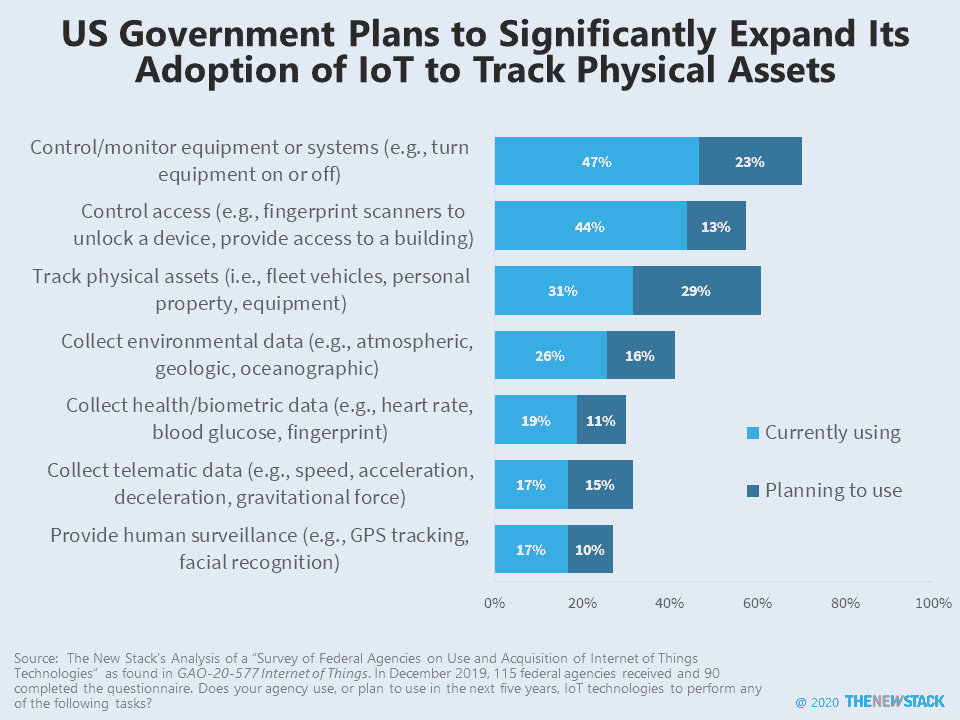

# 来自边缘的明信片:政府对物联网的使用

> 原文：<https://thenewstack.io/postcard-from-the-edge-government-use-of-internet-of-things/>

边缘计算的喧嚣炒作分散了人们的注意力，但推动需求的实际用例在一份新报告中得到描述， [*物联网:联邦机构使用信息*](https://www.gao.gov/products/GAO-20-577) 。物联网描述分散位置的设备和传感器。物联网在本地处理信息和执行应用程序的程度与集中位置相反，这是关于什么是真正定义边缘计算的辩论的核心。

在接受调查的 90 个美国政府机构中，监控设备是最常见的物联网用例。这些用例类似于工业物联网(IIoT)趋势，其核心是运营技术(oT)系统连接网络。第二个最常见的用例是访问控制，基本上是使用类似指纹或视网膜扫描仪的东西来提供对建筑物的访问。排名第三的是跟踪实物资产，如车队或设备，31%的受访机构目前正在使用它。另有 29%的受访者计划在未来五年内开始将物联网用于实物资产。

AR/VR、缓存、数据摄取、位置映射、ML、机器人、NLP、视频处理是推动边缘计算需求的其他用例。应用程序是否应该在边缘运行取决于安全性、延迟、数据驻留和性能要求等标准。

该报告还询问了这些机构部署物联网技术的挑战性有多大。不出所料，36%的人认为网络安全非常具有挑战性，24%的人认为与遗留系统的互操作性非常具有挑战性。至少在考虑应用程序架构方面，从云计算到边缘计算的转移可能会给开发人员带来“互操作性”问题，他们可能没有太多选择。

敬请关注更多关于[边缘物联网](https://thenewstack.io/the-internet-of-things-on-the-edge/)的明信片，以及开发人员正在集成到其下一个新堆栈中的其他用例、技术和架构。

<svg xmlns:xlink="http://www.w3.org/1999/xlink" viewBox="0 0 68 31" version="1.1"><title>Group</title> <desc>Created with Sketch.</desc></svg>