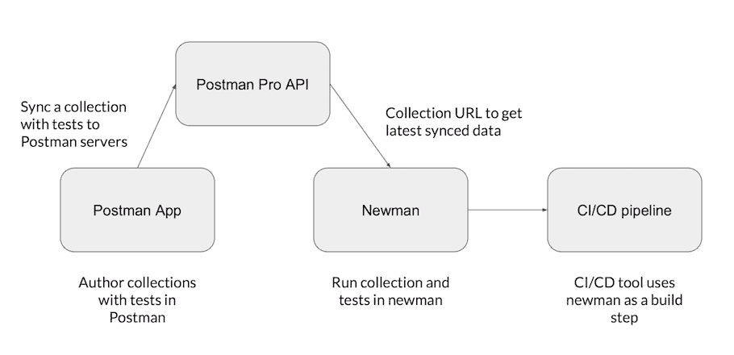
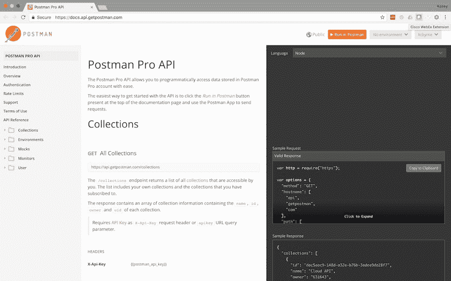

# Postman API 生命周期平台使开发者能够轻松集成外部 API

> 原文：<https://thenewstack.io/postman-adds-api-consumption-api-lifecycle-platform/>

API 生命周期工具提供商[Postman](https://www.getpostman.com/)——估计拥有超过 360 万用户的开发人员社区——发布了其旗舰应用程序的第 5 版，该版本在支持持续集成实践方面取得了巨大进步，现在越来越多的开发商店正在使用该应用程序。

Postman 应用程序现在提供了一个开发环境，除了帮助设计、测试和记录内部生成的 API 之外，还可以用来消费 API。新版本还带来了一个改进的商业模式，使更多的免费开发者可以使用 Pro 功能。

就像[re presen 最近对其 API 生命周期工具](https://thenewstack.io/api-document-generators-can-fall-woefully-short-meeting-accessibility-guidelines/)的更新一样，Postman 现在更专注于确保开发人员能够在一个整体的持续集成/持续交付管道中更新和管理他们的 API。与以前的版本不同，Postman Pro API 现在对所有用户都可用。

“核心组件非常简单，”Postman 的联合创始人兼首席执行官 Abhinav Asthana 解释道。“您获得 Postman Pro API 密钥，然后在 Jenkins 或 TeamCity 中添加密钥，并将 Newman 指定为构建步骤。然后像往常一样使用 Postman 编写 API 测试。它被同步到我们的服务器上，服务器与我们的测试工具 Newman 相连。它检查测试是通过还是失败。如果测试通过，那么您的 CI/CD 工具(如 Jenkins 或 TeamCity)可以自动接受它。它让迭代变得超级快。”

## 作为生命周期阶段的 API 消费

今年，API 领域发生了巨大的变化，人们更加关注 API 消费，这已经成为初创公司和企业的主流活动。这改变了 API 生命周期的整个概念，从设计内部 API 开始，然后测试它们，创建文档，向合作伙伴开放它们，然后向第三方提供商开放它们，以构建微服务。

现在，API 生命周期正被扩展到一个消费 API 的起点。“消费的 API”就像是企业可用的额外微服务，必须与内部微服务和 API 一起管理。

Postman 的一个关键方法是提供集合，用户可以在集合中将他们一起用于一个流程的 API(内部或第三方)分组。这使得识别连接问题变得更加容易，例如字段名命名的差异、定义时间或货币的不同方式，或者不同的安全性和速率限制规则。

对于创业公司来说，这对于新兴的“无堆栈创业”非常有用:企业将 API 菊花链在一起，创建新的服务并提供给客户。随着当前金融技术的发展，这种无堆栈创业公司预计将在未来几年内显著增长。

例如，一家初创公司可以提供个人财务管理(PFM)工具，将客户的银行账户绘制到一个仪表板中，然后应用算法根据可用的金融产品预测储蓄潜力。然后，可以使用通信 PaaS API 来告知客户更好的理财方式。所有这些都可以通过在工作流中使用 API 来完成。

对于企业来说，SaaS 工具的激增意味着需要将更多孤立的数据连接在一起。在今年五月玛丽·米克尔的年度互联网趋势报告中发现，企业平均使用 1052 个基于云的应用程序，金融服务企业报告使用了大约 1170 个。这包括从营销和人力资源到 CRM、销售和生产力工具以及 IT 和云存储。

企业需要链接通过许多这些应用运行的数据，并[转向 SaaS 工具的 API，使集成成为可能](https://thenewstack.io/integration-drives-api-uptake-enterprise/)。同样，这带来了像 Postman's collections 这样的服务，以及创建自定义文档的能力，以便向内部开发人员解释如何链接内部使用的 API，以及如何共享示例和测试结果。

Asthana 认为这是 Postman 的一个主要优势。“Postman 的交互性很强，但是你不用担心删除数据。当你把数据放在更多人面前时，他们会更快地意识到它的价值。他们开始构建用例以及迷你应用程序。”这就是为什么 Asthana 认为 API 生命周期已经从消费 API 扩展到构建 API。

## 文档、模拟服务器和监控

Asthana 表示，新版本现在有四个关键特性:

*   文档支持。
*   模拟服务器。
*   监控。
*   访问 Postman API。

### 文档是测试的关键部分

Postman 5 开始采用一些文档内容管理系统(CMS)类型的功能，有两种关键方法。用户现在可以将示例请求作为文档的一部分。Asthana 说，这是行业最佳实践的一部分，API 设计者正在使用元数据来改进文档。

Asthana 说，现在在文档中，你可以更好地解释:“这是请求，这是响应，然后你可以添加示例。在 Postman 的任何部分，您都可以完全访问 markdown、详细的参数描述、API 条款和条件，您可以定义特定的状态代码，例如，如果它正在发送 404 响应，您可以决定接下来会发生什么，因此 Postman 允许您完整地记录您的 API。”

然后，文档可以在内部与开发人员或外部读者共享，使用可编辑的 CMS，允许用户将网页发布为 API 文档，并带有自定义的域、徽标和颜色。根据免费计划，用户每月只能浏览 1000 页。

Asthana 说，他看到的一个趋势是，越来越多的用户将测试作为他们文档的一部分。“编写测试的发布者希望测试被文档化，这样人们就能知道是什么规则使测试成功。我们看到文档、测试和监控比外界看到的更加紧密。我们看到开发人员希望在开发的这些阶段进行更仔细的审查。

## 模拟服务器，监控

作为 API 测试上升的一部分，Postman 的模拟服务器允许用户模拟他们的 API。“你现在可以独立于你的生产 API 来操作你的后端和前端，”Asthana 说。在 Postman 中，用户可以创建 API 或 API 端点的集合，记录一些如何进行调用、解析和转发到其他 API 的示例。Asthana 表示，这让开发人员可以测试整个工作流程链，并确保流程和数据传递顺畅。Asthana 说，由于模拟服务器允许不同的测试环境，这使得团队更容易“完全独立地在每个 API 开发筒仓上工作”。

Postman 还包括一些监控服务。Postman 的特性允许开发者为 API 设置外部监控器，在免费计划下提供 1000 个对监控服务的调用。

## 无服务器的未来

对于无栈创业公司和企业 SaaS 用户来说，像 Postman 这样帮助开发者消费 API 的工具对于管理消费(和 API 设计)工作流是必不可少的。但是，随着无服务器基础设施的同时出现，这一点才真正脱颖而出。

现在，将 API 消费作为业务工作流设计的一部分是可能的，也是负担得起的，因为所有这些消费工作流只需要根据需要进行启动和计算。这意味着需要开发更少的线性和循环模型，相反，可以同时创建和管理同时运行的多渠道途径。目前，API 消费正在重塑 API 生命周期，但接下来，无服务器将把它带入一个全新的可能性领域。

特征图像[通过](http://blog.getpostman.com/2017/05/27/not-your-grandmas-postman/)邮递员。

<svg xmlns:xlink="http://www.w3.org/1999/xlink" viewBox="0 0 68 31" version="1.1"><title>Group</title> <desc>Created with Sketch.</desc></svg>