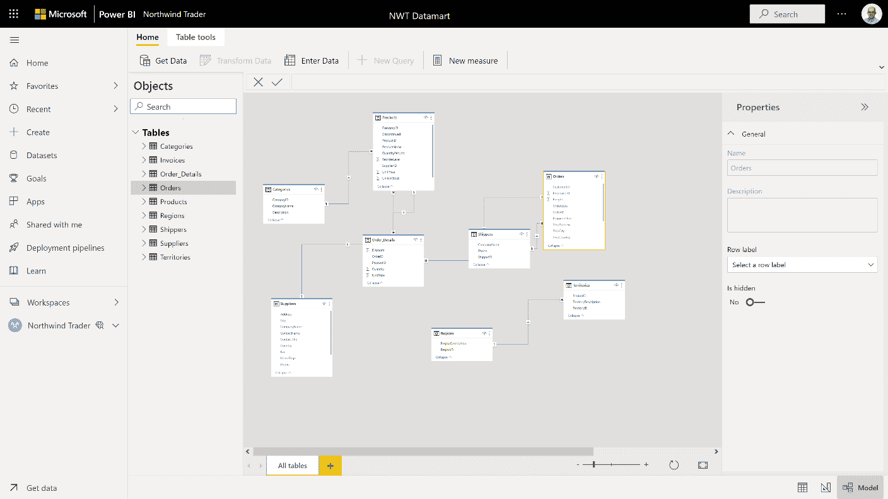
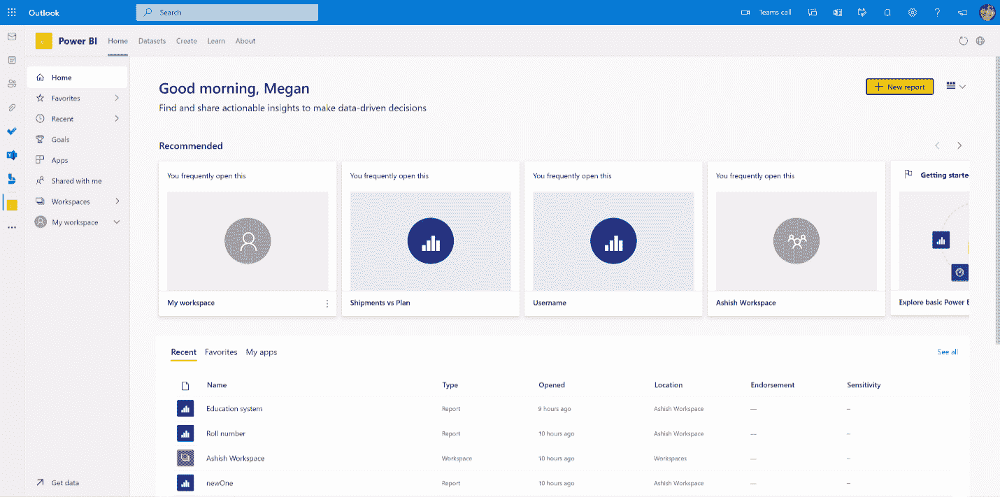

# 微软 Power BI 获得低代码数据集市特性

> 原文：<https://thenewstack.io/power-bi-gets-low-code-datamart-feature/>

今天，在面向开发者的 [Build](https://mybuild.microsoft.com/home) 大会上，微软的 [Power BI](https://powerbi.microsoft.com/en-us/) 团队宣布了 Power BI Premium 的一个新的自助式、低代码“数据集市”功能。这一举措整合并弥合了 Power BI 自己的分析引擎和微软的 [Azure SQL 数据库](https://azure.microsoft.com/products/azure-sql/database/)技术之间的差距，该技术源自其旗舰 [SQL Server](https://www.microsoft.com/sql-server/) 关系数据库。该公告还带来了一个重要的可用性红利，为非 Windows 平台的用户提供了成熟的 Power BI 创作体验。

## 分析技术大杂烩

在讨论数据集市特性的细节之前，让我们来看看是什么促使微软提供它。坦白地说，对该功能的需求源于一种尴尬的局面:在分析领域，三种主要的技术共存，通常是合作的，但有时是混乱的。关系技术用于数据仓库和数据集市。维度技术用于商业智能场景，数据湖技术用于开源大数据工作负载

各种技术属于不同的年代，并且基于稍微不同的范例。然而，大多数客户至少会结合使用其中的两种。集成它们通常涉及使用数据管道和 ETL(提取、转换和加载)技术来处理它们之间的数据移动和转换。然而，这些管道可能很复杂，而且很脆弱。创建和维护它们的需求通常会阻碍组织向分析成功迈进的速度。

## 高管背书

[微软负责智能平台的公司副总裁 Arun Ulag](https://www.linkedin.com/in/arunulag/) 向新堆栈简要介绍了这一主要的新功能集，并解释说它代表了将两种主要分析技术(关系和维度)结合在一起的重大努力。Ulag 还解释了 datamart 特性如何以一种自动化、无代码的方式生成所需的数据管道。

谈到新的 datamart 特性集，Ulag 说“这可能是我们在过去两到三年内在 Power BI 中推出的最大功能。”他还解释了它所代表的自助服务价值。Ulag 告诉 New Stack，“今天，许多工作都是基于 IT 提供的集中式数据仓库进行的”，并补充道，“挑战在于 IT 团队高度超载。如今，他们从业务部门收到的请求数量远远超过了他们能够处理的数量，这意味着业务增长放缓。”Ulag 说，因此，企业用户经常在 Excel、Access 和 SharePoint 等工具中构建自己的数据集市，这些工具不是为数据集市工作负载而设计的，通常性能或扩展性不好。“最糟糕的是，”Ulag 说，“他们处于 IT 的可见性之外…这实质上造成了大量的数据蔓延。”

## 它是如何工作的

Power Bi 数据集市的实现实际上非常简单。Power BI 始终监控用户识别其报告所需的数据源和表/数据集的过程。现在，Power BI 不再只是创建一个与报告一起存储的数据模型，而是设计和部署一个成熟的关系数据集市以及填充和刷新它所需的数据管道。

用于创建 Power BI 模型的相同的 [Power Query](https://docs.microsoft.com/power-query/power-query-what-is-power-query) 技术也被用来生成数据集市。由于 Power Query 一直是以低代码/无代码的方式使用的，所以它仍然是可用的。那些想要定制所需数据转换和移动的某些方面的人仍然可以使用 Power Query 丰富的[“M”语言](https://docs.microsoft.com/powerquery-m/)这样做，就像他们以前可以做的那样。但是他们从来不需要。

datamart 特性利用了 Power BI 云服务的[数据流](https://docs.microsoft.com/power-bi/transform-model/dataflows/dataflows-create)工具，该工具已经为 Web 浏览器环境实现了 Power Query 的大部分用户界面，消除了对 [Power BI 桌面](https://powerbi.microsoft.com/desktop/)的依赖。但是现在全模型设计体验也已经在浏览器中实现了。对于希望在云服务中做所有事情，而不是在那里和桌面之间分散精力的 Power BI 用户来说，这是一个不错的选择。

Power BI 新的基于浏览器的数据建模体验
归功于:微软

## 更大的帐篷

但是浏览器托管的设计体验的价值不仅仅是优雅和灵活。事实上，对 Power BI Desktop 依赖性的消除意味着非 Windows 操作系统的用户现在可以获得成熟的创作体验，而不必在模拟下运行 Windows。在 Power BI 发布近七年后，Mac 用户、Linux 用户和 Chromebook 用户现在也可以使用 Power BI 报告的全功能创作。这是一个非常大的问题，也是微软面对主要竞争对手的最后一个真正的竞争漏洞，如 Salesforce 的 [Tableau](https://www.tableau.com/) 、谷歌的 [Looker](https://www.looker.com/) 、 [Qlik Sense](https://www.qlik.com/products/qlik-sense) 以及其他 BI 玩家。

有趣的是，微软正在使用其 Azure SQL 数据库技术来实现数据集市功能。这意味着，除了可以从 Power BI 内部使用之外，每个数据集市都有自己的 SQL Server 端点，并将与所有兼容的工具和开发人员库一起工作。但是不关心这一点的用户可以将其视为一个简单的实现细节，因为数据集市不要求用户拥有 Azure 帐户，也不要求提供 Azure SQL 服务器或数据库。无论如何，所有数据集市对客户的 IT 组织都是完全可见的，为业务用户提供自助服务，而不会将 IT 部门锁在流程之外。

可见性也扩展到其他 Power BI 兼容平台。这意味着除了本地 Power BI 环境之外，Power BI 数据集市还可以从 Excel 和[团队](https://www.microsoft.com/microsoft-teams/)中发现。Datamarts 还参与 Power BI 的信息保护、认可、认证和安全服务。

## 定价和可用性

[需要 Power BI Premium](https://powerbi.microsoft.com/power-bi-premium/) 才能获得数据集市功能，但这包括 Premium per user (PPU)，使客户能够灵活地按企业范围或按席位付费。目前，PPU 收取大约 10 美元/月/用户附加费，总价格为 20 美元/月/用户。

新的数据集市特性现在可以在公共预览中使用。根据 Ulag，截至构建时的公告，所有 350，000 多个 Power BI 客户都应该能够访问数据集市功能。预览版正式上市(GA)的时间表有点像“TBD”微软喜欢让主要的新功能尘埃落定，然后再用 GA 荣誉徽章装饰它们。

## 在办公室给的

除了新的 datamart 特性集，微软还宣布了一系列其他新特性。其中包括将于本月底发布的公开预览，这是一种新的数据叙事功能，基于 PowerPoint 演示文稿中交互式 Power BI 报告页面的集成，如本文顶部的图片所示。还有 Power BI 与 Outlook 和 Office Hub 新集成的预览，如下所示。

Power BI 与 Outlook 的集成
归功于微软

Power BI 自动聚合已正式发布，新的[微软权限](https://www.microsoft.com/security/business/microsoft-purview)集成、管理功能、 [Power BI 嵌入式](https://azure.microsoft.com/services/power-bi-embedded/)和分页报告功能也将发布。最重要的是，微软表示，将 Azure Analysis Services 模型迁移到 BI 的新迁移服务即将推出。

## 终点线

Power BI 团队是微软最忙碌的团队之一。它每月定期更新产品，包括现在，团队收集了足够的进展来构成平台的巨大变化。

尽管 Power BI 正在大获成功，但在云计算领域，微软仍是亚马逊网络服务的副手。那么，迫在眉睫的问题是，Power BI 在 BI 世界的主导地位是否以及如何能够改变微软在整个云市场的地位。微软需要做的不仅仅是构建；它也需要赢。Power BI 的势头为这种胜利提供了一个潜在的途径，微软的观察家应该继续关注它的进展。

*披露:帖子作者 Andrew Brust 是微软数据平台 MVP 和微软独立影响者区域董事计划的成员。他的公司 [Blue Badge Insights](https://www.bluebadgeinsights.com/) ，为微软做过工作，包括 Power BI 团队。*

<svg xmlns:xlink="http://www.w3.org/1999/xlink" viewBox="0 0 68 31" version="1.1"><title>Group</title> <desc>Created with Sketch.</desc></svg>