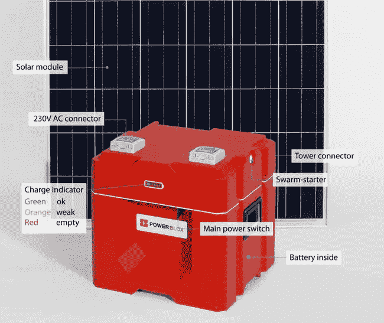

# Power-Blox 利用群体智能创建分布式微型能源网

> 原文：<https://thenewstack.io/power-blox-uses-swarm-intelligence-create-distributed-micro-energy-grids/>

分布式系统背后的基本原则不仅改变了我们的计算方式，还促使我们重新思考我们生活中有多少基本系统是设计出来的。

以能源生产为例:如果你像大多数人一样，你可能会连接到一个中央电网，这个电网使用大量庞大、低效的基础设施，维护成本高昂。但这些特征并不是最大的问题:由于它的配置方式，集中式系统只有一个主要控制点，这使得它非常容易发生大规模故障。

谢天谢地，有更好的选择。我们看到世界各地的许多创业公司用创新的解决方案来解决这个问题，瑞士公司 [Power-Blox](https://www.power-blox.com/) 是另一家，它提供了一种“ [swarm power](https://docs.wixstatic.com/ugd/41ad7d_a99c03e6c2414b5bb8bbe00091650a9b.pdf) 技术，使用户能够创建自己的完全自主、智能的微型电网，作为分布式系统建立，并能够根据需要扩大规模。Watch Power-Blox 联合创始人[阿曼德·马丁](https://www.linkedin.com/in/armand-martin-52aa4024/?ppe=1)解释概念:

[https://www.youtube.com/embed/UngTkmrW5TI?feature=oembed](https://www.youtube.com/embed/UngTkmrW5TI?feature=oembed)

视频

Power-Blox 被认为是一个“通用能源接口”，负责监管各种能源的发电、储存和配电，这些能源可能来自太阳能、风能、水热、生物质能或发电机的组合。单个的电力块可以堆叠成更大的“电力墙”,不仅将电力输送到家庭，还可以输送到学校、医院、基础设施，甚至是偏远地区的整个城镇，形成分散的分布式微型电网。

这种分布式系统的一个主要优势是，它可以抵御中断，并且升级更简单。当网络中的一个点出现故障时，整个系统仍然可以运行。当电力需求增加时，用户只需添加另一个模块和更多的能源，而不必更换整个系统来升级。这种灵活性将使 Power-Blox 成为发展中国家社区的一种方便和经济有效的替代方案，在这些国家，电网可能不可靠或不存在。

## “群体智能”技术

另一大资产是该系统内置的人工智能算法，它形成了一种“[群体智能](https://thenewstack.io/bee-inspired-autonomous-robots-improve-crop-yields/)”，使其能够自动适应波动的电力负载和不断变化的电源名单。由于这套相对简单的软件代码，群体中的可用能量存储在其节点中，系统中的每个组件都能够自我调节，适应整个电网的当前状态。

Power-Blox 的群体智能功能显然是受大自然本身的启发，正是这种群体概念使 Power-Blox 系统具有自主性、用户友好性和可扩展性。通过保持基础简单，更复杂的配置是可能的。

[该公司的](http://www.altenergymag.com/news/2017/04/26/power-blox-uses-swarm-power-to-create-intelligent-autonomous-energy-grids/26112/)说:“群体技术是基于自然界以完全分散的方式组织复杂结构的方法。”。“在一个群体中，最复杂的系统都由一套简单的规则管理，无需集中决策就能采取行动。由于群体中的个体实体遵循这套规则，它们在不知道群体行为的情况下相互作用，从而为整个系统带来了一种‘智能’的全局行为。”

单个 Power-Blox 模块属于 200 系列，能够产生高达 200 瓦的交流电，足以为电灯、冰箱、电视等设备供电，并为手机和笔记本电脑充电。电力可以储存在该装置的集成 1.2 千瓦时电池中。它就像一个“便携式插座”，但它的模块化设计意味着单个单元可以像乐高一样组合起来，创建一个更高容量的离网系统，以满足更大的需求。Power-Blox 基于“即插即用”的原则运行，这意味着启动和运行系统不需要特殊技能。

## 民主化权力

这又把我们带回到“群体电力”的潜力上来，它将给 12 亿人(占全球人口的 16%)的生活带来巨大的变化，这些人用不上电，他们生活在建设中央电网没有经济意义的地方。

“群体连接意味着什么是真正令人着迷的:它意味着电力可以很容易地规模化，”马丁[在他的 TEDx 演讲](https://youtu.be/UngTkmrW5TI)中说。“这也意味着地球上的任何人都可以获得电能。但更重要的是，这将使权力更加民主，因为它将使权力摆脱对大公司和不稳定政府的依赖。”

但是群体智能并不局限于电网。这些自组织和去中心化的原则几乎可以应用于任何事情。

“我们今天看到的只是开始，”马丁说。“未来的数字信息时代将会非常复杂，以至于集中模式不再是应对我们面临的许多挑战的有效方法。群体算法可能用于[自动驾驶](https://thenewstack.io/how-bumblebees-may-help-smart-cars-drive-themselves/)，减少交通堵塞，提高安全性。可能存在群体市场，任何人都可以消费或提供微服务，甚至是一个意义深远的想法，那么群体资金呢？这将是一种无法集中控制的货币形式，其价值由供求关系自动决定，在这种情况下，不可能也不需要中央银行。”

群体智能的力量和潜力确实令人印象深刻，看看这些挑衅性的预测是否会实现将是令人着迷的。

图像:Power-Blox

<svg xmlns:xlink="http://www.w3.org/1999/xlink" viewBox="0 0 68 31" version="1.1"><title>Group</title> <desc>Created with Sketch.</desc></svg>