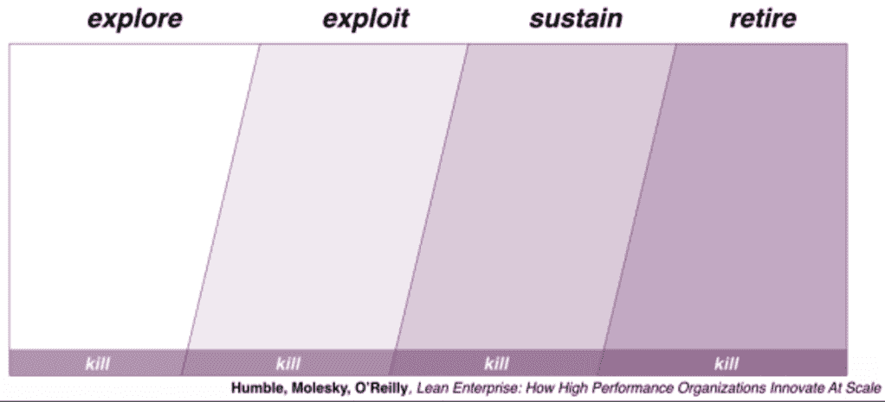
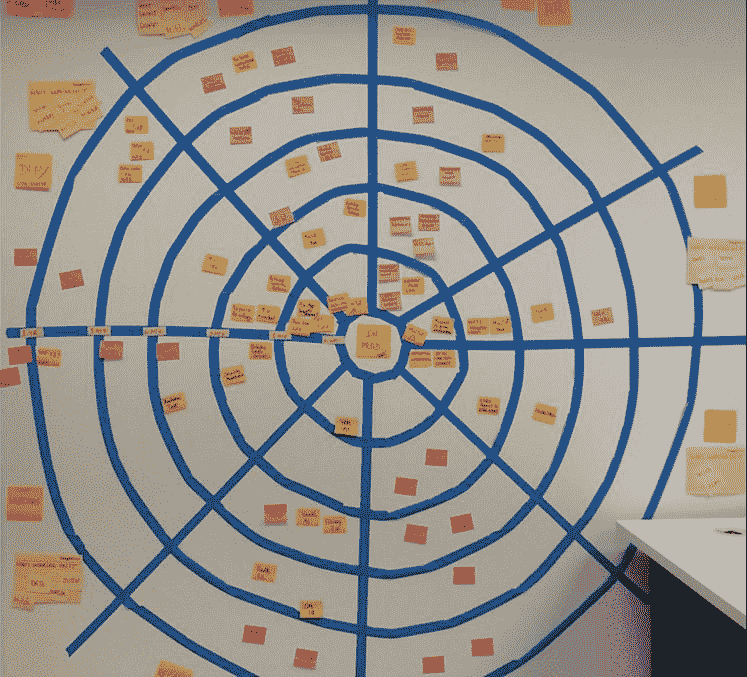
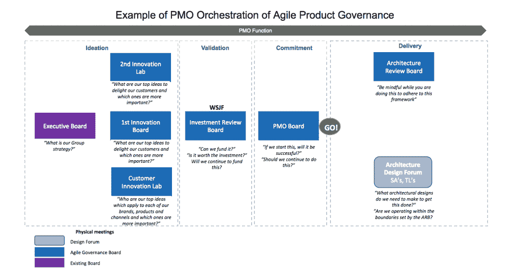

# 项目管理办公室如何支持敏捷软件开发

> 原文：<https://thenewstack.io/power-project-management-office-agile-software-development/>

敏捷软件开发有许多好处，包括加速增长、培养开发人员自主权以及更快地响应不断变化的客户需求的能力，同时创造一种拥抱创新的公司文化。但是，当我们还在争论什么是精确的敏捷，什么不是精确的敏捷时，有些人感觉落后了。从中层管理到整个项目管理办公室，许多人都在努力寻找他们在敏捷转型中的位置。

但是 scrum 大师 Dean Latchana 最近在伦敦的 AgiNext 会议上向持怀疑态度的听众发表了关于这个主题的演讲，他说，对于项目管理办公室(PMO)在一个走向敏捷的公司中所扮演的角色，存在争议。

> 项目管理办公室的领导可以像一个首席执行官一样，在前进之前鼓励实验和验证。

传统上，任何大型组织中的 PMO 都是为该业务项目设定标准的实体，其目标是节省资金和提高整体效率。最初，PMO 可能看起来像是一个用慢时间需求来减缓敏捷软件开发的办公室。但是办公室也可以反其道而行之，

“有些人提到，也许这是一种矛盾，”他在谈到敏捷项目管理办公室时说道，“但是，“ 项目管理办公室[看起来]不像一只卑微的恐龙，业务功能可以真正地自我重组，成为组织的中心。”

事实上，Latchana 不仅没有认为项目经理的角色已经过时，相反，他认为这个与长瀑布图相关的部门实际上可以领导敏捷革命。他提出了不同的组织方法来帮助实现这一目标。

## 项目管理办公室如何实现敏捷

Latchana 以两个陈述开始了他的讲话:

*   组织正在消亡。有些人知道。有些人对此很天真。
*   项目管理办公室可以支持你的组织生存和发展的革命。

他在这种生存危机中列出的组织包括媒体、银行、金融、个人交通(如出租车)、专业服务(如法律和房地产)、零售，甚至 B2B 市场。

他说:“我相信项目管理办公室有能力帮助他们的同事认识到不确定性并为之努力，并将其作为建立新商业模式的一种方式。”。

Latchana 认为项目管理办公室非常适合“感知和响应”这些外部威胁，如果他们能够转向更敏捷和精益的思维模式，并“转向市场甚至内部响应”

“一个 gile 心态超越了工具、实践和方法，”他断言，认为 PMO 可以帮助“ 重新审视我们的商业模式，为我们的客户或利益相关者交付价值，并通过采用一种或多种不同的项目管理方法来检查运营:

### #1:将权威推向信息

这是一个简单的方法，它并没有完全接受敏捷的扁平组织结构，而是开始对其进行删减。遵循“信任然后验证”的方法，他建议项目管理办公室帮助将权力和决策向下推一个层次，这样可以将周期从六周缩短到四周。

### #2:帕尔钦斯基的原则

这种方法借鉴了[彼得·帕尔钦克斯的三个工业设计原则](https://www.m-brain.com/blog-posts/peter-palchinskys-3-principles-to-improve-anything-including-marketing/):

1.  变化:寻找和尝试新的想法。
2.  生存能力:在一定范围内进行实验，证明你能够在失败中生存下来。
3.  选择:寻求反馈，从错误中学习。

Latchana 说:“如果你有一种更具实验性的文化，你实际上可以测试这些功能。”。

### #3:创新组合管理

如下图所示，创新项目组合管理方法从您以快节奏的敏捷和精益的方式探索的许多想法开始。然后你可能会选择十分之一来开发和实验。然后用最好的实践和产品来维持你的生意，如果他们不盈利，你可以让他们退休。他认为项目管理办公室最适合领导这些精简过程。

### #4:利特尔定律

[利特尔定律](http://web.mit.edu/sgraves/www/papers/Little's%20Law-Published.pdf)提供了以下等式:

**周期时间=队列长度除以完工率**

基本上，正如 Latchana 解释的那样，“我们可以将队列的大小降得越小，我们可以获得的效率越高，我们就越快。”他支持利特尔法则，同时也支持帕尔钦奇的原则。项目管理办公室应该解决所有的瓶颈和积压问题，帮助引领服务和生产线的整合。

下图展示了一家公司如何创建一个[巨大的网络来展示其积压](https://leankit.com/blog/2017/05/lean-agile-pmo/)，楔形部分代表一个团队，每个同心圆代表四分之一远的地方。

### 敏捷项目管理方法#5:治理原则

在与英国政府的合作中，Latchana 发现了以下服务交付的管理原则:

1.  不要减慢交货速度。
2.  需要决策时，决策必须在正确的级别上做出。
3.  和合适的人一起做。
4.  你自己去看吧。
5.  只有当它增加价值时，才这样做。

与上面描述的“将权限推给信息”方法类似，这里也有一些信任和验证。Latchana 说，一个好的领导者认识到，即使你“知道你是对的”，你也愿意让组织中的其他人有失败的空间，并从中吸取教训。他继续说，项目管理办公室的领导就像一个小型的首席执行官，鼓励在前进之前进行试验和验证，最好遵循以下指导方针:

*   遵循假设驱动的开发。
*   开发处理不确定性的模型。
*   在开发人员所在的地方与他们会面(不要让项目管理办公室成为一个非常独立的办公室)。
*   学习并培养生存焦虑和学习焦虑。
*   就是小心避免[双峰](https://research.gartner.com/definition-whatis-bimodal?resId=3216217&srcId=1-8163325102)。

这五种方法中的任何一种都可以与敏捷和精益的心态相结合，甚至相互结合，一切都是一种**假设驱动的转换**，可以遵循类似于以下的模板:

我们认为

*【支持此变更】*

*【针对这些人】*

将实现*【这个结果】*

当我们看到时，我们会知道我们成功了

*【我们组织/市场内部的信号】*

<svg xmlns:xlink="http://www.w3.org/1999/xlink" viewBox="0 0 68 31" version="1.1"><title>Group</title> <desc>Created with Sketch.</desc></svg>